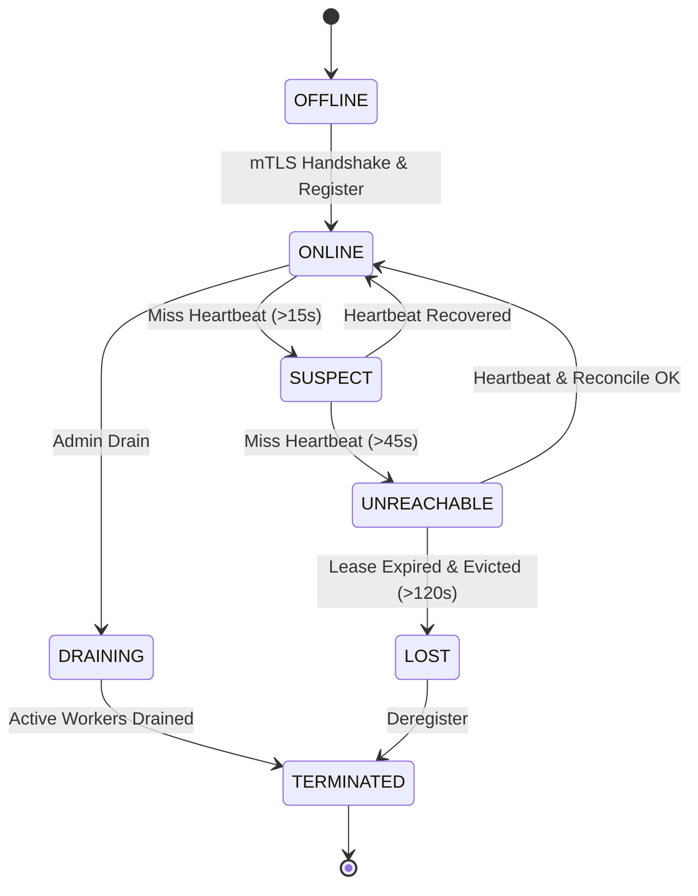
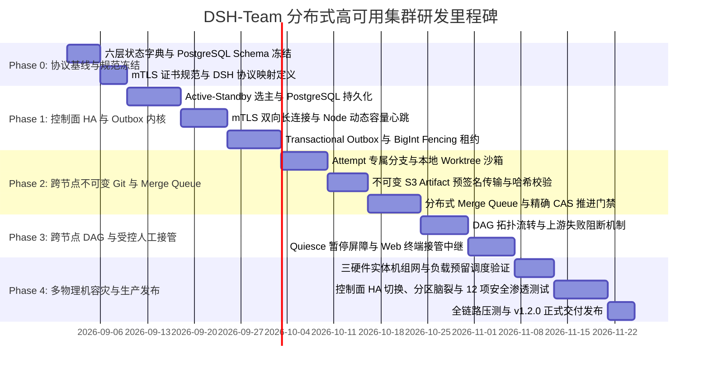

# DSH-Team (基于 DeepSeek Harness 的分布式多 Agent 协同系统)
## 软件需求规格说明书 (Software Requirements Specification, SRS)

* **文档版本**：v1.2.0 (Distributed Production & High-Availability Release)
* **状态**：已完成 Sol 阻塞项全面修复与闭环 (Sol Architecture Review Hardened)
* **基线与参考项目**：
  * DeepSeek Harness (DSH): `@deepseek-ai/dsh` (基线版本协议兼容: `>=0.3.0`，基于显式 Correlation 映射解耦协议 RPC ID 与集群 Attempt ID)
  * Claude Codex Bridge (CCB): `SeemSeam/claude_codex_bridge` (Commit: `01d5b1c` - 复用其 Mailbox、Lease、Fencing 与会话隔离设计思想；网络层与拓扑升级为多硬件节点集群)
* **主要作者**：Reasonix System Architecture Team & Sol Plan Reviewer

---

## 1. 引言与目标边界 (Introduction & Boundaries)

### 1.1 编写目的
本文档明确规定了 **DSH-Team (基于 DeepSeek Harness 的分布式常驻多 Agent 协同与编排系统)** 的产品定位、跨硬件分布式架构边界、控制面高可用（HA）、功能需求（FR）、非功能需求（NFR）、六层状态机模型、数据契约、安全沙箱规范及验收标准。本文档作为系统研发、跨节点通信协议设计、自动化测试与集群验收交付的**唯一权威基线**。

### 1.2 系统定位与愿景
DSH-Team 是基于 DeepSeek Harness (DSH) 构建的**跨硬件实体分布式多 Agent 协同与编排集群系统**。它以 DSH Master 为集群控制大脑（Master Orchestrator），通过中心化控制面（Cluster Control Plane）统筹调度部署在不同物理机、虚拟机或容器沙箱中的轻量级 **Node Agent**。

每个 Node Agent 负责在本地硬件实体上拉起、监督和守护专职的 DeepSeek 助手（如 Coder、Tester、Reviewer、Security Auditor），支持异构算力与工具链感知、长会话心智保持、异步信箱（Mailbox）消息驱动、物理工作区沙箱隔离、Git 远程仓库与产物中枢（Artifact Registry）协同流转，以及严格受控的集中式代码集成门禁（Merge Queue）。

### 1.3 目标（In-Scope）与非目标（Out-of-Scope）

#### In-Scope（系统目标）：
1. **多硬件节点分布式集群管理**：支持跨不同物理机/节点的轻量 Node Agent 注册、能力标签（OS/CPU/GPU/内存/工具链）、双向心跳、负载均衡与 Drain 隔离。
2. **主动出站安全通信网络（Egress-Only mTLS）**：Node Agent 主动向控制面建立双向 mTLS WebSocket/gRPC 长连接，无需在各硬件节点暴露公网入站端口，无缝穿透 NAT 与复杂内网防火墙。
3. **控制面 Active-Standby 高可用选主**：控制面采用基于 PostgreSQL `pg_advisory_lock` / Leader Lease 的选主机制，只有 Active Leader 拥有调度、Lease 签发与 Merge Queue 权限，杜绝控制面双主。
4. **能力感知与粘性任务调度（Sticky Placement）**：集群调度器依据节点标签、硬件负载与角色亲和性派发任务；Agent 会话在生命周期内粘性绑定在特定物理节点。
5. **跨节点代码与工件协同（Decoupled Workspaces）**：节点间彻底解耦物理文件系统依赖。代码交换通过中心 Git 远程仓库与 Commit SHA 传递（任务分支格式带不可冲突的 Attempt 标识：`agent/<agent_id>/<task_id>/<attempt_id>`）；测试报告、补丁、运行日志等非代码产物通过集中式 Artifact Registry（对象存储）分发并进行 SHA256 完整性校验。
6. **高可用异步信箱与全局防脑裂租约**：基于 Transactional Outbox 解决 Dual Write 难题；配合分布式 Lease 租约与单调递增 `fencing_token`（BigInt），杜绝网络分区下的旧节点双写与脏提交。
7. **集中式 Merge Queue 与精确 CAS 门禁**：控制面作为主分支（Integration Ref）的唯一合入管理者，统一在指定测试节点上构建 Staging 分支验证，通过带预期的精确 CAS (`--force-with-lease`) 原子推进主分支。
8. **DSH 原生流式与完成度判定**：直连各节点上的 DSH Worker 实例，通过控制面维护的 `attempt_id -> worker_rpc_id` 显式映射表，基于结构化终态与事件进行精准裁决。
9. **显式控制权的人工接管（Human Takeover）**：基于 Workspace Control Lease 与节点锁机制，支持开发者通过 Web/终端安全接管任意远程节点上的 Agent 会话。
10. **开发/生产双模式兼容**：生产环境默认运行分布式多节点模式（PostgreSQL 权威存储）；本地开发支持单机兼容模式（Standalone Mode）。

#### Out-of-Scope（非系统目标）：
1. **首版不承诺运行中会话内存无损热迁移（No Live Memory Session Migration）**：执行中节点若发生硬件宕机或失联，控制面在确认 Lease 到期后，基于不可变输入任务参数、关联 Git Commit SHA 及历史消息在新节点拉起全新 Session 重新执行，不依赖复杂的跨机器内存 Dump/Restore。
2. **不采用 P2P 全对等拓扑**：首版坚持“中心控制面 + 边缘 Worker 节点”主从拓扑，避免去中心化一致性协商带来的复杂度与脆弱性。
3. **不承诺端到端 Exactly-Once**：底层网络与分布式恢复遵循业界标准的“At-least-once + 幂等键 + Fencing Token”。
4. **不承诺完全自动解决业务代码语义冲突**：Git 冲突由 Merge Queue 拦截并生成结构化诊断报告转人工/主控决策，严禁模型在未验证情况下强行合入。

### 1.4 分布式时间语义与窗口规范 (Time Semantics & Lease Protocol)
为彻底杜绝时序冲突与脑裂重调度歧义，系统严格定义以下时间常量与因果规则：
* **`heartbeat_interval = 5s`**：Node Agent 定期向控制面发送心跳与动态负载。
* **`heartbeat_suspect_after = 15s`**（3 次连续心跳丢失）：节点状态转为 `SUSPECT`，控制面暂停向其分派新任务，但保留现有 Lease。
* **`node_unreachable_after = 45s`**（9 次连续心跳丢失）：节点状态转为 `UNREACHABLE`，宣告连接中断。
* **`task_lease_expires_after = 60s`**（Lease TTL）：任务租约有效期。
* **因果重调度铁律**：**`node.state == UNREACHABLE` 仅代表节点不可达，不自动等价于 Lease 失效**。控制面必须等待该任务租约达到 `expiresAt (60s)` 且在 PostgreSQL 内部通过原子 CAS 条件更新将 Lease 置为 `EXPIRED`、生成更大的 `fencing_token` 后，方允许将任务重新调度给新节点（创建新 Attempt）。

---

## 2. 核心架构与高可用分层设计 (System Architecture & HA)

系统采用 **“Active-Standby 集群控制面 (Cluster Control Plane) + 分布式硬件节点 (Node Agents) + 外部协同基础设施 (Git & Artifact Store)”** 的解耦高可用架构：

```mermaid
graph TD
    subgraph Host_Control_Plane [DSH 集群控制面 (Active-Standby HA @ Machine-Master)]
        DSH_Master[DeepSeek 主控 Agent (Cluster Orchestrator)]
        Web_Console[Web 管理控制台 / 监控大盘]
        
        subgraph Active_Leader [Active Controller (持有 pg_advisory_lock)]
            Cluster_Scheduler[Cluster Scheduler 集群调度器<br/>(标签过滤 / 动态负载 / 粘性绑定)]
            Node_Registry[Node Registry 节点注册中心<br/>(Heartbeat / SUSPECT / Drain)]
            Message_Bureau[Message Bureau 消息中枢<br/>(Transactional Outbox / Idempotency)]
            Lease_Manager[Lease & Fencing Manager<br/>(BigInt Fencing Token / CAS 续租)]
            Merge_Queue[Merge Queue 集成控制器<br/>(Staging 验证 / 精确 CAS 推进)]
            Artifact_Registry[Artifact Registry 工件元数据服务]
        end
        
        subgraph Standby_Controller [Standby Controller (热备监听)]
            Standby_Heartbeat[Standby Watchdog<br/>(监听 Leader Lock 状态)]
        end
        
        MCP_Gateway[MCP Server Gateway<br/>(team_spawn, team_ask, node_list)]
    end

    subgraph Infrastructure_Layer [集中式协同基础设施]
        Git_Server[(Git 远程代码仓库<br/>GitHub / GitLab / Gitea)]
        Object_Store[(Artifact 对象存储 / MinIO / S3<br/>日志 / 补丁 / 测试报告)]
        Central_DB[(PostgreSQL 权威元数据库<br/>支持主从高可用与 WAL 归档)]
    end

    subgraph Hardware_Node_A [硬件节点 A: 业务开发 (Machine-A @ Ubuntu 22.04 / 32核)]
        Node_Agent_A[Node Agent A<br/>(主动 mTLS 出站连接 / 本地 Inbox 去重)]
        DSH_Worker_1[DSH Worker: Coder-1<br/>(dsh web: 127.0.0.1:P1)]
        Worktree_A[本地私有 Git Worktree<br/>.dsh-worktrees/coder-1/att_101]
    end

    subgraph Hardware_Node_B [硬件节点 B: 自动化测试 (Machine-B @ Debian 12 / GPU)]
        Node_Agent_B[Node Agent B<br/>(主动 mTLS 出站连接 / 本地 Inbox 去重)]
        DSH_Worker_2[DSH Worker: Tester-1<br/>(dsh web: 127.0.0.1:P2)]
        Worktree_B[本地私有 Git Worktree<br/>.dsh-worktrees/tester-1/att_102]
    end

    subgraph Hardware_Node_C [硬件节点 C: 审计与评审 (Machine-C @ macOS / M3 Max)]
        Node_Agent_C[Node Agent C<br/>(主动 mTLS 出站连接 / 本地 Inbox 去重)]
        DSH_Worker_3[DSH Worker: Reviewer-1<br/>(dsh web: 127.0.0.1:P3)]
        Worktree_C[本地私有 Git Worktree<br/>.dsh-worktrees/reviewer-1/att_103]
    end

    %% 控制流
    DSH_Master -->|MCP Tool Calls| MCP_Gateway
    Web_Console <-->|WebSocket Stream| Active_Leader
    MCP_Gateway --> Active_Leader
    Active_Leader <--> Central_DB
    Standby_Controller -.->|Lock Probing| Central_DB

    %% 跨网络节点通信 (mTLS 双向安全通道，节点主动建立)
    Node_Agent_A ===|mTLS gRPC/WebSocket| Active_Leader
    Node_Agent_B ===|mTLS gRPC/WebSocket| Active_Leader
    Node_Agent_C ===|mTLS gRPC/WebSocket| Active_Leader

    %% 节点内部控制
    Node_Agent_A -->|Loopback HTTP/WS| DSH_Worker_1
    Node_Agent_B -->|Loopback HTTP/WS| DSH_Worker_2
    Node_Agent_C -->|Loopback HTTP/WS| DSH_Worker_3
    DSH_Worker_1 --- Worktree_A
    DSH_Worker_2 --- Worktree_B
    DSH_Worker_3 --- Worktree_C

    %% 跨节点数据流与产物交互
    Worktree_A -.->|git push/fetch branch/att_101| Git_Server
    Worktree_B -.->|git push/fetch branch/att_102| Git_Server
    Worktree_C -.->|git push/fetch branch/att_103| Git_Server
    Node_Agent_A -.->|upload logs to /tasks/t1/att_101/| Object_Store
    Node_Agent_B -.->|upload reports to /tasks/t2/att_102/| Object_Store
    Node_Agent_C -.->|upload review to /tasks/t3/att_103/| Object_Store
    Active_Leader -.->|metadata indexing| Artifact_Registry
```

### 2.1 分层架构与核心职责

* **集群控制面高可用（Active-Standby Control Plane）**：
  * 基于 PostgreSQL `pg_advisory_lock` 产生全局唯一的 Active Leader 实例，Standby 实例作为热备，Leader 宕机后 5s 内自动接管；
  * 全局状态由 PostgreSQL 保证 ACID 与持久化；基于 **Transactional Outbox 模式** 确保命令投递与数据库更新的原子性；
  * 运行集群调度器（Cluster Scheduler），根据节点动态 CPU/GPU/内存容量与标签做原子预留与粘性分派；
  * 维护全局单调递增的 `fencing_token`（BigInt）与带 TTL 的 Lease 锁；
  * 统筹 Merge Queue，持有唯一的 `merge_epoch` 驱动远程测试与 CAS 主分支原子推进。
* **硬件执行节点（Hardware Node Agents）**：
  * 在每台物理机器/容器内常驻轻量级 `Node Agent` 守护进程；
  * **主动出站连接**：加载本地 mTLS 证书主动连接控制面，建立双向保活与指令通道；
  * **本地 Inbox 与去重**：持久化本地 `command_inbox` 表，依据 `command_id` 和 `idempotency_key` 过滤重复指令；
  * **本地 Worker 监管**：负责本物理机上 DSH Worker 的生命周期（分配私有回环端口 `127.0.0.1:0`、进程组、健康检查与孤儿回收）；
  * **本地沙箱与 Attempt 级 Worktree 隔离**：管理本机 Git 缓存与 Worktree，分支命名严格绑定 Attempt（`agent/<name>/<task>/<attempt_id>`）；
  * **双通道事件上报**：区分轻量流式观测通道（Token/Thinking 过程脱敏推送）与可靠状态控制通道（Attempt 终态与 ACK 上报）。
* **协同基础设施（Shared Infrastructure）**：
  * **Git 远程仓库**：作为跨节点代码成果的唯一事实源（Source of Truth），节点间通过不可冲突的 Attempt 分支与 Commit SHA 交换代码。
  * **对象存储 / Artifact Registry**：统一存储不可变大文件工件（路径带 `attempt_id`），由控制面登记 SHA-256 哈希元数据。
  * **PostgreSQL 权威存储**：持久化节点注册信息、任务流水、信箱消息、Outbox 队列、Lease 租约与审计记录。

---

## 3. 六层解耦状态机模型 (Six-Layer State Machine & State Dictionary)

为彻底解耦“物理节点可用性”、“进程/会话存活”、“任务租约”、“模型 Turn 推理”、“消息中继”与“代码集成”，系统建立唯一的权威六层状态字典。Mermaid 图、正文需求与 TypeScript 数据模型**必须 100% 遵循此字典**：



### 3.1 权威状态字典与转换规范

#### 1. 硬件节点状态机 (Hardware Node State)
* `OFFLINE`：节点未连接或网络阻断；
* `ONLINE`：Node Agent 通过 mTLS 鉴权并完成能力注册，心跳正常（节点负载由 `activeWorkerCount` 表达，节点自身不设 BUSY 态）；
* `SUSPECT`：连续丢失心跳（>15s），进入疑似故障窗口，暂停向该节点分派新任务；
* `UNREACHABLE`：心跳中断（>45s），控制面宣告连接不可达，标记节点下线；
* `LOST`：超时（>120s）且绑定的所有任务 Lease 均已安全超时转移，节点被判定永久丢失；
* `DRAINING`：运维排空状态，拒绝新任务分派，等待现有在途 Worker 任务执行与工件推送完毕；
* `TERMINATED`：节点已安全注销。

#### 2. Agent 实例状态机 (Agent State)
* `STARTING`：Node Agent 本地创建工作区与 `dsh web` 启动中；
* `IDLE`：就绪且空闲，等待信箱任务；
* `BUSY`：正在执行具体 Attempt 任务；
* `WAITING_INPUT`：遇到交互式提问，阻塞等待主控输入；
* `TAKEOVER_PENDING`：开发者发起人工接管，正在等待本地自动工具调用安全挂起；
* `HUMAN_CONTROLLED`：开发者已接管终端控制权（持有 Workspace Control Lease）；
* `DEGRADED`：响应迟缓或健康检查异常；
* `TERMINATING`：正在执行优雅退出与资源清理；
* `TERMINATED`：本地进程已退出，临时目录已安全清理；
* `LOST`：承载该 Agent 的物理节点进入 `LOST` 状态。

#### 3. 任务状态机 (Task State)
* `QUEUED`：任务已持久化入库，等待调度；
* `SCHEDULED`：调度器已选定物理节点与 Agent；
* `LEASED`：目标节点已认领并获得具有单调递增 `fencing_token` 的有效租约；
* `RUNNING`：目标 Worker 正在执行 Attempt；
* `WAITING_INPUT`：任务阻塞等待用户/主控补充参数；
* `WAITING_HUMAN`：任务处于人工接管调试中；
* `SUCCEEDED`：业务目标达成且经校验通过；
* `FAILED`：技术性失败（重试次数耗尽）；
* `FAILED_BUSINESS`：模型执行完成但业务测试未通过（由 Merge Queue 或 Quality Gate 判定）；
* `BLOCKED_UPSTREAM`：DAG 工作流中前序依赖节点失败，后续任务被自动阻断；
* `CANCELLED`：人工取消或父任务终止。

#### 4. 单轮尝试状态机 (Turn Attempt State)
* `CREATED`：Attempt 记录已生成并派发至 Node Agent；
* `STREAMING`：正在接收 DSH Worker 的流式输出（Token 与脱敏 Thinking 过程）；
* `COMPLETED`：Worker 成功返回终态且包含有效产出；
* `ABORTED`：模型 Turn 被主动取消；
* `INTERRUPTED`：模型 Turn 因限流、超时或网络断开异常中断；
* `UNKNOWN`：网络中断未收到回执，等待对账。

#### 5. 分布式任务租约状态机 (Task Lease State)
* `GRANTED`：控制面原子签发租约，绑定 `lease_id`、`node_id` 与单调递增 `fencing_token`；
* `RENEWED`：Node Agent 随心跳成功续租，更新 `expiresAt`；
* `EXPIRED`：服务端时间超过 `expiresAt`（60s）且未收到心跳续租，租约作废；
* `REVOKED`：任务被主动取消或控制面主动回收。

#### 6. 邮件消息状态机 (Mail Message State)
* `READY`：消息已在 Outbox 就绪；
* `LEASED`：消息已被 Node Agent 领取处理中；
* `ACKED`：Node Agent 已确认完成；
* `DEAD_LETTER`：重试次数超限，转入死信队列。

#### 7. 代码集成状态机 (Merge State)
* `PENDING`：待入集成队列；
* `VALIDATING`：正在校验 Commit SHA 与 Attempt 归属性；
* `TESTING`：在指定测试节点的临时 Staging 分支上运行自动化测试门禁；
* `MERGED`：测试全部通过且通过精确 CAS 原子推进主分支成功；
* `CONFLICTED`：检测到 Git 代码冲突，保留现场并转人工决策；
* `REJECTED`：自动化测试失败，临时 Staging 已清理，主分支零污染。

---

## 4. 功能需求规格说明 (Functional Requirements, FR)

### FR-001: 分布式硬件节点注册与心跳对账治理 (Node Registration & Heartbeat)
* **需求描述**：支持跨不同物理硬件实体的 Node Agent 主动向控制面注册、上报硬件能力与动态容量、维持双向 mTLS 心跳，并在网络恢复后执行状态对账。
* **接口契约**：
  * `node_register(node_id: string, boot_id: string, hostname: string, os: string, arch: string, tags: string[], capacity: NodeCapacity, tls_cert_fp: string) -> RegisterAck`
  * `node_heartbeat(node_id: string, boot_id: string, active_attempts: string[], dynamic_metrics: NodeDynamicMetrics, lease_tokens: bigint[]) -> HeartbeatAck`
  * `node_drain(node_id: string, timeout_s?: number) -> DrainResult`
  * `node_list(filter_tags?: string[]) -> NodeSummary[]`
* **处理逻辑**：
  1. **主动出站 mTLS 连接**：Node Agent 启动后加载本地 mTLS 证书，主动向控制面网关发起 gRPC/WebSocket 长连接，规避入站防火墙与 NAT；
  2. **静态能力与动态容量上报**：注册时上报静态标签（`tags: ["gpu", "cuda-12", "docker", "rust-nightly"]`）与静态容量；心跳（每 5s）持续上报动态负载（`load_avg`、`available_memory_mb`、`gpu_free_memory_mb`、`available_disk_gb`）；
  3. **心跳滑动窗口与状态跃迁**：
     * 连续丢失心跳 >15s（3 次）：节点状态置为 `SUSPECT`，调度器停止分派新任务；
     * 连续丢失心跳 >45s（9 次）：节点状态置为 `UNREACHABLE`，宣告连接中断；
  4. **断线恢复与状态对账（Reconciliation）**：
     * `UNREACHABLE` 节点重新连通后，上报当前本地存活 Worker 与 `active_attempts`；
     * 控制面对账：若某任务租约已在控制面超时重调度，控制面向该节点下发 `EvictAttemptCommand` 强制终止本地陈旧进程，防止僵尸计算。
* **验收案例 (Given-When-Then)**：
  * **Given**：三台不同硬件机器（Machine-A: Linux/Dev, Machine-B: Linux/GPU-Test, Machine-C: macOS/Review）；
  * **When**：各节点启动 `node-agent` 并指定控制面网关地址与证书；
  * **Then**：控制面在 3s 内完成握手注册，Node Registry 显示三台节点处于 `ONLINE` 状态，准确记录硬件标签与动态可用资源。

---

### FR-002: 基于能力感知、原子预留与会话粘性的集群调度
* **需求描述**：主控 Agent 通过统一 MCP 接口创建专职助手，调度器根据角色要求、硬件能力标签与动态资源余量进行原子预留，并将 Agent 会话粘性绑定至目标物理节点。
* **接口契约**：
  * `team_spawn(agent_name: string, role_profile?: string, constraints?: PlacementConstraints) -> SpawnResult`
  * `team_terminate(agent_id: string, force?: boolean) -> TerminateResult`
  * `team_status(agent_id?: string) -> ClusterTeamStatus`
* **处理逻辑**：
  1. **两阶段原子调度（Filter & Reserve）**：
     * **Filter**：过滤掉处于 `SUSPECT/UNREACHABLE/DRAINING` 状态的节点，检查 `constraints.required_tags` 与动态内存/GPU/磁盘余量；
     * **Score & Reserve**：在 PostgreSQL 事务中原子锁定并扣减节点可用容量配额（`ResourceReservation`），杜绝并发调度导致的容量超卖；
  2. **会话粘性绑定（Sticky Scheduling）**：生成全局唯一 `agent_id`（如 `agent_coder_01`），将会话绑定在选定节点，生命周期内保持本地上下文；
  3. **Transactional Outbox 指令下发**：控制面将 `SpawnWorkerCommand` 写入 Outbox 表，可靠推送给目标 Node Agent，目标节点在本地分配 `127.0.0.1:0` 端口并启动 `dsh web` 实例。
* **验收案例**：
  * **Given**：节点 A 为通用开发机，节点 B 配备高性能 GPU 且标有 `["gpu-test"]`；
  * **When**：主控调用 `team_spawn("tester", constraints={required_tags: ["gpu-test"]})`；
  * **Then**：调度器原子预留节点 B 容量，精准将 `tester` 调度至节点 B 启动，返回包含 `node_id: "node-b"` 和 `agent_id: "agent_tester_01"` 的会话信息。

---

### FR-003: Attempt 级不可变 Git 协同与工作区沙箱隔离
* **需求描述**：彻底解耦多物理节点间的文件系统依赖，代码成果全部通过中心 Git 远程仓库与 Commit SHA 流转。**任务分支格式强制包含 Attempt ID**，杜绝重试冲突与脑裂覆盖。
* **处理逻辑**：
  1. **不可变分支命名契约**：每次任务尝试严格使用专属分支：
     `agent/<agent_id>/<task_id>/<attempt_id>`（例如 `agent/coder_01/task_8890/att_01`）；
  2. **本地独立 Worktree 沙箱**：Node Agent 收到任务后在本地 Git 镜像拉取 `base_commit_sha` 并创建独立工作区：
     `git worktree add .dsh-worktrees/<agent_id>/<task_id>/<attempt_id> -b agent/<agent_id>/<task_id>/<attempt_id> <base_commit_sha>`；
  3. **沙箱受限执行**：Worker 的所有文件读写和命令执行被严格限制在该物理目录，禁止访问宿主机其他目录；
  4. **成果安全推送**：任务完成且 Commit 后，Worker 执行 `git push origin agent/<agent_id>/<task_id>/<attempt_id>`，向控制面回报产出的 `output_commit_sha`；
  5. **脑裂免疫**：若旧 Attempt 因网络分区迟到恢复并强行 push，由于分支名带 `att_01`，绝不会覆盖新 Attempt（`att_02`）的分支，且 Merge Queue 拒绝非法 Attempt 的合并请求。
* **验收案例**：
  * **Given**：`coder` 在 Machine-A，`tester` 在 Machine-B；
  * **When**：`coder` 完成代码修改并推送到 `agent/coder/task_1/att_01`；
  * **Then**：Machine-B 上的 `tester` 接收到包含 Commit SHA 的通知后，直接从远程仓库拉取对应分支并挂载本地独立 Worktree 展开测试，两台机器无共享磁盘依赖。

---

### FR-004: Transactional Outbox、分布式 Lease 与 BigInt Fencing 防脑裂
* **需求描述**：基于 Transactional Outbox 解决 Dual Write 难题，配合带 TTL 的 Lease 租约与单调递增 `fencing_token`（BigInt），全方位杜绝网络分区下的脏写。
* **接口契约**：
  * `team_ask(target_agent_id: string, prompt: string, mode: "sync"|"async"|"chain", timeout_s?: number, idempotency_key: string) -> AskResult`
  * `team_inbox(agent_id?: string, cursor?: string, wait_ms?: number) -> InboxMessages`
  * `team_ack(task_id: string, attempt_id: string, fencing_token: bigint, result_payload?: object) -> AckResult`
* **处理逻辑**：
  1. **Transactional Outbox 持久化**：调用 `team_ask` 时，控制面在单个数据库事务内原子写入 `TaskRecord`、`AttemptRecord`、`TaskLease` 与 `OutboxRecord`，由 Outbox Relayer 异步可靠推送到 Node Agent；
  2. **Node 本地 Inbox 去重**：Node Agent 本地维护 `command_inbox` 表，根据 `command_id` 和 `idempotency_key` 过滤网络重试导致的重复命令；
  3. **租约签发与心跳续租**：初始签发具有 TTL（60s）的 Lease 并生成递增 `fencing_token`（BigInt）；长任务期间随心跳自动续租更新 `expiresAt`；
  4. **超时与条件原子更新**：
     * 若节点失联导致服务端时间超过 `expiresAt`（60s），控制面执行条件更新将 Lease 置为 `EXPIRED`，并在新节点创建新 Attempt（签发更大的 `fencing_token`）；
     * 旧节点恢复后若尝试提交，控制面执行 CAS 校验：
       `UPDATE task_leases SET state='ACKED' WHERE task_id=? AND attempt_id=? AND fencing_token=? AND state='GRANTED'`；
     * 若 Token 已过期或 Attempt 已被废弃，更新行数为 0，控制面直接返回 `409 FENCING_TOKEN_STALE` 拒绝，主数据零污染。
* **验收案例**：
  * **Given**：Machine-A 执行长任务 T1（Attempt att_01, Token=101n），突发网络中断；
  * **When**：控制面在 Lease TTL（60s）到期后判定租约失效，将 T1 重新派发给 Machine-C（Attempt att_02, Token=102n）；
  * **Then**：Machine-A 随后恢复并尝试提交 Token=101n 的结果，被控制面坚决拦截并丢弃，主数据零污染。

---

### FR-005: 跨节点不可变 Artifact Registry 与 SHA-256 完整性校验
* **需求描述**：集中化管理测试覆盖率报告、二进制文件、Debug 日志等大型工件，对象存储路径严格绑定 Attempt ID，实现不可变存储与防篡改校验。
* **处理逻辑**：
  1. **不可变对象路径**：工件上传路径强制命名为：
     `s3://dsh-artifacts/tasks/<task_id>/<attempt_id>/<artifact_name>`，禁止覆盖写（Write-Once）；
  2. **预签名安全传输**：控制面为 Node Agent 签发具有短期 TTL（15分钟）的 S3 Pre-signed Upload URL，Node Agent 计算 `SHA-256` 并直传对象存储；
  3. **元数据登记入库**：上传成功后，控制面在 `ArtifactManifest` 登记 `artifact_id`、`attempt_id`、`sha256` 与 `storage_uri`；
  4. **下游安全拉取与解压防护**：下游节点通过 Pre-signed Download URL 拉取工件，解压前执行本地 `SHA-256` 校验，并对压缩包内文件路径做严格合法性检查，杜绝 Zip Slip 路径穿越攻击。
* **验收案例**：
  * **Given**：Machine-B 上的 Tester 生成了 50MB 的测试覆盖率报告；
  * **When**：Tester 将报告直传对象存储并登记为 `art_cov_01`；
  * **Then**：控制面准确记录其 SHA-256，Machine-C 上的 Reviewer 顺利拉取该工件，哈希一致且解压安全，顺利开展审阅。

---

### FR-006: 跨节点 DAG 链式工作流与回调流转 (--chain)
* **需求描述**：支持跨多硬件节点的复杂工作流拓扑编排，前序节点完成后自动组装 Context 触发下游节点。
* **处理逻辑**：
  1. **拓扑编排与防环**：支持声明跨节点依赖（如 `Coder@Node-A -> Tester@Node-B -> Reviewer@Node-C`），入队前使用 Kahn 算法进行严格的 DAG 有向无环检测；
  2. **跨节点数据封装**：上游节点产出的有效 Output（`output_commit_sha`、`produced_artifacts`）由控制面自动封装为下游任务的输入 Payload；
  3. **容错阻断**：上游任一 Attempt 失败且重试耗尽时，下游关联任务自动转为 `BLOCKED_UPSTREAM` 并触发告警。
* **验收案例**：
  * **Given**：编排跨 3 台机器的开发-测试-评审流水线；
  * **When**：Machine-A 上的 Coder 成功完成提交并触发 `SUCCEEDED`；
  * **Then**：控制面在 200ms 内向 Machine-B 上的 Tester 派发测试任务，Tester 自动拉取 Coder 的 Commit SHA 展开测试。

---

### FR-007: 集中式 Merge Queue 与精确 CAS 门禁
* **需求描述**：协调多个分布式 Agent 产出的 Git 提交，保证主分支（Integration Ref）的原子推进与绝对安全。
* **处理逻辑**：
  1. **唯一写者与分支保护**：集群控制面持有唯一的 `merge_epoch`，远程 Git 仓库的主分支（如 `main`）配置强分支保护规则，仅允许控制面服务账号推送；
  2. **远端 Staging 构建与测试**：控制面从当前 `main` 分支最新 HEAD 创建 `staging/<task_id>` 分支，合并候选 Attempt 的 Commit SHA，并调度专用测试节点运行全量回归；
  3. **精确 CAS 原子前移**：测试全部通过后，控制面执行带预期 OID 校验的精确 CAS 操作：
     `git push --force-with-lease=refs/heads/main:<expected_main_sha> origin <tested_staging_sha>:refs/heads/main`；
  4. **并发冲突与安全重排**：若在此期间 `main` 分支已被其他任务前移导致 CAS 失败，控制面自动丢弃当前 Staging，基于新 `main` HEAD 重新排队构建 Staging 再次验证。
* **验收案例**：
  * **Given**：Machine-A 上的 Coder 提交了代码变更；
  * **When**：Merge Queue 调度 Machine-B 执行 Staging 自动化回归测试失败；
  * **Then**：合并请求被标记为 `REJECTED`，远程 Staging 分支被清理，中心仓库 `main` 分支保持纯净。

---

### FR-008: DSH 原生流式事件与 Correlation 映射裁决
* **需求描述**：直连各物理节点上的 DSH Worker 实例，通过显式 Correlation 映射解耦协议细节，跨网络捕获流式事件并做严格终态判定。
* **判定三要素**（必须全部满足才判定 Attempt 成功）：
  1. 控制面查验该事件属于有效的 `attempt_id -> worker_rpc_id` 映射；
  2. 捕获到提交后的非空结构化助手产出（`assistant/message` 或指定 Output Schema）；
  3. 捕获到对应 Turn 的 `turn/end` 事件且 `reason.kind == "completed"`。
* **双通道解耦设计**：
  * **流式观测通道**：流式 Token 与脱敏的思考摘要（Thinking Process）走轻量观测通道回传，供 Web Console 实时可视化呈现；
  * **可靠控制通道**：状态变更、Attempt 终态与 ACK 走高优先级控制通道，确保网络拥塞时不阻塞心跳与状态流转。
* **验收案例**：
  * **Given**：Machine-A 上的 Coder 在生成复杂代码；
  * **When**：Node Agent 将流式 Token 与思考摘要实时回传 Web 控制台展示；
  * **Then**：在收到 `turn/end (completed)` 后精确裁决 Attempt 成功并归档。

---

### FR-009: 分布式显式控制权的人工接管与 Quiesce 屏障
* **需求描述**：开发者可通过集中控制台随时接管任意远程物理节点上的 Agent 会话，建立严格的 Quiesce 暂停屏障，杜绝人机并发冲突。
* **接管协议流程**：
  1. **发起接管**：开发者在控制台触发接管，Agent 状态跃迁至 `TAKEOVER_PENDING`；
  2. **建立 Quiesce 屏障**：控制面向目标 Node Agent 发送 `PauseWorkerCommand`，Node Agent 挂起后续工具调用，等待或安全终止当前正在执行的本地子进程，并回传 `QuiescedAck`；
  3. **锁定与授权**：控制面确认 Quiesce 完成后，签发 `WorkspaceControlLease`，Agent 状态转为 `HUMAN_CONTROLLED`，开启 Web 终端安全中继通道；
  4. **释放与一致性对账**：开发者调试完成后点击“释放”，Node Agent 在本地执行 Git 工作区快照与状态对账，上报最新状态后恢复自动调度。
* **验收案例**：
  * **Given**：开发者在 Web 控制台发现 Machine-B 上的 Tester 陷入死循环；
  * **When**：开发者点击“接管会话”；
  * **Then**：Tester 在 2s 内完成 Quiesce 挂起，开发者直接在网页端输入指令调整测试参数并验证；点击“释放”后，系统恢复正常生命周期。

---

---

## 5. 非功能需求规格说明 (Non-Functional Requirements, NFR)

| 编号 | 维度 | 需求指标 (SLO / Hard Requirements) | 验收标准 |
|---|---|---|---|
| **NFR-001** | **分布式安全与强制沙箱** | 1. **双向 mTLS 通信**：所有 Node Agent 与控制面通信必须通过 TLS 1.3 双向证书认证（支持 CA 根证书吊销列表 CRL 验证）；<br>2. **凭据最小化与预签名**：模型 API Key 仅在控制面集中管理，通过代理模式或受控内存注入 Worker，禁止落盘；对象存储全部基于短期 Pre-signed URL（TTL≤15m）；<br>3. **多平台强制沙箱 Profile**：<br>• Linux: cgroups v2 资源配额 + unshare / Rootless Docker 进程空间隔离；<br>• macOS: sandbox-exec 策略限制仅允许读写对应 Worktree 目录；<br>• Windows: Job Object 进程树控制与只读系统目录约束。 | 运行包含 12 项安全渗透用例集（含目录遍历、Symlink 逃逸、环境变量窃取、凭据探测等），0 项高危漏洞逃逸。 |
| **NFR-002** | **分布式性能与延迟** | 1. **双通道事件延迟**：控制通道状态上报延迟 P95 < 300ms，P99 < 1.5s；观测通道 Token 流式推送抖动 < 100ms；<br>2. **网络分区快速收敛**：网络异常后，15s 转 `SUSPECT`，45s 转 `UNREACHABLE`，60s 到期后原子执行租约重调度；<br>3. **全局速率与并发控制**：控制面具备全局 Token 桶限流，支持针对各物理节点并发容量与模型 API 429 动态退避。 | 在包含 3 台异构机器的集群上压测 20 个并发 Attempt 任务，事件上报与状态收敛时间达标。 |
| **NFR-003** | **高可用存储与自愈** | 1. **控制面 Active-Standby HA**：基于 PostgreSQL `pg_advisory_lock` 选主，Active 宕机后 Standby 节点在 5s 内自动接管（RTO < 5s，RPO = 0）；<br>2. **事务 Outbox 容灾**：控制面状态更新与远程指令通过 Transactional Outbox 保证最终一致性；Node Agent 本地持久化 Inbox 保证幂等；<br>3. **孤儿 Worker 清理**：Node Agent 启动或断网重连后 10s 内与控制面对账，回收无主僵尸进程与废弃 Worktree。 | 注入控制面 Leader `kill -9` 与节点突然断电故障，Standby 5s 内接管，未决任务自动恢复且零重复派发。 |
| **NFR-004** | **异构硬件与平台兼容性** | 明确多硬件与架构分级支持：<br>• **Tier 1 (完全支持)**：Linux (Ubuntu 22.04+, Debian 12+, RHEL 9+) @ x86_64 / ARM64；<br>• **Tier 2 (完全支持)**：macOS (Apple Silicon M-series & Intel) @ ARM64 / x86_64；<br>• **Tier 3 (适配兼容)**：Windows 11 / Server 2022 (基于 Job Object 进程隔离或 WSL2)。 | 在 Tier 1/2/3 异构硬件节点混合组成的集群中运行全链路集成测试并全部通过。 |

---

## 6. 权威数据模型与接口契约规范 (Data Models & Schemas)

### 6.1 核心数据结构 (TypeScript / JSON Schema)

```typescript
// 1. 硬件节点实体 (Node Record)
export interface NodeRecord {
  nodeId: string;                 // 唯一节点 ID (node_xxx)
  bootId: string;                 // 节点每次启动生成的 UUID (区分重启)
  hostname: string;               // 机器主机名
  ipAddress: string;              // 节点内网/上报 IP
  os: 'linux' | 'darwin' | 'windows';
  arch: 'amd64' | 'arm64';
  tags: string[];                 // 硬件标签: ["gpu", "cuda-12", "docker", "rust"]
  capacity: {
    cpuCores: number;             // CPU 物理核心数
    totalMemoryMb: number;        // 总内存 (MB)
    availableMemoryMb: number;    // 可用内存 (MB)
    gpuModel?: string;            // GPU 型号 (如 "NVIDIA RTX 4090")
    gpuCount?: number;
    availableDiskGb: number;      // 可用磁盘空间 (GB)
    maxConcurrentWorkers: number; // 最大承载 Worker 数量
  };
  state: 'OFFLINE' | 'ONLINE' | 'SUSPECT' | 'UNREACHABLE' | 'LOST' | 'DRAINING' | 'TERMINATED';
  activeWorkerCount: number;
  lastHeartbeatAt: string;        // ISO 8601 UTC
  tlsCertFingerprint: string;     // mTLS 证书 SHA-256 指纹
}

// 2. Agent 物理挂载分布 (Agent Placement)
export interface AgentPlacement {
  agentId: string;                // 唯一 Agent ID (agent_coder_01)
  agentName: string;              // 逻辑名称 (coder, tester 等)
  nodeId: string;                 // 绑定的物理机器节点 ID
  assignedPort: number;           // 物理机本地 127.0.0.1 绑定的 Worker 端口
  worktreeBaseDir: string;        // 物理机本地工作区基准路径
  roleProfile: string;            // 角色配置模板
  status: 'STARTING' | 'IDLE' | 'BUSY' | 'WAITING_INPUT' | 'TAKEOVER_PENDING' | 'HUMAN_CONTROLLED' | 'DEGRADED' | 'TERMINATING' | 'TERMINATED' | 'LOST';
  createdAt: string;
  updatedAt: string;
}

// 3. 业务任务实体 (Task Record)
export interface TaskRecord {
  taskId: string;                 // task_xxx
  workflowId?: string;            // 所属 DAG Workflow ID
  targetRole: string;             // 期望角色 (coder, tester)
  assignedAgentId?: string;       // 实际分配的 Agent ID
  assignedNodeId?: string;        // 实际分配的物理节点 ID
  status: 'QUEUED' | 'SCHEDULED' | 'LEASED' | 'RUNNING' | 'WAITING_INPUT' | 'WAITING_HUMAN' | 'SUCCEEDED' | 'FAILED' | 'FAILED_BUSINESS' | 'BLOCKED_UPSTREAM' | 'CANCELLED';
  currentAttemptId?: string;      // 当前活跃 Attempt ID
  maxAttempts: number;            // 最大重试次数 (默认 3)
  inputPayload: {
    prompt: string;
    baseCommitSha?: string;
    gitRemoteUrl: string;
    dependencyArtifacts?: string[];
  };
  createdAt: string;
  updatedAt: string;
}

// 4. 单轮尝试记录 (Attempt Record)
export interface AttemptRecord {
  attemptId: string;              // att_xxx (全局唯一)
  taskId: string;                 // 关联 Task ID
  attemptNo: number;              // 尝试序号 (1, 2, 3...)
  nodeId: string;                 // 执行物理节点 ID
  agentId: string;                // 执行 Agent ID
  dshRpcId?: string;              // DSH Worker 实际返回的 RPC ID (显式映射)
  fencingToken: string;           // 单调递增租约令牌 (BigInt 字符串序列化)
  startedAt: string;
  finishedAt?: string;
  turnState: 'CREATED' | 'STREAMING' | 'COMPLETED' | 'ABORTED' | 'INTERRUPTED' | 'UNKNOWN';
  terminalStatus?: 'SUCCEEDED' | 'FAILED' | 'CANCELLED';
  taskBranch: string;             // 专属任务分支: agent/<agent_id>/<task_id>/<attempt_id>
  outputCommitSha?: string;       // 产生的 Commit SHA
  producedArtifacts?: string[];   // 产出的 Artifact ID 列表
  replyText?: string;
  diagnostics?: {
    errorCode?: string;
    errorMessage?: string;
    reasonKind?: string;
  };
}

// 5. 分布式任务租约 (Task Lease)
export interface TaskLease {
  leaseId: string;                // lease_xxx
  taskId: string;                 // 关联任务 ID
  attemptId: string;              // 关联 Attempt ID
  nodeId: string;                 // 持有租约的物理节点 ID
  agentId: string;                // 执行 Agent ID
  fencingToken: string;           // 全局单调递增防脑裂令牌 (BigInt 字符串)
  grantedAt: string;              // 授权时间 (服务端单调时钟)
  expiresAt: string;              // 到期时间 (TTL=60s)
  state: 'GRANTED' | 'RENEWED' | 'EXPIRED' | 'REVOKED';
}

// 6. 事务 Outbox 记录 (Transactional Outbox Record)
export interface OutboxRecord {
  outboxId: string;               // outbox_xxx
  aggregateType: 'TASK' | 'AGENT' | 'COMMAND';
  aggregateId: string;
  targetNodeId: string;
  commandType: 'SPAWN_WORKER' | 'DISPATCH_ATTEMPT' | 'PAUSE_WORKER' | 'TERMINATE_WORKER' | 'EVICT_ATTEMPT';
  payload: Record<string, any>;
  state: 'PENDING' | 'SENT' | 'DEAD_LETTER';
  retryCount: number;
  nextRetryAt: string;
  createdAt: string;
}

// 7. 跨节点工件清单 (Artifact Manifest)
export interface ArtifactManifest {
  artifactId: string;             // art_xxx
  taskId: string;                 // 产出该工件的任务 ID
  attemptId: string;              // 产出该工件的 Attempt ID (不可变校验)
  nodeId: string;                 // 产出该工件的物理节点 ID
  artifactType: 'test_report' | 'coverage' | 'patch' | 'debug_log' | 'binary';
  fileName: string;
  storageUri: string;             // 不可变对象路径: s3://dsh-artifacts/tasks/<t_id>/<att_id>/<file>
  sizeBytes: number;              // 工件大小 (字节)
  sha256: string;                 // SHA-256 哈希防篡改
  createdAt: string;
}

// 8. 集中集成请求 (Merge Request Record)
export interface MergeRequestRecord {
  mergeId: string;                // mr_xxx
  taskId: string;
  attemptId: string;              // 绑定的有效 Attempt
  fencingToken: string;           // 校验有效性的 Fencing Token
  sourceCommitSha: string;        // 待合入的 Commit SHA
  expectedMainSha: string;        // 预期的 main 分支 HEAD SHA (CAS 条件)
  stagingBranch: string;          // staging/<task_id>
  mergeEpoch: number;             // 控制面 Leader 持有的递增 Epoch
  status: 'PENDING' | 'VALIDATING' | 'TESTING' | 'MERGED' | 'CONFLICTED' | 'REJECTED';
  rejectionReason?: string;
  createdAt: string;
  updatedAt: string;
}

// 9. 开发者人工接管租约 (Workspace Control Lease)
export interface WorkspaceControlLease {
  leaseId: string;                // wcl_xxx
  agentId: string;
  nodeId: string;
  operatorId: string;             // 接管开发者 ID
  quiesced: boolean;              // Node Agent 是否已确认暂停自动调用
  grantedAt: string;
  expiresAt: string;
  activeTerminalSessionId?: string;
}

// 10. 幂等控制记录 (Idempotency Record)
export interface IdempotencyRecord {
  idempotencyKey: string;         // 客户端提供或服务端生成的幂等键
  scope: string;                  // 业务作用域 (如 "team_ask")
  requestHash: string;            // 请求体哈希
  status: 'PROCESSING' | 'COMPLETED' | 'FAILED';
  responsePayload?: Record<string, any>;
  createdAt: string;
  expiresAt: string;              // 保留期 (默认 24h)
}
```

---

## 7. 实施路线图与里程碑 (Roadmap & Milestones)

根据 Sol 架构评审建议，系统采用**“安全与分布式内核前置”**的研发实施路线：



---

## 8. 验收测试矩阵与退出标准 (Acceptance Matrix)

系统必须通过以下 12 项严苛的生产级分布式与高可用场景测试，方可宣布 v1.2.0 正式交付：

1. **三硬件实体集群组网与原子预留调度测试**：
   * 在三台物理实体机（Machine-A: Linux/Dev, Machine-B: Linux/GPU-Test, Machine-C: macOS/Review）上成功组网；控制面能实时感知节点 CPU/GPU/内存/磁盘可用余量，调度器原子预留配额，精准将 Coder、Tester 分发到对应机器并行执行，杜绝容量超卖。
2. **Attempt 级不可变分支与跨节点 Git 协同测试**：
   * Machine-A 上的 Coder 产生代码提交推送到 `agent/coder/task_1/att_01`；Machine-B 上的 Tester 自动拉取对应 Commit SHA 并挂载本地私有 Worktree 开展测试，两台机器间无任何物理共享存储依赖。
3. **网络分区、Lease TTL (60s) 到期与 Fencing Token 脑裂拦截测试**：
   * 模拟 Machine-A 在执行长任务时发生网络断开，控制面在 45s 标记 `UNREACHABLE`，在 Lease TTL（60s）到期后原子判定租约失效，将任务生成新 Attempt（att_02）并分配更大 BigInt Token（102n）调度至 Machine-C；Machine-A 恢复后尝试提交 att_01（Token=101n）的结果，被控制面条件更新坚决以 `409 FENCING_TOKEN_STALE` 拦截，杜绝脏写。
4. **控制面 Active-Standby 5s 自动接管与零重复派发测试**：
   * 控制面 Active Leader 进程在处理多节点在途任务时被 `kill -9` 强杀；Standby 实例在 5s 内成功竞争获得 `pg_advisory_lock` 晋升为 Leader（RTO < 5s，RPO = 0），瞬间从 PostgreSQL 恢复全部状态，与各 Node Agent 完成心跳对账并无缝继续流转，无任务重复派发。
5. **Transactional Outbox 丢包重传与 Node Inbox 幂等去重测试**：
   * 人为注入网络丢包与重复 TCP 包，控制面 Outbox 自动执行指数退避重试；Node Agent 依据本地 `command_inbox` 准确去重，同一 `idempotency_key` 指令仅执行一次副作用。
6. **跨硬件不可变 Artifact 预签名传输与 Zip Slip 路径穿越防御测试**：
   * Machine-B 上的 Tester 将大文件测试报告直传对象存储（路径带 `att_02`），生成 SHA-256 哈希；Machine-C 上的 Reviewer 拉取并校验哈希；注入包含 `../../etc/passwd` 的恶意压缩包，Node Agent 解压安全沙箱 100% 拦截并告警。
7. **跨节点 DAG 链式流转与上游失败阻断测试**：
   * 编排 `Machine-A (Coder) -> Machine-B (Tester) -> Machine-C (Reviewer)` 跨机流水线；上游输出的 Commit SHA 自动作为下游输入；模拟 Tester 自动化测试断言失败，下游 Reviewer 任务自动转为 `BLOCKED_UPSTREAM` 并向控制台告警。
8. **持有 merge_epoch 的分布式 Merge Queue 与精确 CAS 推进测试**：
   * 多个 Coder 节点并发提交分支，Merge Queue 串行拉取到测试机执行 Staging 自动化回归；测试失败则自动阻断并删除 Staging 分支；测试全部通过后通过带预期的精确 CAS 命令（`--force-with-lease`）原子推进远程 `main` 分支。
9. **带 Quiesce 屏障的分布式人工接管与状态对账测试**：
   * 开发者在集中控制台点击接管 Machine-B 上的 Tester，控制面向节点发送暂停指令，Tester 在 2s 内完成本地子进程挂起并回传 `QuiescedAck`；控制面签发 `WorkspaceControlLease`，开发者通过网页终端实时调试；释放接管后，系统自动完成工作区对账并恢复调度。
10. **mTLS 证书吊销（CRL）、双向认证与 12 项沙箱渗透防御测试**：
    * 尝试使用未授权证书或已吊销证书接入控制面，被 mTLS 网关 100% 握手拦截；对执行中的 Worker 运行 12 项标准安全渗透用例（含提权、逃逸、环境变量探测等），0 项高危漏洞逃逸。
11. **节点优雅排空（Drain）与失联节点恢复对账测试**：
    * 将 Machine-A 标记为 `DRAINING`，调度器立即停止向其分派新任务；等待其在途 Attempt 产物上传完毕后安全注销；恢复上线后与控制面执行状态对账，陈旧 Worker 进程被安全回收。
12. **单机开发模式与分布式模式双轨兼容一致性测试**：
    * 在单台本地开发机上启动 Standalone 模式，使用内嵌 SQLite 即可跑通完整的 Agent 派发、信箱交互与 Worktree 隔离流程，保障开发与测试体验的高效一致。
