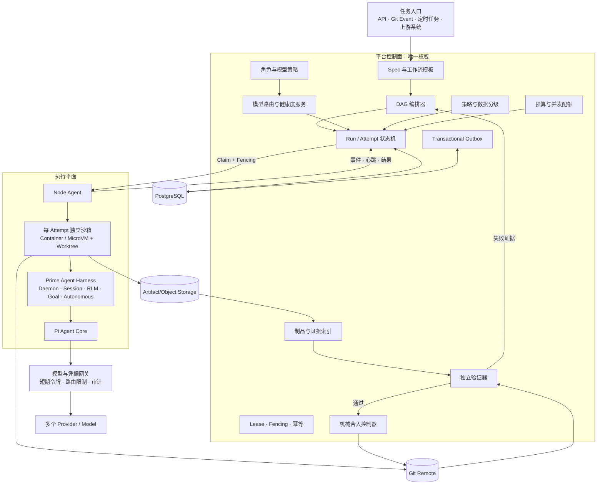
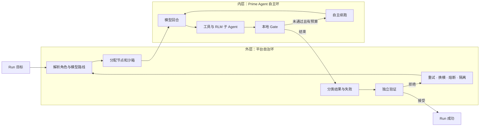
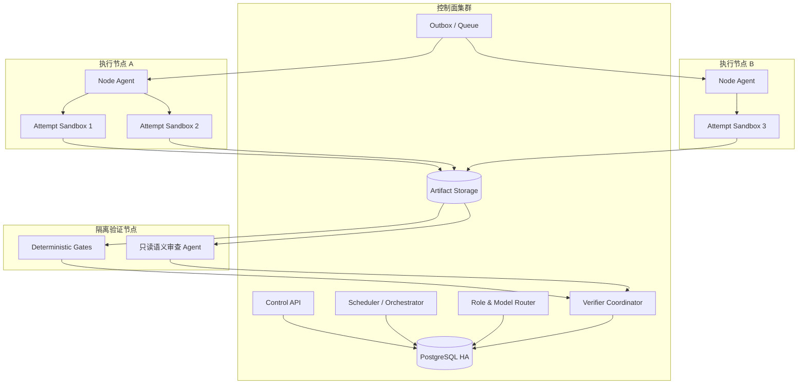
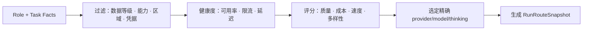
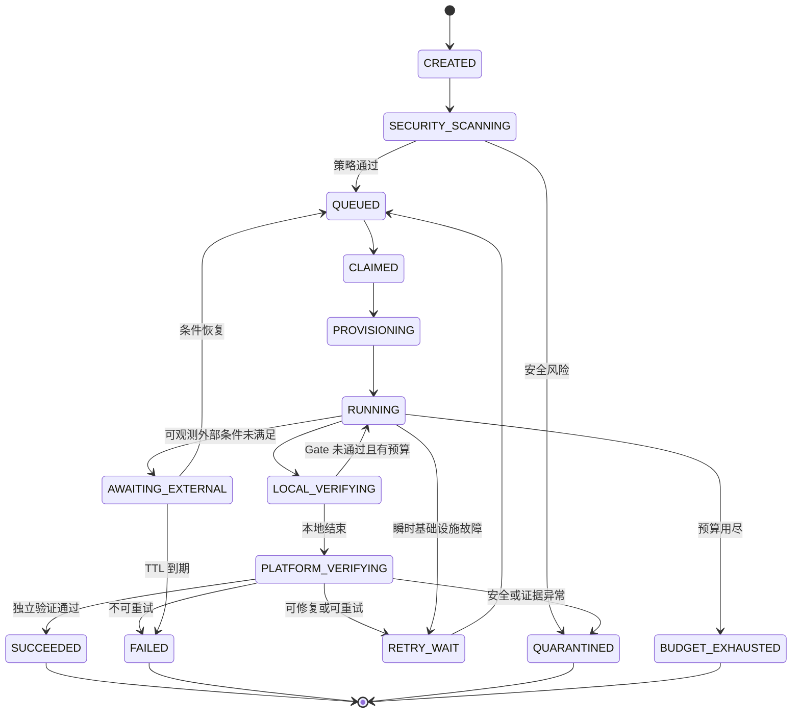
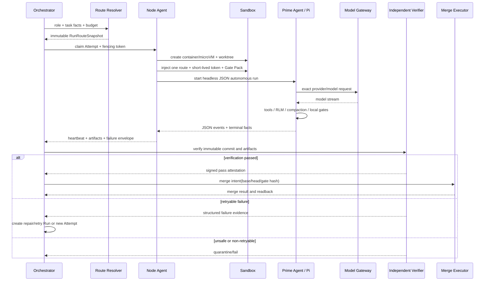

# Pi 多 Agent 无人自治开发平台

## 最终架构蓝图与实现路径（v1.0）

> 文档日期：2026-09-02  
> 文档性质：总体架构设计、技术蓝图、实施路径与可行性预测  
> 适用范围：软件研发、代码审查、测试修复、制品生成与受控合入等无人值守 Agent 任务  
> 约束：本文只给出架构和设计方案，不包含具体实现代码

---

## 0. 执行摘要

本平台的最终方向不是把 CCB、Anneal、Pi 和 Prime Agent 机械拼接，而是按职责分层建设自己的平台：

- **平台控制面**：借鉴 Anneal 的任务、Run、Attempt、租约、Fencing、工作流和机械合入思想，自建唯一权威控制面。
- **Agent 内核**：坚持使用 Pi 体系的模型调用、工具循环和会话能力。
- **无人运行壳**：优先采用 Prime Agent 作为 Pi 之上的长期运行框架，复用其 Daemon、持久会话、RLM 子 Agent、自动压缩、Goal 和 Autonomous Mode。
- **CCB 的位置**：由于正式运行过程不再有人类参与，CCB 的窗格展示和人工接管不再是核心依赖；仅借鉴 Role Pack、消息账本、状态可见性等设计思想。
- **模型选择**：Agent 永远不绑定 provider。平台根据角色、任务、数据等级、预算和实时健康度，在 Run 创建时解析为具体的 `provider/model`。
- **安全与成功裁决**：模型不能自行宣布成功。最终成功必须同时经过确定性质量门禁、平台独立验证器和安全策略检查。

推荐的总体组合为：

> **Anneal 风格控制面 + Prime Agent 无人运行壳 + Pi Agent 内核 + 平台模型路由器 + 外部沙箱 + 独立验证器 + 机械 Git 集成**

该方案适合从单节点 MVP 逐步演进到多节点生产集群，并且保持任务状态、模型路由和安全决策只有一个权威来源。

---

## 1. 已确定的需求与边界

### 1.1 已确定需求

1. 正式任务运行期间不依赖任何人类输入、审批、接管或补充说明。
2. Agent 平台使用 Pi 体系作为 Agent 内核。
3. Agent 本身不指定 LLM provider，也不固定具体模型。
4. 平台根据不同角色和任务上下文，动态选择不同模型和 provider。
5. 支持多个 Agent 分工、任务依赖、并发执行、自动复核、自动修复和受控合入。
6. 支持长时间运行、断点恢复、故障重试、预算限制和无人终止判定。
7. 所有执行必须可审计、可复现、可追踪，并且不能因为 Agent 自己声称“完成”就判定成功。

### 1.2 首期明确不做

- 不把人工审批伪装成一个永远等不到的状态。
- 不让 Agent 直接掌握生产环境永久凭据。
- 不允许 Agent 直接决定生产发布。
- 不允许多个调度器同时拥有同一个 Agent 进程或同一个工作区。
- 不把 Prime Agent 的本地 Daemon 当作跨节点控制面。
- 不让 Prime Agent 的 `/refine` 结果未经验证直接升级为全局规则。
- 不在同一个可写 worktree 中安排多个独立实现 Agent 自由并发修改。

### 1.3 对“无人参与”的准确解释

无人参与不等于没有治理，而是把人类原来承担的职责替换为平台机制：

| 原来由人完成 | 无人平台中的替代机制 |
|---|---|
| 补充模糊需求 | 假设账本、默认规则、可验证条件；无法验证则失败或隔离 |
| 审批高风险操作 | 策略引擎、权限边界、自动拒绝、自动灰度和回滚 |
| 判断是否完成 | 可执行验收标准、独立验证器、质量 Gate |
| 发现 Agent 卡死 | 心跳、停滞检测、预算、进程监督和租约回收 |
| 决定是否重试 | 结构化失败分类和重试策略 |
| 处理反复失败 | 熔断、隔离、死信和定时重新评估 |
| 手工合并代码 | 独立机械 Merge Executor |

---

## 2. 最终技术选型

### 2.1 各参考项目的最终定位

| 项目 | 在目标平台中的定位 | 采用方式 |
|---|---|---|
| Anneal | 控制面、DAG、Run/Attempt、租约、Fencing、工作区、Gate、机械合入的主要参考 | 借鉴架构和数据模型，按自身需求重新实现 |
| Prime Agent | Pi 之上的无人运行壳，负责单个根会话树的长期运行 | 优先作为版本固定的执行组件接入 |
| Pi | Agent 模型调用、工具循环和模型/provider 适配的底层内核 | 通过 Prime Agent 内含的 Pi 派生核心使用；保留直接接入原版 Pi 的备选路线 |
| CCB | Role Pack、消息账本、执行可见性和恢复思想 | 只借鉴概念，不作为生产执行链核心依赖 |

### 2.2 为什么不再采用“CCB 通道 + Anneal 通道”双运行时

此前双通道设计的主要价值是：一条无人产线，一条可见、可人工接管的协作通道。现在已经明确任务运行过程没有人类参与，因此：

- CCB 最有价值的 Pane、终端接管和人在环能力不再是刚需。
- CCB 的消息、常驻和恢复能力与 Prime Agent 的 Daemon、Agent-to-Agent Message、RLM 子 Agent 出现较多重叠。
- 双运行时会引入两个会话账本、两个进程管理者和两套完成判定，增加双控风险。
- CCB 为 AGPL-3.0；Prime Agent 和 Anneal 为 MIT。自有项目采用 MIT 组件、对 CCB 只做架构借鉴，许可边界更清晰。

因此最终架构只保留一条正式执行链：

> **控制面 → Node Agent → 隔离沙箱 → Prime Agent/Pi → 模型网关**

---

## 3. 关键术语

为了避免“provider”一词混用，平台必须区分以下概念：

| 术语 | 含义 |
|---|---|
| Agent Kernel | Agent 的底层推理与工具循环，本平台固定为 Pi 体系 |
| Execution Harness | 管理 Agent 长期运行、会话、子 Agent 和恢复的外壳，推荐 Prime Agent |
| Model Provider | Pi/Prime Agent 中的模型接入名称，如 `cpa`、`anthropic`、`openai-codex` |
| Upstream Vendor | provider 背后真正的模型服务商；代理 provider 可能转发到多个厂商 |
| AgentSlot | 平台中的逻辑 Agent 工位，只描述角色和容量，不保存模型 |
| Role | 规划、实现、审查、修复等职责及权限定义 |
| ModelPolicy | 角色应该使用什么能力等级、成本等级和备选路线的策略 |
| ModelRoute | 某次运行最终解析出的精确 `provider/model + thinking` |
| Task | 用户或上游系统给出的完整目标 |
| Run | 工作流中的一个角色步骤 |
| Attempt | Run 的一次具体执行尝试，对应一个进程所有者和一个隔离环境 |
| Session | Prime Agent/Pi 保存的对话和执行上下文 |
| Gate | 可重复执行、结果确定的验收检查 |
| Verifier | 位于 Agent 外部、负责最终证据裁决的验证服务 |

---

## 4. 架构原则与不可破坏的约束

1. **PostgreSQL 是任务状态唯一权威来源。** Prime Agent 会话文件、Git 分支和对象存储都是证据或执行载体，不反向取代控制面。
2. **Agent 不绑定 provider 和模型。** AgentSlot 只绑定 Role，Role 只绑定 ModelPolicy。
3. **路由在 Run/Attempt 创建时冻结。** 已运行任务不受后续角色配置变更影响。
4. **一个 Attempt 只能有一个进程所有者。** Node Agent 通过租约和 Fencing Token 获得所有权。
5. **Prime Agent 的 Daemon 只负责单节点会话树。** 跨节点调度、重试和最终状态由平台控制面负责。
6. **模型切换不是普通重试。** 更换 provider、模型或 thinking 必须创建新 Attempt；原则上创建新的 Prime Agent 会话。
7. **恢复会话必须验证 Route Fingerprint。** 角色、模型、thinking、工具策略、Prompt、代码基线任一不一致都禁止直接恢复。
8. **模型输出不是完成证明。** `SUCCEEDED` 只能由平台验证器写入。
9. **所有外部副作用都必须经过平台代理。** Git 合并、部署、数据库写入、消息发送等不能由 Agent 凭口头结论直接执行。
10. **每个 Attempt 都在外部沙箱中执行。** Prime Agent 的 Worker 和 Python Kernel 不是安全沙箱。
11. **写任务使用独立 worktree。** 多个可写 Agent 不共享同一个工作目录。
12. **机械动作不使用 LLM。** 能用确定性程序完成的 Git 合并、校验、签名和发布不交给 Agent。
13. **预算耗尽不是成功。** 必须明确落入 `BUDGET_EXHAUSTED` 或失败状态。
14. **所有上游版本固定。** Prime Agent、角色包、Gate Pack 和 Prompt Bundle 都以版本和哈希进入运行快照，禁止自动升级。

---

## 5. 总体架构蓝图

### 5.1 逻辑分层



### 5.2 双层自治控制环

平台不能只依赖 Prime Agent 的 Autonomous Mode。推荐采用内外两个自治环：



内层负责“继续把当前工作做好”，外层负责“是否接受、是否换模型、是否重新调度以及是否允许进入下一步”。

### 5.3 多节点部署拓扑



控制面和执行节点之间只传递任务契约、路由快照、短期凭据引用和制品引用；不共享可写 worktree。

---

## 6. 核心组件设计

### 6.1 控制面

#### 6.1.1 Spec 与 Workflow Registry

- 保存版本化任务规范、工作流模板和验收契约。
- 工作流步骤只引用 Role，不引用模型和 provider。
- 新版本模板只影响新创建的 Run。
- 任务必须携带可执行验收条件；没有验收条件的任务进入受限模式或拒绝无人执行。

#### 6.1.2 Orchestrator / DAG Engine

- 根据模板创建 Run DAG。
- 管理依赖、并行波、重试和跳过条件。
- 负责平台级 Agent 委派，而不是让 Prime Agent 自由创建所有正式角色。
- 处理 `RETRY_WAIT`、`AWAITING_EXTERNAL` 和 Dead Letter。

#### 6.1.3 Role 与 Model Policy Registry

- Role 定义职责、输入输出契约、工具权限、数据权限和默认预算。
- ModelPolicy 定义能力需求、允许的路线集合、thinking、成本和降级顺序。
- AgentSlot 仅表示某种角色可以分配多少并发，不保存具体模型。

#### 6.1.4 Route Resolver

路由解析输入包括：

- Role 和 Role Revision；
- 任务类型、复杂度和上下文规模；
- 数据等级与合规区域；
- 模型/provider 实时健康度；
- 当前限流、预算和单位成本；
- 所需工具调用、图像或长上下文能力；
- 独立审查的模型多样性要求。

解析结果为一个不可变 `RunRouteSnapshot`，其中不保存密钥值。

#### 6.1.5 Run / Attempt Service

- Run 表示一个角色步骤。
- Attempt 表示一次实际进程执行。
- 所有状态写入需要 Fencing Token。
- Node Agent 只能更新自己当前持有租约的 Attempt。
- 不允许旧节点在租约失效后补写结果。

#### 6.1.6 Budget 与 Quota Service

至少管理：

- 每个 Attempt 的最大时间、回合、Token、费用和子 Agent 数；
- 每个 Task 和 Workflow 的总预算；
- 每个 provider、模型、项目和节点的并发额度；
- 相同失败的最大重复次数；
- RLM 最大递归深度和同时活动子 Agent 数。

Prime Agent 自身没有平台级总并发上限，因此必须在外部控制。

#### 6.1.7 Policy Enforcement Plane

- 在 Prompt、文件读取、网络访问、工具调用、制品上传、Git Push 和 Merge 前执行策略。
- 确定性规则优先；本地模型只做语义风险识别，不能成为唯一裁决者。
- 对安全违规执行停止沙箱、撤销令牌和隔离制品。

#### 6.1.8 Evidence 与 Artifact Service

保存或索引：

- Run 输入快照；
- Prompt Bundle 哈希；
- Prime Agent JSON 事件流；
- 最终消息和 `stopReason`；
- Git base/head SHA、diff 和 worktree 状态；
- 测试、构建、扫描和评审结果；
- Token、费用、模型响应和路由健康事实；
- Assumption Ledger 与 Failure Envelope。

#### 6.1.9 Independent Verifier

验证器与执行 Agent 分离，按 Gate Pack 执行：

1. 任务特定验收测试；
2. 编译、静态检查和单元测试；
3. 安全和敏感信息扫描；
4. 禁止路径、依赖和许可证策略；
5. Diff 范围与需求覆盖；
6. 独立模型的只读语义审查；
7. 制品完整性和可复现性；
8. 预算和审计完整性。

只有 Verifier 可以把 Run 写为 `SUCCEEDED`。

#### 6.1.10 Merge Executor

- 独立身份、独立进程、最小 Git 权限。
- 只接受已经通过 Gate 的不可变 Commit SHA。
- 合入前重新读取目标分支和 Required Checks，防止基线漂移。
- 合入动作使用幂等键和 CAS 语义。
- LLM 不参与最终 Git 合并命令的决策和执行。

### 6.2 Node Agent

Node Agent 是每台执行机器上唯一允许拥有 Prime Agent 进程的平台代理，职责包括：

1. 向控制面注册节点能力和当前容量；
2. 认领带 Fencing Token 的 Attempt；
3. 创建独立 worktree、容器或 MicroVM；
4. 创建只包含本次路线的 Prime Agent 配置；
5. 注入短期模型网关令牌和最小工具权限；
6. 启动 Prime Agent Headless Driver；
7. 收集 JSON 事件、stderr、退出码和会话文件；
8. 定期上报心跳、进度、Token 和停滞证据；
9. 在取消、超时或安全违规时终止整个进程树；
10. 上传制品并回收工作区。

Node Agent 不负责决定任务是否成功，只负责忠实执行和报告。

### 6.3 Prime Agent Harness

优先复用 Prime Agent v0.9.1 的以下能力：

- Daemon Supervisor、Session Worker 和 Kernel 生命周期；
- 会话 JSONL、断开后继续运行和恢复；
- Python REPL 与 RLM 子 Agent；
- 自动上下文压缩；
- Goal、Heartbeat 和 Schedule；
- Autonomous Mode 的续跑、时间、回合、Token 和 Gate 限制；
- JSON/RPC 事件接口；
- 自定义模型和 provider 配置；
- 子 Agent 的精确模型和 thinking 选择。

平台不直接继承的能力：

- Prime Agent 本地 Schedule 不作为平台全局调度器；
- Prime Agent 本地 Agent Message 不作为跨节点权威消息总线；
- Prime Agent Gate 不单独决定平台成功；
- Prime Agent Daemon 不作为安全沙箱；
- Prime Agent 全局 Harness Refinement 不允许自动进入生产规则。

### 6.4 Pi Agent Core

Pi 体系在本方案中负责：

- 把模型消息、thinking、工具调用和结果组织成 Agent Loop；
- 对接多个 LLM provider 和自定义代理；
- 维护模型目录和 provider 兼容性；
- 支持结构化输出和会话上下文。

平台不会让 Pi 自己承担：

- 跨节点调度；
- 任务 DAG；
- 强租约和 Fencing；
- 最终验收；
- 安全沙箱；
- Git 合入权威。

### 6.5 Model/Credential Gateway

推荐在 Agent 与真实 provider 之间增加平台网关：

- Agent 只看到短期、限模型、限预算的访问令牌；
- 网关根据 Route Snapshot 校验模型是否被允许；
- 防止 Agent 利用同一个 provider 令牌调用未经授权的其他模型；
- 统一做速率限制、审计、成本计量、脱敏和故障探测；
- 真实上游密钥保存在沙箱之外；
- 网关不可用时按数据等级 Fail Closed。

---

## 7. 数据模型蓝图

### 7.1 核心实体

| 实体 | 关键字段 | 作用 |
|---|---|---|
| AgentSlot | `roleId`、`capacityClass`、`enabled` | 逻辑 Agent 工位，不含 provider/model |
| RoleDefinition | `roleRevision`、权限、输入输出 Schema、预算策略 | 定义 Agent 应该做什么 |
| ModelPolicy | 候选能力档、thinking、成本、降级规则 | 定义角色应该使用什么类型的模型 |
| ModelRouteCandidate | `provider`、`modelId`、能力、成本、区域 | 路由器可选择的具体路线 |
| Task | Spec、验收契约、数据等级、工作流版本 | 完整目标 |
| Run | `taskId`、`roleId`、依赖、状态 | 工作流中的角色步骤 |
| Attempt | `runId`、`attemptNo`、节点、状态、失败分类 | 一次具体执行 |
| RunRouteSnapshot | 精确路线、版本、策略和哈希 | 保证运行可复现 |
| SessionBinding | Prime Session ID、路径、Route Fingerprint | 控制是否可以恢复会话 |
| Lease | generation、fencingToken、expiresAt | 防止双写和旧节点回写 |
| Artifact | 类型、URI、哈希、生成者 | 保存输出和证据 |
| GateExecution | Gate Pack、命令、退出事实、日志哈希 | 确定性验收记录 |
| PolicyDecision | 决策、策略版本、证据 | 安全裁决 |
| AssumptionRecord | 假设、依据、影响、验证状态 | 替代向人提问 |
| FailureEnvelope | 阶段、类别、重试性、证据 | 自动重试和熔断依据 |
| MergeIntent | base/head SHA、授权 Gate、幂等键 | 机械合入意图 |
| OutboxEvent | 事件类型、幂等键、投递状态 | 跨组件可靠事件 |

### 7.2 RunRouteSnapshot 建议字段

```text
runRouteId
roleId / roleRevision
modelPolicyId / modelPolicyRevision
executionHarness = prime-agent
executionHarnessVersion = 0.9.1
agentKernel = pi-derived
modelProvider
modelId
thinkingLevel
modelCatalogRevision
promptBundleHash
toolPolicyHash
gatePackHash
sandboxProfileId
credentialProfileRef
sourceRepository
baseCommitSha
workspacePolicyHash
routeFingerprint
resolvedAt
```

其中 `credentialProfileRef` 只是引用，数据库和运行快照不保存明文密钥。

---

## 8. 角色与模型路由设计

### 8.1 推荐角色集合

| 角色 | 主要职责 | 默认权限 | 模型策略方向 |
|---|---|---|---|
| Orchestrator | 分解任务、形成 DAG、汇总证据 | 只读；不得修改代码 | 强推理、长上下文、较高稳定性 |
| Researcher | 检索仓库、文档和外部资料 | 只读、受限联网 | 长上下文、检索和信息综合能力 |
| Planner | 输出可执行计划和验收映射 | 只读 | 强规划和约束理解 |
| Implementer | 在独立 worktree 中实现 | 指定文件范围可写 | 编码能力、工具稳定性、成本平衡 |
| Reviewer | 独立审查 Diff 和需求覆盖 | 只读 | 与 Implementer 尽量不同的模型族或 provider |
| Repairer | 根据已接受的问题修复 | 受限可写 | 强修复能力，输入包含失败证据 |
| Semantic Verifier | 语义验收补充 | 只读、无合并权 | 高可靠、与实现模型去相关 |
| Integrator | Git 合入 | 非 Agent | 确定性程序，不使用模型 |

### 8.2 路由解析流程



解析结果在 Run 创建后不可修改。若路线失效：

- 模型请求级瞬时故障：Prime Agent 在当前 Attempt 内按配置重试；
- 进程或节点故障：创建新 Attempt，保持同一 Route Snapshot；满足严格条件时可恢复原 Session；
- provider/model 需要切换：创建新 Attempt、新 Route Snapshot 和新 Session；
- 不能把一次换模伪装成原 Attempt 的继续执行。

### 8.3 平台级 Agent 与 Prime RLM 子 Agent 的边界

**平台级 Agent/Run：**

- 有明确角色、Route Snapshot、独立预算和状态；
- 写任务拥有独立沙箱和 worktree；
- 可跨节点调度；
- 是正式审计和验收对象。

**Prime Agent 原生 RLM 子 Agent：**

- 属于一个根 Attempt 内部；
- 适合搜索、分析、只读审查和小范围辅助；
- 共享根任务的故障域和通常相同的工作目录；
- 不应替代平台 DAG、租约和跨节点 Agent；
- 默认继承父模型；若需要不同正式角色，应通过平台创建新的 Run。

首期建议把 RLM 子 Agent 限定为只读，最大递归深度不超过 1～2，并设置严格的活动数量和 Token 上限。

---

## 9. 无人自治状态机

### 9.1 Task/Run 主状态



### 9.2 成功判定合同

Run 成功至少同时满足：

1. Prime Agent 没有以 `error` 或 `aborted` 结束；
2. Autonomous Mode 没有因预算耗尽而停止；
3. 所有本地 Gate 通过；
4. Task Output 符合结构化 Schema；
5. 工作区变化符合允许范围；
6. 平台验证节点上的 Gate Pack 通过；
7. 安全扫描和敏感信息扫描通过；
8. 必要的独立语义审查通过；
9. 所有证据、日志、Git SHA 和路由快照完整；
10. 最终状态写入时租约和 Fencing Token 仍有效。

### 9.3 无人条件下的模糊与阻塞处理

Agent 如果准备询问用户，Prime Agent Autonomous Mode 可以注入“无人可回答，请作合理假设并验证”的续跑指令。平台必须同步记录：

- 假设内容；
- 为什么必须假设；
- 可能影响哪些输出；
- 使用什么证据验证；
- 验证是否完成。

如果假设无法安全验证，则不得继续扩大影响范围，应进入：

- `AWAITING_EXTERNAL`：缺失的是可自动恢复的外部条件；
- `FAILED_SPEC_AMBIGUOUS`：规范无法形成可验证目标；
- `QUARANTINED`：继续尝试可能造成安全或数据风险。

---

## 10. 一次完整执行链路



---

## 11. Prime Agent 接入规范

### 11.1 推荐运行方式

生产执行优先使用 Headless JSON 模式，由 Node Agent 持有进程并解析事件。每次运行必须显式设置：

- 精确模型路线；
- 单独的 thinking；
- Autonomous Mode 预算；
- 一个或多个签名 Gate；
- 独立 Session Directory；
- 独立 Agent Config Directory；
- `offline` 或等价启动策略，禁止非必要的启动联网；
- 明确的 Skills、Extensions、Context Files 白名单。

### 11.2 为什么不能只看退出码

Node Agent 的结果分类应同时读取：

- 进程退出码；
- JSON 事件中的最终 Assistant Message；
- `stopReason` 和错误信息；
- Autonomous Gate 状态；
- Token/时间/回合是否触及限制；
- 子 Agent 是否真正静默完成；
- 工作区、Commit 和制品是否完整。

任何一项缺失都只能形成 `NO_VERDICT` 或失败，不能推定成功。

### 11.3 会话恢复规则

只有同时满足以下条件才允许恢复 Prime Agent Session：

1. `routeFingerprint` 完全一致；
2. `provider/model/thinking` 完全一致；
3. Role Revision、Prompt Bundle 和 Tool Policy 完全一致；
4. Git base/head 和 worktree 快照可证明连续；
5. 上一 Attempt 的外部副作用状态明确；
6. 没有同时活动的旧 Worker 或旧租约；
7. 新 Attempt 获得了更高 generation 的 Fencing Token。

否则从最后一个可信 Git/Artifact Checkpoint 创建新会话。

### 11.4 Prime Agent 自我改进的治理

Prime Agent Continual Harness 可以保存 Prompt、Memory、Skill 和 Subagent Spec。无人平台中必须分级：

```text
Session Local Learning
        ↓ 自动评测
Candidate Bundle
        ↓ 回归集 + 安全扫描 + Canary
Approved Version
        ↓ 签名发布
Production Role Pack
```

禁止 Agent 直接执行全局 `/refine` 并让所有后续任务立即继承。全局提升必须是平台受控的自动发布流程，能够回滚到上一版本。

---

## 12. 安全蓝图

### 12.1 威胁模型

主要风险包括：

- 仓库中的 Prompt Injection 或恶意 AGENTS.md；
- Agent 读取或外传密钥、客户数据和内部资料；
- 生成代码或测试脚本逃逸执行环境；
- 第三方 Skill、Extension、npm 包和安装脚本供应链风险；
- Agent 通过网关调用未授权模型或无限消耗预算；
- 并发 Agent 互相覆盖文件或提交；
- 旧节点恢复后继续写入；
- Gate 被 Agent 修改后伪造通过；
- 模型和评审模型产生相关性错误；
- Agent 直接操作生产系统造成不可逆副作用。

### 12.2 必须具备的控制

| 层面 | 控制措施 |
|---|---|
| 计算 | 每 Attempt 独立容器/MicroVM、非特权用户、资源限制、只读基础镜像 |
| 文件 | 独立 worktree、路径 Allowlist、禁止宿主目录和其他 Attempt 目录 |
| 网络 | 默认拒绝、域名/IP/协议白名单、所有模型请求经过网关 |
| 凭据 | 短期令牌、只允许一个模型路线、运行结束立即撤销 |
| 工具 | 角色级 Allowlist、危险命令策略、外部副作用平台代理 |
| Prompt | 禁止自动加载未审核全局资源；仓库指令按不可信输入处理 |
| 依赖 | 固定版本、离线缓存、SBOM、签名和漏洞扫描 |
| Git | 每 Attempt 独立分支、保护主分支、机械 Merge Executor |
| Gate | Gate Pack 只读挂载、哈希进入 RunRouteSnapshot |
| 审计 | 全事件、策略、路由、工具、制品和成本均可追溯 |
| 熔断 | 超预算、重复失败、异常网络和安全违规自动终止 |

### 12.3 数据分级

| 等级 | 模型路线 | 执行要求 |
|---|---|---|
| PUBLIC | 可使用合规的外部模型 | 常规沙箱和日志 |
| INTERNAL | 脱敏后可使用外部模型 | 输入输出双向扫描 |
| CONFIDENTIAL | 仅允许批准的私有网关或本地模型 | Fail Closed、严格出口控制 |
| RESTRICTED | 隔离节点和专用模型 | 默认不进入首期无人平台 |

### 12.4 生产副作用原则

首期 Agent 只能生成“期望变更”和验证证据，不能直接持有生产发布权限。后续如果加入无人部署，也必须满足：

- Agent 输出部署意图；
- 确定性 CD Controller 执行；
- 自动 Canary；
- SLO/健康 Gate；
- 自动回滚；
- 失败后禁止 Agent 自行扩大流量或修改监控阈值。

---

## 13. Git、Worktree 与合入设计

### 13.1 分支规则

每个 Attempt 使用不可变身份形成分支，例如：

```text
agent/<taskId>/<runId>/<attemptNo>
```

分支必须记录 `baseSha` 和最终 `headSha`。新 Attempt 不复用另一个仍可能活动的可写 worktree。

### 13.2 并行原则

- 并行 Researcher/Reviewer 可以在只读 checkout 中运行。
- 并行 Implementer 必须拥有不同 worktree，最好进一步限定文件所有权或模块边界。
- Prime Agent 内部 RLM 子 Agent 不用于多个自由写者并发修改同一个工作区。
- 多实现结果由平台建立合并 Run，在独立集成 worktree 中机械合并并重新验证。

### 13.3 合入条件

主分支只接受以下对象：

- 不可变 Commit SHA；
- 完整 Route Snapshot；
- 平台 Gate Attestation；
- 安全扫描 Attestation；
- 基线未漂移或已经重新验证；
- Merge Intent 幂等键未使用；
- Merge Executor 当前身份和权限有效。

---

## 14. 故障、重试与恢复策略

| 故障 | 默认动作 | 是否换模型 | 是否恢复 Session |
|---|---|---:|---:|
| provider 瞬时 429/5xx/断流 | 当前 Attempt 内有界重试 | 否 | 是 |
| 精确路线长期不可用 | 结束 Attempt，路由器选下一候选 | 是 | 否 |
| Prime Agent Worker 崩溃 | 新 Attempt 接管，验证检查点 | 否 | 条件满足才允许 |
| Node Agent/主机失联 | 等待租约到期，Fencing 后重新调度 | 否 | 条件满足才允许 |
| Agent 向用户提问 | Autonomous 续跑并记录假设 | 否 | 是 |
| 本地 Gate 失败 | 在预算内继续修复 | 否 | 是 |
| 相同 Gate 失败且工作区无变化 | 停止重复消耗，结束或换 Repair Run | 可选 | 通常否 |
| 独立 Verifier 拒绝 | 新 Repair Run 或新 Attempt | 按策略 | 否 |
| 输出 Schema 缺失 | 一次有界修复续跑 | 否 | 是 |
| 预算耗尽 | `BUDGET_EXHAUSTED` | 不自动 | 否 |
| 缺失可自动恢复的外部依赖 | `AWAITING_EXTERNAL` + 定时检查 | 否 | 可选 |
| 安全策略违规 | 立即杀进程、撤销令牌、隔离制品 | 否 | 禁止 |
| 连续重复失败达到阈值 | 熔断、Dead Letter 或 Quarantine | 否 | 禁止 |

所有重试都必须有新的幂等标识。平台不能根据“进程没回应”直接假定之前没有产生副作用。

---

## 15. 可观测性与运行指标

无人运行仍然需要完整可见性，但可见性用于审计和治理，而不是依赖人实时接管。

### 15.1 必备指标

- Task/Run/Attempt 吞吐和队列等待；
- 每角色成功率、修复率和平均 Attempt 数；
- 每模型路线成功率、延迟、限流率、错误率和单位成功成本；
- Prime Agent 回合数、压缩次数、RLM 子 Agent 数和会话恢复次数；
- Gate 首次通过率、重复失败指纹和无变化重试次数；
- Token、费用和预算耗尽率；
- Lease 过期、Fencing 拒绝和重复写入尝试；
- 沙箱启动/回收时间和逃逸告警；
- 敏感信息命中、策略拒绝和隔离数量；
- Merge 基线漂移和自动回滚数量。

### 15.2 最重要的 SLO

1. 同一个 Attempt 不出现两个有效写者。
2. 未通过验证的 Commit 不进入主分支。
3. 安全违规后令牌和进程在规定时间内失效。
4. 任一成功状态都能回放到完整输入、路线、事件、Gate 和 Git SHA。
5. 预算耗尽、节点失联和验证无裁决不能被记录为成功。

---

## 16. 实现路径

### 阶段 0：架构冻结与契约设计（1～2 周）

**目标：** 把平台语义固定下来，避免边开发边改变 Run、Attempt 和 Session 的含义。

主要工作：

- 冻结领域模型和状态机；
- 确定 Prime Agent 路线与原版 Pi 备选路线的边界；
- 定义 Role、ModelPolicy、RunRouteSnapshot 和 Route Fingerprint；
- 定义 Failure Envelope、Assumption Ledger 和 Gate Attestation；
- 确定首期数据等级和禁止事项；
- 确定上游版本固定与升级策略。

退出条件：所有核心状态、所有权、成功判定和换模语义无歧义。

### 阶段 1：Prime Agent/Pi 技术验证（2～3 周）

**目标：** 证明 Prime Agent v0.9.1 能作为受控执行组件，而不只是交互式工具。

必须验证：

1. 自定义 CPA/provider 与精确模型路线；
2. 模型 ID 中包含冒号时的正确解析；
3. 独立 `model` 与 `thinking`；
4. JSON 事件流、最终 `stopReason` 和退出码分类；
5. Autonomous Gate 通过、失败、预算耗尽和超时；
6. 子 Agent 模型限制和静默完成判定；
7. Worker/Daemon 崩溃、重启和 Session 恢复；
8. Route Fingerprint 不一致时拒绝恢复；
9. 每 Attempt 独立配置和凭据隔离；
10. 外部沙箱终止后没有残留进程。

退出条件：形成一份兼容性矩阵和明确的接入合同。

### 阶段 2：单节点纵向 MVP（4～6 周）

**目标：** 从 Task 创建到代码验证形成一条完整无人链路。

首期组件：

- PostgreSQL 控制面；
- Task/Run/Attempt/Lease；
- 三个正式角色：Planner、Implementer、Reviewer；
- 一个机械 Verifier；
- 一个 Linux Node Agent；
- 容器 + Git worktree；
- Prime Agent Headless Driver；
- 两条以上模型路线；
- Artifact Store；
- 基础 Gate Pack；
- 机械 Git 集成但默认不自动合入主分支。

退出条件：在固定回归仓库上连续完成任务，能够正确区分成功、Gate 失败、预算耗尽、模型故障和节点故障。

### 阶段 3：多 Agent 与自动修复（4～6 周）

**目标：** 支持正式角色 DAG、独立模型审查和失败修复闭环。

主要工作：

- 平台级并行 Run；
- 独立 worktree 和文件所有权；
- Reviewer 与 Implementer 模型多样性；
- Repair Run；
- Assumption Ledger；
- Semantic Verifier；
- Gate 失败指纹和无变化熔断；
- Token/费用预算和 provider 健康路由；
- Merge Executor 和基线漂移处理。

退出条件：同一任务可完成计划、实现、独立审查、修复、回归和受控合入，全程无人工输入。

### 阶段 4：多节点与生产试点（4～8 周）

**目标：** 建立可恢复、可审计的集群化运行能力。

主要工作：

- 多 Node Agent 调度；
- mTLS 或等价节点身份；
- Transactional Outbox；
- 对象存储和不可变制品；
- 模型/凭据网关；
- 安全策略平面；
- Chaos Test：网络分区、节点崩溃、数据库切换、重复投递；
- 版本升级、回滚和 Session 迁移验证；
- Canary 项目和受控自动合入。

退出条件：故障不会产生双写、越权合并或假成功；所有异常都有自动终态。

### 阶段 5：持续自治优化（持续进行）

- 建立角色与模型路线的离线评测集；
- 以“成功成本”而不是单次 Token 价格优化路由；
- 将 Session Local Learning 经过评测后提升为版本化 Role Pack；
- 对不同任务类型做模型 A/B 和 Canary；
- 自动发现高失败步骤，但不允许自动放宽安全或质量标准。

---

## 17. 测试与验收蓝图

### 17.1 测试层次

| 层次 | 重点 |
|---|---|
| 单元测试 | 状态机、路由、预算、Fencing、重试分类、哈希 |
| 合同测试 | Control Plane ↔ Node Agent ↔ Prime Agent JSON 事件 |
| 模型无关测试 | 使用 Faux/Scripted Provider 重放确定性响应 |
| 集成测试 | 真实 Prime Agent、真实 Pi 模型路线、真实 Git worktree |
| 安全测试 | Prompt Injection、密钥读取、网络逃逸、危险命令和恶意依赖 |
| Chaos Test | Worker 崩溃、Node 失联、租约过期、重复消息、数据库切换 |
| 回放测试 | 从 Route Snapshot、事件和 Artifact 重建裁决 |
| 升级测试 | Prime Agent/Pi 升级前后 Session、模型和协议兼容性 |

### 17.2 必须覆盖的反例

- Agent 文本声称完成，但测试未通过；
- Prime Agent 进程退出 0，但 JSON 最终消息为错误；
- Gate 输出被截断或 Gate 进程超时；
- 旧 Node 在新 Attempt 已启动后回写成功；
- 恢复 Session 时模型或 Prompt 已改变；
- reviewer 与 implementer 实际路由到同一模型，违反多样性策略；
- Agent 修改 Gate 脚本后使测试通过；
- Agent 在预算耗尽时输出“任务完成”；
- 子 Agent 尚未完成，父 Agent 已结束；
- 同一 provider 凭据被用来调用未授权模型；
- Agent 把密钥写入日志、Commit 或 Artifact；
- Merge 前目标分支发生变化。

---

## 18. MVP 建议范围

### 18.1 建议纳入

- 单个 Git 仓库；
- 单个 Linux 执行节点；
- Planner、Implementer、Reviewer 三个角色；
- 每次最多 2～4 个正式并发 Run；
- Prime Agent v0.9.1 固定版本；
- 两种模型能力档，provider 由路由器决定；
- 单元测试、静态检查、安全扫描和 Diff 策略；
- 独立 worktree；
- 自动修复一次或两次；
- 无人工交互的明确失败终态；
- 默认只生成候选分支，不直接发布生产。

### 18.2 建议暂不纳入

- 任意递归深度的 RLM Agent；
- Agent 自己安装未知 Skills/Extensions；
- 跨仓库原子事务；
- 无验证标准的开放式业务决策；
- 生产数据库写入；
- 自动修改基础设施和安全策略；
- 自动把自我学习结果推广为全局规则；
- Windows 作为首期生产执行节点。

---

## 19. 可行性与投入预测

以下为工程预测，不是上游项目承诺或测量基准。

### 19.1 可行性

| 目标 | 预测可行性 |
|---|---:|
| 建成自有平台控制面和 Prime Agent 执行层 | 85%～90% |
| 有明确测试与验收条件的无人编码任务 | 75%～85% |
| 多 Agent、跨模型、自动审查与修复 | 65%～80% |
| 缺少可执行验收条件的开放任务 | 40%～60% |
| 无人直接修改生产环境 | 30%～50%，首期不建议 |

### 19.2 团队和周期

建议最小团队：

- 1 名控制面/分布式系统工程师；
- 1 名 Node Agent/沙箱/系统工程师；
- 1 名 Agent Runtime/模型路由工程师；
- 0.5～1 名测试、安全与 DevOps 工程师。

3～4 人团队达到受控生产试点，预计需要 **3～5 个月**。单人全栈实现预计需要 **7～12 个月**，主要风险不在模型调用，而在故障恢复、安全和验收闭环。

---

## 20. 两条 Pi 技术路线

### 20.1 路线 A：使用 Prime Agent 作为 Pi 的长期运行壳（推荐）

这里的“包裹”是架构层面的说法，并不准确等同于：

```text
prime-agent.exe 启动本机已有的 pi.exe
```

Prime Agent v0.9.1 的实际形态更接近：它在自己的代码库和发布物中整合、继承并扩展 Pi 体系的 `pi-ai`、`pi-agent-core`、`pi-coding-agent` 和 TUI 等核心能力，然后在这些能力之外增加：

```text
Prime Agent 产品层
  ├─ Daemon Supervisor / Worker
  ├─ 持久 Session 与恢复
  ├─ Python REPL / RLM 子 Agent
  ├─ Goal / Heartbeat / Schedule
  ├─ Autonomous Mode / Gates / Budgets
  ├─ Agent-to-Agent Message
  └─ JSON / RPC / TUI
          ↓
Pi 派生的 Agent 与模型核心
          ↓
provider/model
```

因此，“使用 Prime Agent 包裹 Pi”更准确的表达是：

> **平台把 Prime Agent 当作 Pi 派生内核的长期运行发行版和执行 Harness，而不是平台自己直接管理每一次原版 Pi CLI 会话。**

优点：

- 少建一套 Daemon、RLM、会话恢复和 Autonomous Loop；
- 原生适合无人长任务；
- 已有 JSON/RPC、子 Agent 和持久状态；
- Prime Agent 与 Anneal 风格控制面职责边界清晰；
- MIT 许可更适合自有平台接入或必要的定制。

代价与风险：

- 平台依赖 Prime Agent 的版本和协议；
- Prime Agent 发展较快，必须固定版本并做升级兼容测试；
- 它不是外部安全沙箱；
- 它的本地 Daemon、Schedule 和 Gate 不能替代平台控制面；
- 如果“必须使用原版 Pi 官方 CLI 进程”是硬性合规要求，则这条路线可能不满足字面要求。

### 20.2 路线 B：直接使用原版 Pi，并重建长期运行层

该路线保留原版 Pi 作为每个 Agent 进程，平台自己在 Pi 外面实现 Prime Agent 已经提供的长期运行能力：

```text
自建 Control Plane
       ↓
自建 Node Agent / Supervisor
  ├─ 自建 Daemon 与进程恢复
  ├─ 自建 Session Binding
  ├─ 自建 RLM / 子 Agent 编排
  ├─ 自建 Goal 状态
  ├─ 自建 Autonomous Continuation
  ├─ 自建 Gate Runner
  └─ 自建 Heartbeat / Schedule
       ↓
原版 pi --mode json/rpc --model ...
       ↓
provider/model
```

这里的“重建”不包括重新实现 LLM 推理和 Pi 的单回合 Agent Loop，而是重建以下外围系统：

#### Daemon

- 后台 Supervisor；
- 每会话 Worker；
- 进程存活和崩溃恢复；
- Client 断开后的继续运行；
- 会话文件租约；
- 命令幂等日志；
- 旧进程树清理；
- 重新连接和事件补发。

#### RLM

- 持久 Python 或其他程序化控制环境；
- 子 Agent 创建、递归深度、并发和预算；
- 子 Agent 独立会话；
- 父子消息和结果回传；
- 子 Agent 故障、取消和用量归集；
- 压缩和恢复后的子 Agent Registry。

#### Goal

- 持久目标对象；
- Token、时间和续跑次数统计；
- 完成、失败、暂停和预算耗尽状态；
- 每轮结束后判断是否需要继续；
- 进程重启后继续呈现目标。

#### Autonomous Mode

- 无人续跑 Prompt；
- 回合、Token、时间和 Continuation 限制；
- Gate 执行和输出截断；
- Gate 失败后的自动修复指令；
- 工作区无变化时避免重复 Gate；
- 终止原因和退出码；
- Budget Exhausted 与 Success 的严格区分。

优点：

- 原版 Pi CLI 是明确、可替换的执行边界；
- 平台能够完全控制协议、状态和安全策略；
- 不依赖 Prime Agent 的内部实现和升级节奏；
- 更容易满足“必须直接运行原版 Pi”的严格要求。

代价：

- 需要重新实现并长期维护大量非业务基础设施；
- 崩溃恢复、幂等、会话恢复和子 Agent 生命周期很容易出现隐蔽错误；
- 预计比路线 A 增加约 **6～10 周** 的团队开发时间；
- 测试面、运维面和后续兼容成本更高。

### 20.3 推荐决策

除非存在“必须直接运行原版 Pi 可执行文件”的审计、合规或技术硬约束，否则推荐路线 A：

> **Prime Agent 负责单个 Agent 会话树的长期运行；自有平台负责跨任务、跨节点、角色路由、安全、验收和集成。**

同时保持一层稳定的 `AgentRuntimeDriver` 接口，使未来可以新增 `NativePiDriver`，避免平台控制面与 Prime Agent 深度耦合。

---

## 21. 风险与应对

| 风险 | 影响 | 应对 |
|---|---|---|
| Prime Agent 快速演进 | 升级破坏协议或 Session | 固定 v0.9.1 起步、兼容测试、Canary 升级 |
| Prime/Pi 语义混淆 | 需求和审计争议 | 文档明确 Agent Kernel 与 Execution Harness 两层 |
| 自主 Gate 覆盖不足 | 假成功 | 平台独立 Verifier 和任务特定测试 |
| 模型路由隐式换模 | 结果不可复现 | Route Snapshot、指纹、换模必须新 Attempt |
| 子 Agent 并发失控 | 成本和文件冲突 | 平台配额、RLM 深度和数量上限、写任务独立 worktree |
| 凭据泄漏 | 严重安全事件 | 外部网关、短期令牌、网络白名单、沙箱外保管真实密钥 |
| Agent 自我学习污染 | 错误规则扩散 | Local→Candidate→Canary→Approved 自动发布链 |
| 无人遇到不可解歧义 | 无限重试或错误假设 | Assumption Ledger、TTL、明确失败和隔离终态 |
| 控制面和 Prime Daemon 双控 | 重复进程和状态冲突 | 控制面只调度 Attempt，Node Agent 是唯一进程所有者 |
| 许可边界不清 | 发布风险 | Prime/Anneal MIT 组件优先；CCB 仅概念借鉴，正式发布前法务复核 |

---

## 22. 最终建议

1. 采用路线 A，以 Prime Agent v0.9.1 作为首期 Pi 长期运行 Harness。
2. 不 fork CCB，也不把 CCB Pane 通道带入首期生产架构。
3. 控制面按照 Anneal 的强状态、租约、Fencing 和机械 Gate 思想重新设计，而不是直接修改 Anneal 成为跨机平台。
4. AgentSlot 永不保存 provider/model；所有路线由 Role + ModelPolicy 在 Run 创建时解析。
5. 首期只接受具有确定性验收条件的代码任务。
6. Prime Agent Autonomous Mode 只作为内层修复循环，平台 Verifier 才是最终裁判。
7. 每 Attempt 独立沙箱、独立 worktree、独立短期模型路线和不可变 Route Snapshot。
8. 先用单节点、三角色、两条模型路线跑通纵向闭环，再扩展多节点和自动合入。
9. 在平台中定义稳定的 `AgentRuntimeDriver` 抽象，为未来直接接入原版 Pi 保留替换能力。

---

## 23. 参考基线

- Prime Agent v0.9.1：https://github.com/PrimeIntellect-ai/prime-agent/releases/tag/v0.9.1
- Prime Agent Architecture：https://github.com/PrimeIntellect-ai/prime-agent/blob/v0.9.1/packages/coding-agent/docs/architecture.md
- Prime Agent Long-running Agents：https://github.com/PrimeIntellect-ai/prime-agent/blob/v0.9.1/packages/coding-agent/docs/long-running-agents.md
- Prime Agent Daemon：https://github.com/PrimeIntellect-ai/prime-agent/blob/v0.9.1/packages/coding-agent/docs/daemon.md
- Prime Agent RLM Runtime：https://github.com/PrimeIntellect-ai/prime-agent/blob/v0.9.1/packages/coding-agent/docs/rlm-runtime.md
- Prime Agent Models：https://github.com/PrimeIntellect-ai/prime-agent/blob/v0.9.1/packages/coding-agent/docs/models.md
- Pi：https://github.com/earendil-works/pi
- Anneal v0.6.0：https://github.com/mosonlab/anneal/tree/v0.6.0
- CCB v8.6.10：https://github.com/SeemSeam/claude_codex_bridge/tree/v8.6.10

---

*本文是当前最终架构基线。后续如果改变“是否必须直接运行原版 Pi CLI”“是否允许无人生产部署”或“任务是否具备确定性验收条件”中的任一项，应重新发起架构决策记录，而不是在实现中隐式改变。*
