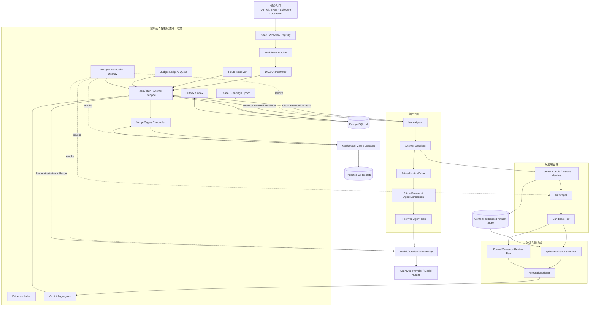
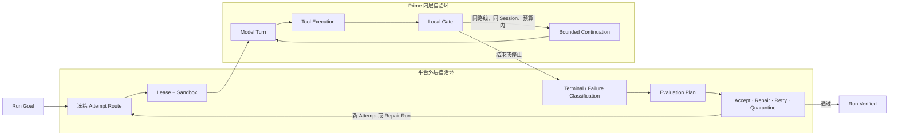
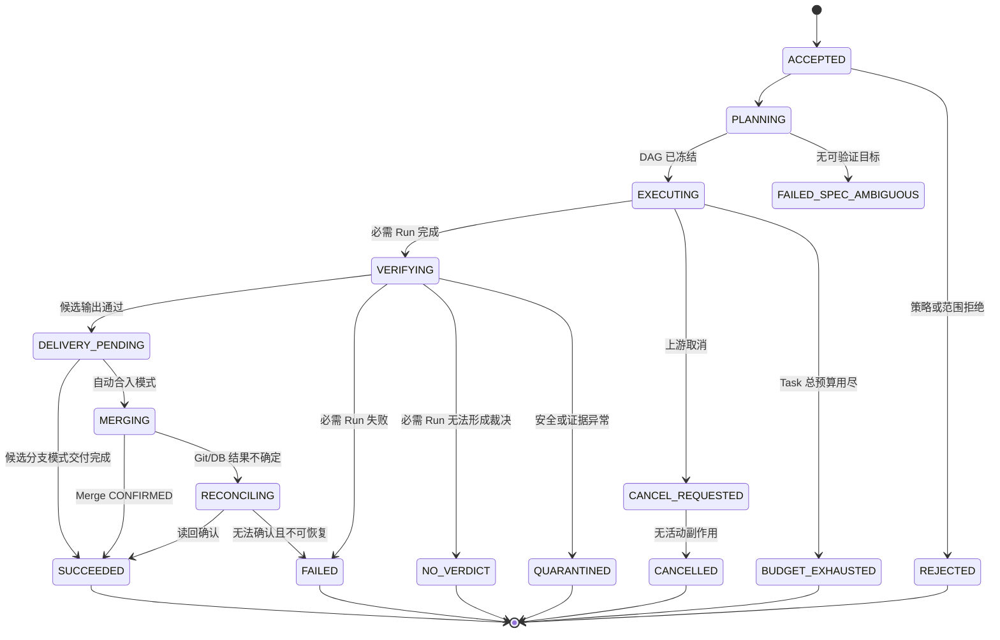
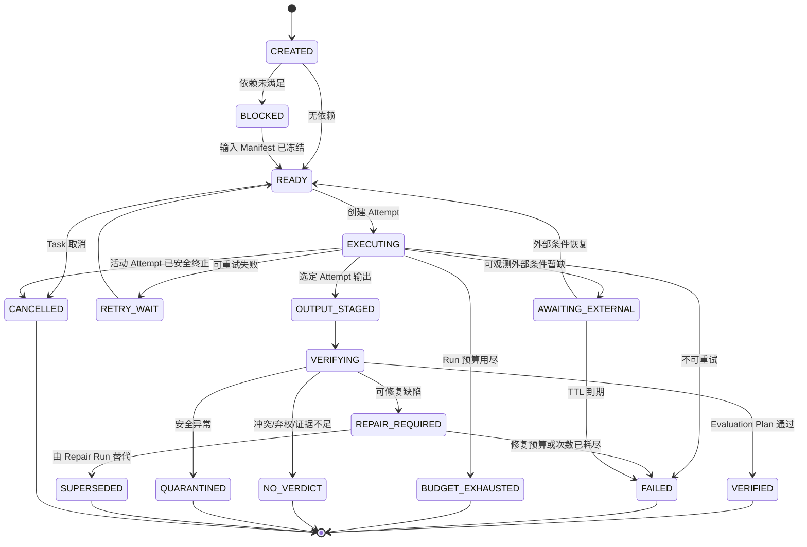
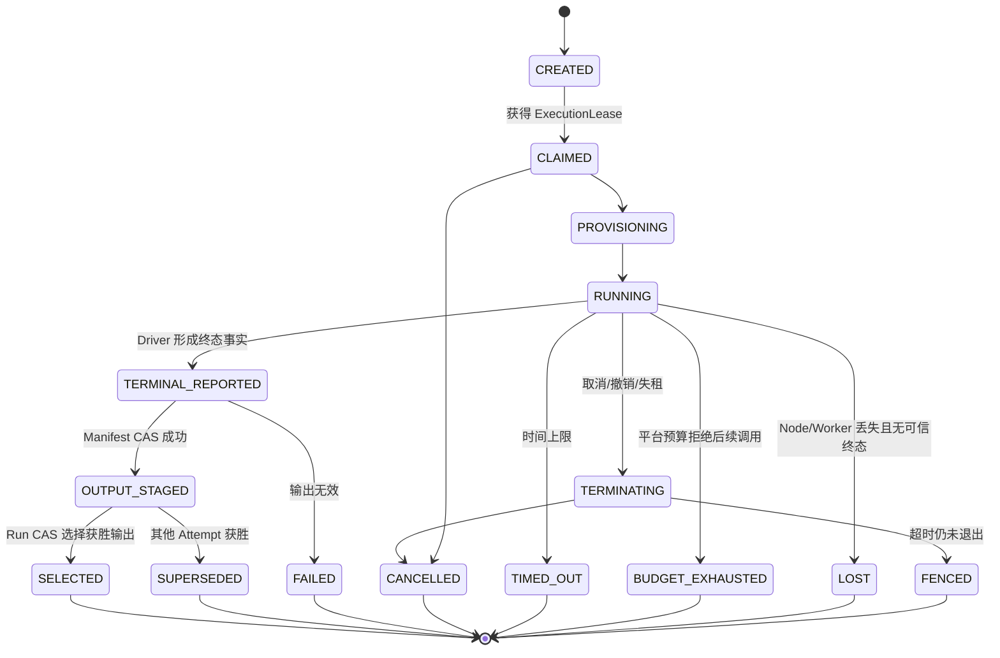
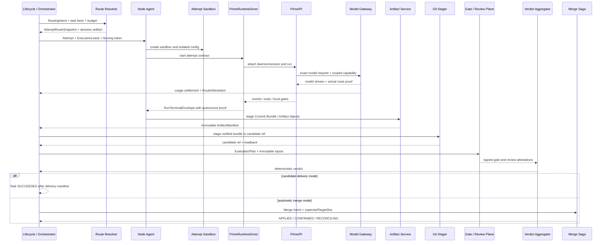
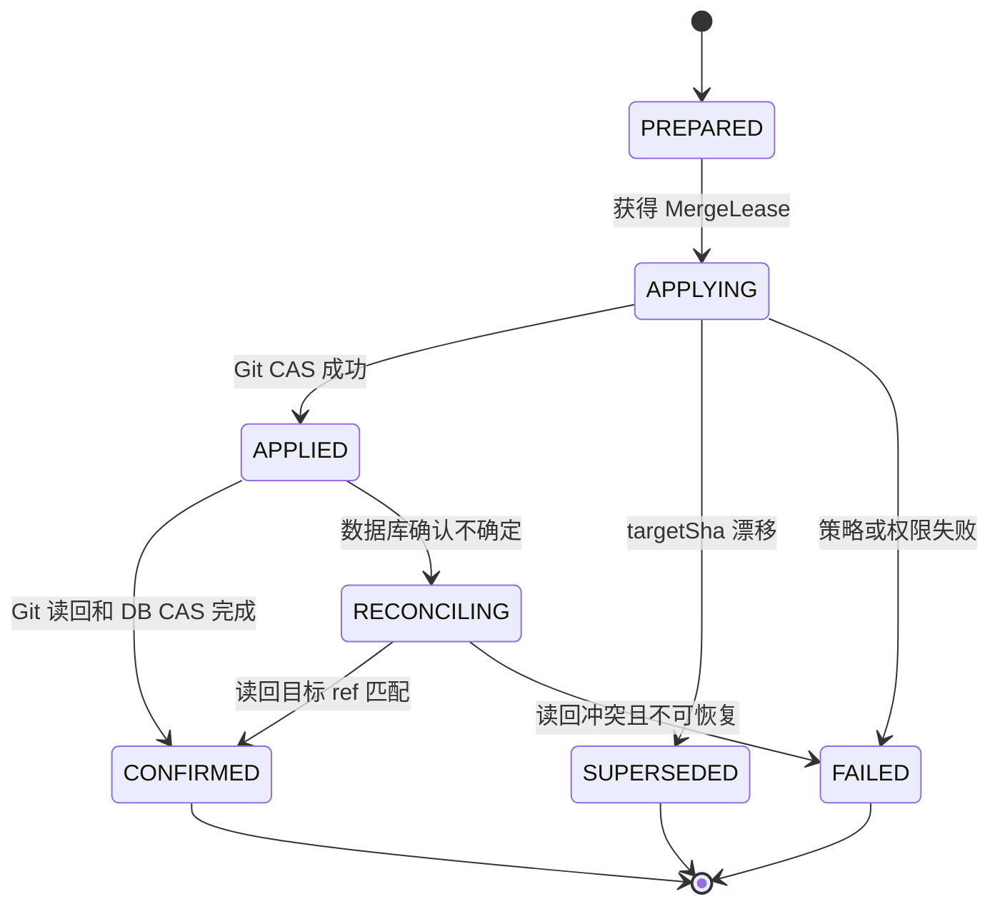

# Pi 多 Agent 无人自治开发平台

## 架构闭环版（v1.1）

> 文档日期：2026-09-02  
> 上一基线：`Pi多Agent无人自治开发平台_最终架构蓝图与实现路径_v1.0.md`  
> 文档性质：总体架构、关键契约、安全边界、实施路径与 Go/No-Go 基线  
> 当前状态：可进入阶段 0“契约冻结”和阶段 1“运行时与安全技术验证”；不构成生产就绪结论  
> 适用范围：软件研发、代码审查、测试修复、制品生成和受控 Git 集成等无人值守 Agent 任务  
> 约束：本文不包含实现代码；文中的指标是建议验收门槛，不是已经取得的测试结果

---

## 0. 执行摘要

本平台继续采用 v1.0 确立的总体方向，不把 CCB、Anneal、Pi 和 Prime Agent 机械拼接，而是建设职责清晰、状态单一权威、运行时可替换的自有平台：

> **Anneal 风格控制面 + Prime Agent/Pi 运行时 + 角色驱动的动态模型路由 + 外部安全沙箱 + 独立验证与裁决 + 机械 Git 集成**

v1.1 不推翻路线 A，但修正 Prime Agent 的接入方式：平台不把 stock Headless JSON CLI 直接视为完整生产协议，而是通过固定版本的 `PrimeRuntimeDriver` 接入 Prime Agent Daemon/AgentConnection，并由 Driver 形成平台定义的结构化终态信封。

最终职责划分如下：

| 层级 | 最终职责 | 明确不承担 |
|---|---|---|
| 自有控制面 | Task/Run/Attempt 生命周期、DAG、租约、路由、预算、安全、验收和合入权威 | 不直接执行 Agent 工具循环 |
| Node Agent | 认领 Attempt、创建隔离环境、持有进程、上传证据和执行取消 | 不判断最终成功 |
| PrimeRuntimeDriver | 对接固定版本 Prime Agent，管理事件、完成屏障、Session 和终态合同 | 不承担跨节点调度和平台预算权威 |
| Prime Agent/Pi | 单个根会话树内的推理、工具循环、Goal、Session、可选 RLM 和内层自主修复 | 不承担安全沙箱、正式角色 DAG、最终验收和 Git 合入 |
| Model/Credential Gateway | 精确路线校验、实际模型证明、预算计量、短期凭据和撤销 | 不替模型输出作质量判定 |
| Independent Verifier | 在隔离环境中产生机械 Gate 和语义评审证明 | 不直接修改业务代码，不持有合入权限 |
| Verdict Aggregator | 按不可变 Evaluation Plan 确定性汇总证明 | 不调用 LLM 自由决定是否成功 |
| Git Stager / Merge Executor | 校验候选提交包、更新候选引用、执行 CAS 合入和对账 | 不接受 Agent 口头指令，不运行不可信测试 |

### 0.1 v1.1 已闭合的关键问题

| v1.0 缺口 | v1.1 决策 |
|---|---|
| Task、Run、Attempt 混用一套状态机 | 拆成三套状态机，并定义唯一写入者和状态聚合规则 |
| Verifier 写成功却要求执行租约有效 | Verifier 只发布签名 Attestation；Lifecycle Service 以 CAS 写状态；执行、验证、合入分别持有不同 Lease |
| `RunRouteSnapshot` 同时属于 Run 和 Attempt | 拆成 `RoutingIntentSnapshot` 与 `AttemptRouteSnapshot` |
| Headless JSON 被当作完整终态协议 | 引入 `PrimeRuntimeDriver` 与 `RunTerminalEnvelope`；缺少强完成证明即 `NO_VERDICT` |
| 写任务中的 RLM 被假定为只读 | MVP 写 Attempt 禁用 RLM；只读必须由文件系统、工具和 OS 权限共同实现 |
| Prime Autonomous 被误当作持久预算 | 平台 Budget Ledger 和模型网关是全树预算唯一权威 |
| Fencing 只保护数据库状态 | 模型、制品、Git 和所有副作用代理逐请求校验 Lease/Fencing，并受实时撤销层控制 |
| worktree 被当作安全隔离 | 沙箱不持有 Git Remote 写凭据，只输出 Commit Bundle；独立 Git Stager 负责候选引用 |
| Verifier 被默认视为可信执行环境 | Gate 运行沙箱与裁决、签名服务分离；仓库测试始终视为不可信代码 |
| 成功合同没有审查数量、冲突和弃权规则 | 新增不可变 `EvaluationPlanSnapshot` 和确定性 `Verdict Aggregator` |
| 3～5 个月被表述为生产试点周期 | 修正为受限单节点 MVP 周期；生产试点按团队规模重新估算 |

### 0.2 最终可行性判断

- **路线 A 继续推荐。** Prime Agent 已提供 Daemon、Session、Goal、RLM Registry、事件和恢复基础设施，自建同等外围层的成本更高。
- **当前可以启动阶段 0 和阶段 1。** 先冻结合同并完成 PoC，不能把待验证的 Prime 能力直接当作已满足生产要求。
- **首期只接受 PUBLIC 数据、确定性验收、候选分支模式。** 不自动发布生产，不让 Agent 持有 Git Remote 或生产写权限。
- **无人参与只限定单次任务执行链。** 平台建设、密钥治理、漏洞修复、事故处理和策略版本管理仍需有明确责任主体；自动化不能通过放宽权限来换取继续运行。

---

## 1. 需求、边界与成功前提

### 1.1 已确定需求

1. 正式任务从创建到终态不依赖人类补充说明、审批、接管或手工判定成功。
2. Agent 内核使用 Pi 体系；首期通过 Prime Agent 内含的 Pi 派生核心使用。
3. `AgentSlot` 和 `Role` 不绑定 provider/model。
4. 平台根据角色、任务、数据等级、预算、能力和健康事实选择路线。
5. 每个真实执行的 Attempt 必须绑定一个不可变、可证明的精确模型路线。
6. 支持多个正式 Agent 分工、依赖、并发、独立审查、自动修复和受控合入。
7. 支持长时间运行、崩溃恢复、重试、预算、取消和无人终止判定。
8. 模型输出不能成为成功证明；成功必须由平台按照预先冻结的验收合同计算。
9. 全链路必须可审计、可追踪，并能回放当时的输入、决策和证据。

### 1.2 “无人参与”的准确边界

“无人参与”是任务执行属性，不是组织治理消失。单个任务可以自动进入 `SUCCEEDED`、`FAILED`、`QUARANTINED`、`BUDGET_EXHAUSTED`、`NO_VERDICT` 等终态，但平台不得为了维持运行而自动：

- 放宽工具、网络、数据或 Git 权限；
- 降低数据等级或更换到不合规模型；
- 跳过 Gate、降低审查阈值或修改受保护测试；
- 修改安全策略、监控阈值或生产发布边界；
- 将无法证明安全的状态解释为成功。

无人任务之外，平台仍必须具备负责人、只读管理面、全局停止、路线封禁、凭据撤销、版本回滚、事故处置和灾备演练机制。

### 1.3 无人机制对原人工职责的替代

| 原人工职责 | 平台替代机制 | 自动失败条件 |
|---|---|---|
| 补充模糊需求 | Assumption Ledger、默认规则、可执行 Oracle | 无法形成安全且可验证假设 |
| 选择 Agent 模型 | Role、ModelPolicy、Route Resolver | 无合规或无独立路线 |
| 判断 Agent 是否完成 | RunTerminalEnvelope、Gate、Evaluation Plan | 终态字段、证据或裁决缺失 |
| 发现卡死 | 心跳、停滞指纹、预算、Lease、进程监督 | TTL 或预算耗尽 |
| 决定重试 | Failure Envelope、重试矩阵、熔断 | 重复失败达到阈值 |
| 复核代码 | 正式 Reviewer Run、Semantic Judge、机械 Gate | 冲突、弃权或发现否决级缺陷 |
| 合并代码 | Git Stager、Merge Saga、CAS 和 Reconciler | 基线漂移、证明失效或权限撤销 |
| 处理高风险动作 | 策略引擎、类型化能力、Canary 和回滚 | 风险无法自动证明可控 |

### 1.4 首期明确不做

- 不处理 INTERNAL、CONFIDENTIAL 或 RESTRICTED 数据；进入这些等级前需单独通过安全阶段门槛。
- 不直接修改生产数据库、基础设施或安全策略。
- 不自动发布生产；默认只生成已验证的候选提交或候选分支。
- 不允许 Agent 或 Attempt 沙箱持有 Git Remote 通用写凭据。
- 不在写 Attempt 中启用 Prime RLM。
- 不自动安装未知 Skill、Extension、MCP、依赖或全局配置。
- 不把 Prime Schedule、Daemon、Agent Message 或 Gate 当作平台全局权威。
- 不把 CCB Pane 或人工接管通道带入首期正式执行链。
- 不把 Windows 作为首期生产执行节点。
- 不承诺对无验收 Oracle 的开放业务决策实现可靠无人自治。

---

## 2. 技术选型与架构决策

### 2.1 参考项目的最终定位

| 项目 | 采用定位 | 采用方式 |
|---|---|---|
| Anneal | 强状态控制面、Run/Attempt、Lease/Fencing、Gate、机械合入的主要参考 | 借鉴语义和模式，自建符合本平台边界的控制面 |
| Prime Agent v0.9.1 | Pi 派生内核的长期运行发行版和 Execution Harness | 固定版本，通过 `PrimeRuntimeDriver` 接入 |
| Pi | 模型适配、消息、thinking、工具循环和 Session 上下文内核 | 通过 Prime Agent 派生核心使用；保留 Native Pi Driver 备选 |
| CCB | Role Pack、消息账本、状态可见性和恢复思想 | 只借鉴概念，不复制代码，不作为生产执行依赖 |

### 2.2 路线 A 的修订定义

路线 A 不表示平台启动本机已有的原版 `pi` 可执行文件，也不表示直接信任 `prime-agent --mode json` 的退出结果。其准确含义是：

> **平台使用 Prime Agent 作为 Pi 派生运行时，通过版本固定的 PrimeRuntimeDriver 对接其 Daemon、AgentConnection、Session、Goal 和内层自主能力；平台自己掌握跨任务状态、预算、安全、路由、验证和合入。**

首期接入优先级：

1. 直接验证固定 v0.9.1 的 Daemon/AgentConnection 能力和强 RLM 静默屏障；
2. Driver 将 Prime 事件转换为平台稳定协议；
3. stock Headless JSON 仅作为禁用 RLM 的简单任务降级路径；
4. Driver 做能力协商，不能证明完整终态时返回 `NO_VERDICT`；
5. 控制面只依赖 `AgentRuntimeDriver`，不依赖 Prime 内部类型。

### 2.3 继续推荐路线 A 的理由

- Prime 的公共 Daemon 协议已提供稳定客户端/命令身份、游标、重放和快照等运行基础；具体协议版本由 Driver 在连接时协商，不能写死在控制面。
- Session 文件具有路径租约，Goal 可以持久化，RLM Registry 能在压缩和恢复后重建。
- Prime 已整合 Pi 派生的模型、Agent、TUI 和 coding-agent 能力，不需要再自建底层推理循环。
- 真实缺口主要集中在平台终态合同、权限隔离和预算权威，可以通过 Driver 与外部控制面封闭。
- 直接重建 Daemon、Session、RLM、Goal 和 Autonomous 生命周期，会扩大故障面和长期维护面。

### 2.4 切换路线 B 的触发条件

出现任一情况时重新评估 Native Pi Driver：

- 合规或审计明确要求直接运行原版 Pi 可执行文件；
- Prime 的协议、许可、上游维护或内部接口无法满足稳定版本支持；
- PoC 无法获得可靠的终态屏障、Session 绑定或实际路线证明；
- 为封闭 Prime 缺口所需定制已经接近重建长期运行层的成本；
- 平台需要的子 Agent 权限隔离无法通过外部 Runtime Host 实现。

---

## 3. 关键术语与权威边界

| 术语 | 定义 |
|---|---|
| Control State | Task、Run、Attempt、Lease、选择关系、证明引用和合入状态；PostgreSQL 是唯一权威 |
| Content Object | Session、Commit Bundle、Artifact、日志和 Attestation 字节；内容寻址存储或 Git 是字节权威，PostgreSQL 保存不可变引用 |
| Task | 用户或上游系统提交的完整目标和交付合同 |
| Run | 工作流中的一个正式角色步骤，拥有输入、输出、Evaluation Plan 和唯一获胜 Attempt |
| Attempt | Run 的一次实际执行尝试，对应一个进程所有者、一个沙箱和一条精确路线 |
| ExecutionLease | Node Agent 执行 Attempt 的所有权租约 |
| VerificationLease | Gate Worker 或验证协调器处理某个验证作业的租约 |
| MergeLease | Merge Executor 处理某个 Merge Saga 的租约 |
| Fencing Token | 由控制面纪元和资源执行纪元组成的单调所有权证明 |
| RoutingIntentSnapshot | Run 创建时冻结的角色、策略、预算、合规和独立性要求 |
| AttemptRouteSnapshot | Attempt 创建时冻结的精确 provider/model/thinking、网关路线和决策证据 |
| Route Attestation | 模型网关提供的实际上游厂商、模型版本、请求 ID 和路线一致性证明 |
| EvaluationPlanSnapshot | Run 创建时冻结的 Gate、Reviewer、quorum、否决和成功聚合合同 |
| RunTerminalEnvelope | PrimeRuntimeDriver 产生的结构化 Attempt 终态事实，不等于成功裁决 |
| SessionCheckpointManifest | 可跨节点恢复的不可变 Session、事件和工作区连续性证明 |
| ArtifactManifest | Attempt 输出对象清单、哈希、生成者、基线和 staging 提交证明 |
| Gate Attestation | 隔离 Gate 执行结果经过裁决与签名后形成的不可变证明 |
| Verdict Aggregator | 按 Evaluation Plan 确定性计算 Run 验证结论的服务 |
| Git Stager | 校验 Commit Bundle 并以受限权限写候选引用的机械服务 |
| Merge Saga | 从准备、应用到确认和对账的可恢复 Git 合入状态机 |
| Revocation Overlay | 不改写历史快照但可实时阻止路线、版本、节点、凭据和制品继续执行的安全覆盖层 |
| RLM Child | Prime 根 Attempt 内部子会话；不是正式平台角色，也不是独立权限边界 |

---

## 4. 不可破坏的架构约束

1. PostgreSQL 是控制状态和引用关系的唯一权威；Git 和对象存储只作为内容载体，不反向驱动生命周期状态。
2. Task、Run、Attempt 使用独立状态机，且每种状态迁移有唯一授权写入者。
3. Node Agent 只在有效 `ExecutionLease` 下更新 Attempt 运行事实；Verifier 只发布 Attestation；Lifecycle Service 负责 Task/Run 状态 CAS。
4. 一个 Attempt 同时只能有一个有效进程所有者；所有权变化必须提升执行纪元。
5. `AgentSlot` 和 `Role` 不绑定 provider/model，但每个 Attempt 必须绑定一个不可变 `AttemptRouteSnapshot`。
6. 换 provider、model 或 thinking 必须新建 Attempt、路线快照和原则上的新 Session。
7. 路由快照不可变不表示授权永远有效；Revocation Overlay 可以阻止启动和后续动作，但不得改写历史选择。
8. 模型网关返回的实际路线必须与 AttemptRouteSnapshot 一致；发生偏差或 thinking 被静默降级时立即失败并隔离证据。
9. Prime Agent 的 Daemon 只管理单节点的根会话树；跨节点调度、预算、重试和终态由控制面负责。
10. PrimeRuntimeDriver 的终态事实不是成功证明；只有 Verdict Aggregator 能产生通过结论，只有 Lifecycle Service 能写 Run 成功。
11. Prime Autonomous Limit 只是单进程内防线；平台 Budget Ledger 是根 Agent、RLM、所有重试和费用的唯一预算权威。
12. 写 Attempt 的 MVP 禁用 RLM；任何“只读”必须由 OS、挂载和工具权限实现，不能依赖 Prompt 或 Agent 自律。
13. 每个 Attempt 在外部沙箱中运行；Prime Worker、Python Kernel、容器内工具和仓库测试均视为不可信。
14. Attempt 沙箱不持有 Git Remote 写凭据，也不共享可写 Git 元数据；只输出内容寻址的 Commit Bundle 或 Diff Artifact。
15. Gate 执行环境不持有控制面、数据库、Git、对象存储写凭据或 Attestation 签名密钥。
16. 所有外部副作用都通过类型化平台代理，每个能力绑定动作、目标、次数、TTL、幂等键和 Fencing Token。
17. Lease 失效、无法续租或撤销命中时，Node Agent 必须 Fail Closed，立即终止进程树；后继 Attempt 只能在旧能力被 fencing 后启动。
18. 相同逻辑副作用的重试保持同一个幂等键；每次消息投递和每个 Attempt 使用新的 delivery/attempt 标识。
19. 能用确定性程序完成的路由过滤、状态聚合、签名、校验、Git 更新和发布不得交给 LLM 决策。
20. 所有上游版本、Prompt Bundle、Tool Policy、Gate Pack、Sandbox Image 和 Role Pack 都以版本和哈希进入快照，禁止自动升级。
21. Session、Prompt、Skill、失败样本和 Artifact 默认不得跨项目继承；受控晋级必须经过来源记录、离线评测、Canary 和回滚。
22. 无法证明安全、完成或路线一致时必须进入明确非成功状态，不得用更多模型投票无限延长任务。

---

## 5. 总体架构蓝图

### 5.1 逻辑架构



### 5.2 信任域

| 信任域 | 信任级别 | 关键边界 |
|---|---|---|
| 控制面 | 高，但需管理员职责分离 | 仅接受带版本、租约和签名证明的状态变化 |
| Attempt 沙箱 | 不可信 | 无 Git Remote 写权限；短期模型能力；受限网络和资源 |
| Prime/Pi 运行时 | 不可信执行组件 | 可产生事实和制品，不能决定成功或扩大权限 |
| 模型/provider | 外部且不完全可信 | 输入前策略/DLP；输出和实际路线均需验证 |
| Gate 执行沙箱 | 不可信 | 执行仓库代码但无签名和控制面能力 |
| Attestation/Verdict | 高 | 不运行仓库代码；仅验证摘要、证据和合同 |
| Git Stager/Merge Executor | 高、最小权限 | 只接受内容寻址对象和已验证 SHA；执行 CAS |
| Artifact Store | 内容载体 | staging 隔离、哈希、WORM/Object Lock 和生命周期策略 |

### 5.3 双层自治控制环



内层只处理同一 Attempt 内的有限修复。节点故障、路线切换、正式 Repair Run、熔断、验证和合入全部属于外层。

### 5.4 多节点所有权原则

- Queue 只发送“有工作”提示，不是权威任务队列。
- Node 以实例启动 UUID 认领，不以可复用机器名作为唯一身份。
- Attempt、执行纪元、容量 Reservation 和 Outbox 在同一 PostgreSQL 事务中形成。
- 重复或过期消息到达时，消费者读取 PostgreSQL 并 no-op。
- Node 容量使用可过期 Reservation，防止多个调度器并发超卖。
- 控制面主纪元变化时，先提升 `controlPlaneEpoch`、使旧 Lease 失效，再恢复调度。

---

## 6. 控制面组件闭环设计

### 6.1 Spec、Workflow 与 Evaluation Registry

- 保存版本化 Task Spec、Workflow Template、Role Contract 和 Evaluation Plan。
- 工作流步骤只引用 Role，不引用 provider/model。
- 每个 Task 必须携带可执行验收条件；没有 Oracle 的任务拒绝首期无人执行。
- Planner 只能提交 `PlanProposal` 和验收映射；确定性 Workflow Compiler 校验后生成正式 DAG。
- 新版本只影响新建 Run，历史 Run 始终引用原快照。

### 6.2 Lifecycle Service

- 是 Task、Run 生命周期状态的唯一写入者。
- 维护 Run 的 `selectedAttemptId` 和 `selectedOutputManifestId`。
- 使用 `expectedState + rowVersion + evidenceRef` 执行 CAS。
- Node 只能提交 Attempt 事实，不能直接写 Run/Task 成功。
- Verifier 只能提交 Attestation，不能直接写 Run/Task 状态。
- 晚到、旧纪元和未获胜 Attempt 只能留下审计事实，不能改变正式输出。

### 6.3 Lease、Fencing 与容量服务

- 分别管理 Execution、Verification 和 Merge Lease。
- 以数据库时间为准判定过期，客户端时间只用于观测。
- 认领和续约必须同时校验 owner、epoch、rowVersion 和数据库当前时间。
- 容量 Reservation 与 Attempt 认领同事务提交。
- 主库切换时提升控制面纪元并使全部旧 Lease 失效。

### 6.4 Route Resolver

Route Resolver 先执行硬过滤，再在合格候选中评分。它负责冻结选择事实，不负责调用模型。

硬过滤至少包括：

- 数据等级、区域、留存、训练和合规要求；
- 上下文、工具、结构化输出、模态和 thinking 能力；
- 真实上游厂商、模型族、版本和故障域独立性；
- 路线授权、凭据配置和 Revocation Overlay；
- 健康事实新鲜度、熔断状态和并发容量；
- 最坏成本及 Reviewer、Verifier、Repair 预算预留。

评分依据版本化，完整候选集、淘汰原因、分项分数、健康时间点和稳定 tie-break 写入 `RouteDecisionArtifact`。

### 6.5 Budget Ledger 与 Quota

平台预算覆盖：

- Task、Run、Attempt、项目、角色和租户；
- 根模型调用及全部 RLM 后代；
- Provider SDK、Prime、Gateway 和平台重试；
- Token、费用、时间、回合、Gate 次数和并发；
- 对 Reviewer、Verifier 和至少一次 Repair 的预算预留。

Gateway 对每次模型请求执行“预留—结算”，账本是跨 Worker 崩溃的唯一权威。Prime Autonomous 限额只作为第二道本地防线。

### 6.6 Policy Enforcement 与 Revocation Overlay

- 在 Prompt 输入、模型调用、文件读取、工具调用、网络出口、Artifact 提交、Git Staging 和 Merge 前执行策略。
- 确定性规则优先；模型只能做语义风险提示，不能成为唯一安全裁决者。
- 撤销可按 provider、模型、模型版本、Prompt、Skill、Extension、镜像、Gate Pack、节点、项目和凭据生效。
- 撤销不修改原始快照，只阻止启动和后续请求，并触发进程停止、令牌撤销和制品隔离。

### 6.7 Evidence 与 Artifact Service

保存或索引：

- Task/Run 输入和依赖输出快照；
- Role、Prompt、Tool、Gate、Sandbox 和 Runtime 哈希；
- Prime 事件流、RunTerminalEnvelope 和内部重试事实；
- RouteDecisionArtifact、AttemptRouteSnapshot 和 Route Attestation；
- SessionCheckpointManifest；
- Commit Bundle、ArtifactManifest、Gate 和语义审查证明；
- Assumption Ledger、Failure Envelope、预算和成本；
- Merge Saga、目标分支读回和最终交付证明。

Artifact 默认位于 Attempt staging namespace。所有对象存在且哈希匹配后，才允许 CAS 发布不可变 Manifest；未被数据库引用的 staging 对象由后台回收。

### 6.8 Verification Plane

验证平面拆成三个职责：

1. **Gate Worker：** 在全新、无状态、默认断网的沙箱中执行任务测试、构建、扫描和复现检查。
2. **Formal Semantic Review Run：** 作为正式平台 Run 执行，拥有独立路线、预算、只读沙箱和审计，不是 Verifier 内部隐形 Agent。
3. **Verdict Aggregator：** 不运行不可信代码，不自由调用 LLM，只按 EvaluationPlanSnapshot 汇总签名证明。

Gate 执行环境不得持有 Attestation 签名密钥。签名服务仅接收经过验证的摘要、执行身份和结果。

### 6.9 Git Stager、Merge Executor 与 Reconciler

- Git Stager 只接受 Commit Bundle/Artifact Manifest，校验父提交、对象哈希、路径、签名和 Attempt 身份后写候选引用。
- Merge Executor 只接受已通过 Evaluation Plan 的不可变 Commit SHA。
- 合入对目标 ref 使用 `expectedTargetSha` CAS，禁止 force push。
- Git 已更新但数据库未确认时，Reconciler 读回目标 ref 后补记；不能盲目重复合入。
- 基线漂移时，旧验证结果失效，创建新的 Integration Attempt 并重新验证。

### 6.10 Transactional Outbox / Inbox

最小 Outbox/Inbox 从单节点 MVP 开始实施，而不是延后到多节点：

- 领域状态变化与 Outbox 写入同事务；
- 消费者按 `eventId` 通过 Inbox 去重；
- 消息携带预期状态版本，过期消息直接 no-op；
- 同一逻辑副作用重试保持 `operationIdempotencyKey`；
- 每次投递使用新的 `deliveryId`；
- Queue 故障不能改变 PostgreSQL 中的权威状态。

---

## 7. 三层状态机与写入权

### 7.1 Task 状态机



### 7.2 Run 状态机



### 7.3 Attempt 状态机



状态图突出正常和主要异常路径。任何非终态对象都可以接收取消或安全撤销；只有活动进程、能力令牌和外部副作用均已进入明确状态后，Lifecycle Service 才能写入 `CANCELLED` 或 `QUARANTINED`。

### 7.4 状态写入权矩阵

| 对象/事实 | 唯一写入者 | 必须校验 |
|---|---|---|
| Attempt 运行状态、心跳、终态事实引用 | Node Agent 经 Attempt Service | ExecutionLease、Fencing、rowVersion |
| Task/Run 生命周期状态 | Lifecycle Service | expectedState、rowVersion、证明引用 |
| selectedAttemptId / selectedOutputManifestId | Lifecycle Service | Run CAS、Attempt 已 OUTPUT_STAGED |
| Gate 原始结果 | Gate Worker | VerificationLease、工作负载身份、Manifest 哈希 |
| Gate Attestation | Attestation Signer | Gate 身份、结果摘要、签名策略 |
| Semantic Review 结果 | 正式 Review Run | 独立 AttemptRoute、只读策略、输出 Schema |
| Evaluation Verdict | Verdict Aggregator | EvaluationPlanSnapshot、全部必需证明 |
| 候选 Git ref | Git Stager | Commit Bundle、Attempt epoch、路径策略、CAS |
| 受保护目标 ref | Merge Executor | MergeLease、Gate Attestation、expectedTargetSha |
| Merge 最终确认 | Merge Saga/Reconciler | Git 读回、Commit SHA、rowVersion |

### 7.5 Run 与 Task 成功合同

Run 成功必须满足：

1. 有且只有一个 `selectedAttemptId`；
2. 选定 Attempt 绑定完整 ArtifactManifest 和 RunTerminalEnvelope；
3. 所有机械 Gate 和策略证明有效；
4. 必需 Semantic Review 满足 quorum、独立性和否决规则；
5. 路由、预算和审计证明完整；
6. Verdict Aggregator 按冻结的 Evaluation Plan 计算为通过；
7. Lifecycle Service 完成 CAS。

Task 成功按交付模式区分：

- **候选分支模式：** 所有必需 Run 已验证，候选引用和交付清单可读，即可成功。
- **自动合入模式：** 除上述条件外，Merge Saga 必须达到 `CONFIRMED`；`APPLIED` 但未确认不能提前写 Task 成功。

---

## 8. Lease、Fencing 与高可用协议

### 8.1 Token 结构

建议使用逻辑二元组：

```text
fencingToken = (controlPlaneEpoch, resourceExecutionEpoch)
```

- `controlPlaneEpoch` 在数据库主角色或控制面领导权发生变化时提升。
- `resourceExecutionEpoch` 在 Attempt、Verification Job 或 Merge Saga 所有权变化时提升。
- 两部分都由 PostgreSQL 事务生成，Node 不得自增或缓存生成。

### 8.2 Attempt 认领事务

在同一数据库事务中：

1. 锁定 READY Run 或可认领 Attempt；
2. 校验依赖 Manifest、预算、策略和路线仍有效；
3. 增加执行纪元；
4. 创建 AttemptRouteSnapshot、Attempt、ExecutionLease 和容量 Reservation；
5. 写入 Outbox；
6. 提交后才允许 Node 启动沙箱。

所有 Attempt 更新必须满足：

```text
attemptId
+ ownerInstanceId
+ fencingToken
+ expectedRowVersion
+ expiresAt > database_now()
```

### 8.3 Lease 失效后的动作

- Node 无法续租时立即停止接受新工具调用，并终止整个 Prime/Kernel/子进程树。
- Gateway、Artifact Service、Git Stager 和副作用代理逐请求查询或验证短时授权中的当前 epoch。
- 能力令牌有效期不得长于 Lease 续约窗口；撤销命中时立即失效。
- 在旧执行被 fencing、凭据撤销和候选引用封闭前，不创建具有副作用能力的后继 Attempt。
- 旧节点晚到的事件和 Artifact 可以进入隔离审计区，但不得更新选定输出。

### 8.4 PostgreSQL HA

- 关键租约事务采用满足 RPO 目标的同步提交策略。
- 主库提升必须先增加 `controlPlaneEpoch`，旧 epoch 的所有 Lease 和令牌均失效。
- 控制面恢复调度前必须执行孤儿 Lease、运行中 Attempt、Outbox 和 Git 候选引用对账。
- PostgreSQL 是控制状态权威，不意味着外部内容可以不做哈希、读回和对账。

---

## 9. 数据模型与不可变契约

### 9.1 核心实体

| 实体 | 关键关系 | 作用 |
|---|---|---|
| AgentSlot | `roleId`、`capacityClass` | 逻辑工位和并发容量，不含 provider/model |
| RoleDefinition | `roleRevision`、权限、输入输出 Schema | 定义正式角色应做什么 |
| ModelPolicy | 能力、成本、合规、独立性和降级策略 | 定义角色需要什么类型的路线 |
| ModelRouteCandidate | provider、真实上游、模型族、版本、区域、故障域 | 可选择的精确模型路线 |
| Task | Spec、Workflow、数据等级、交付模式 | 完整业务目标 |
| Run | Role、依赖、Evaluation Plan、选定输出 | 正式角色步骤 |
| Attempt | Run、节点、状态、执行纪元、失败分类 | 一次真实执行 |
| RoutingIntentSnapshot | Role、ModelPolicy、合规和独立性约束 | 冻结 Run 路由意图 |
| AttemptRouteSnapshot | 精确 provider/model/thinking 和决策证据 | 冻结 Attempt 执行路线 |
| RouteAttestation | 实际模型、上游、请求 ID、用量 | 证明配置路线和真实路线一致 |
| EvaluationPlanSnapshot | Gate、Reviewer、quorum、否决和聚合表达式 | 冻结成功合同 |
| SessionBinding | Session ID、Checkpoint、Route Fingerprint | 控制恢复边界 |
| Lease | 类型、owner、epoch、expiresAt | 进程或机械作业所有权 |
| ArtifactManifest | 内容对象、哈希、生成者、基线 | 选定输出和验证输入 |
| RunTerminalEnvelope | Driver 收集的 Attempt 终态事实 | 终态分类输入，不是成功证明 |
| GateExecution | Gate、沙箱、命令、退出事实、日志哈希 | 不可信测试的原始执行记录 |
| GateAttestation | Gate 结果摘要、执行身份、签名 | 可供 Verdict Aggregator 使用的证明 |
| SemanticReviewAttestation | 缺陷、严重度、证据、弃权状态 | 语义审查证明 |
| FailureEnvelope | 阶段、类别、重试性、指纹、证据 | 自动重试、修复和熔断依据 |
| MergeSaga | base/head/target、阶段、幂等键、读回结果 | 可恢复 Git 合入 |
| OutboxEvent / InboxReceipt | eventId、deliveryId、状态版本 | 至少一次消息和去重 |

### 9.2 RoutingIntentSnapshot

```text
routingIntentSnapshotId
runId
roleId / roleRevision
modelPolicyId / modelPolicyRevision
taskType / complexityClass / riskClass
dataClassification / complianceRegion
capabilityProfileRevision
independencePolicyRevision
budgetPolicyRevision / reservedDownstreamBudget
promptBundleHash / toolPolicyHash / evaluationPlanId
createdAt
```

该对象在 Run 创建时冻结“如何选”，不包含最终 provider/model。

### 9.3 AttemptRouteSnapshot

```text
attemptRouteSnapshotId
attemptId / runId / routingIntentSnapshotId
resolverVersion / resolverConfigHash
decisionReason / parentRouteSnapshotId
providerAdapterId / providerAdapterRevision
gatewayRouteId / gatewayFaultDomain
upstreamVendor
modelCanonicalId / modelFamily / modelRelease
endpointRegion / apiProtocolVersion
thinkingLevel / samplingParameters
candidateSetDigest / routeDecisionArtifactRef
healthSnapshotId / healthAsOf / routeValidUntil
priceBookRevision / estimatedMaxCost
budgetReservationId
independenceKey / comparisonAttemptIds
executionHarness = prime-agent
executionHarnessVersion = 0.9.1
agentKernel = pi-derived
promptBundleHash / toolPolicyHash / gatePackHash
sandboxProfileId / runtimeImageDigest
credentialProfileRef / credentialProfileRevision
sourceRepository / baseCommitSha
routeFingerprint
```

`credentialProfileRef` 只是版本化引用，不保存明文密钥。基础设施重试也生成新快照记录，但可以引用同一条精确路线并标记 `decisionReason=INFRA_RETRY_SAME_ROUTE`。

### 9.4 RouteAttestation

```text
attemptId / requestSequence
actualUpstreamVendor
actualModelCanonicalId / actualModelRelease
actualEndpointRegion / actualGatewayFaultDomain
vendorRequestIds / systemFingerprint
requestHash / responseHash
actualInputTokens / actualOutputTokens / actualCost
gatewayPolicyDecisionId
routeMatched
routeMismatchReason
gatewaySignature
```

平台不承诺云模型响应可以逐字重现；“可复现”在本平台中指选择依据、请求事实、版本、输入输出哈希和裁决链可以追踪。若 provider 不返回精确 release，只能记录其可提供的实际标识，并在风险评估中体现这一不确定性。

### 9.5 EvaluationPlanSnapshot

```text
evaluationPlanId / evaluationPolicyRevision
requiredGateIds / gatePackHashes
semanticReviewRequired
reviewerCount / quorum
reviewerIndependencePolicy
criticalSeverityVeto
reviewRubricHash / reviewPromptHash / outputSchemaHash
abstainPolicy / conflictPolicy / noEvidencePolicy
maxRepairRounds
runSuccessExpression
taskSuccessExpression
deliveryMode
```

冲突、弃权、独立性不足或证据缺失必须映射为明确状态，不能通过无限追加 Reviewer 规避裁决。

### 9.6 RunTerminalEnvelope

```text
schemaVersion
attemptId / fencingToken
runtimeDriverVersion
primeVersion / sessionId / sessionPathHash
requestedRoute / resolvedRoute
finalAssistantMessageHash / stopReason
autonomousStatus / limitReason
gateAttempts / localGateResults
rlmChildRoster / rlmQuiescent
internalRetryTimeline
rootUsage / descendantUsage
processExitCode / terminationSignal
workspaceStateHash / baseSha / headSha
artifactManifestCandidateRef
terminalClassification
evidenceCompleteness
```

终态字段无法获得、RLM 未静默或路线不一致时，Driver 必须输出 `NO_VERDICT` 或更具体的失败分类，不能用退出码 0 补全缺失事实。

### 9.7 SessionCheckpointManifest

```text
sessionId / checkpointSeq
sessionContentHash / eventSeq
routeFingerprint
harnessVersion / kernelVersion
baseSha / headSha / dirtyPatchHash
runtimeConfigHash / promptBundleHash / toolPolicyHash
rlmRegistryDigest
createdByAttemptId / createdAt
```

只有全部对象上传成功并由控制面 CAS 发布的 Checkpoint 才能跨节点恢复。禁止多个 Worker 共享可写 Session Directory；无可信 Checkpoint 时，从最后一个可信 Commit/Artifact 启动新 Session。

---

## 10. 角色、模型路由与独立评审

### 10.1 角色边界

| 角色/服务 | 主要职责 | 权限与输出 |
|---|---|---|
| Workflow Orchestrator | 执行冻结的 DAG | 确定性服务，不是 Agent |
| Decomposer/Planner | 形成 PlanProposal、任务分解和验收映射 | 只读；不得创建不受约束的正式 Run |
| Workflow Compiler | 校验 PlanProposal 并生成正式 DAG | 确定性服务 |
| Researcher | 仓库、文档和受限外部资料研究 | 只读、来源标记、受限联网 |
| Implementer | 在独立写沙箱形成候选变更 | 指定范围可写；MVP 禁用 RLM |
| Reviewer | 发现、定位和分类缺陷 | 只读；不决定最终成功 |
| Semantic Judge | 按固定 Rubric 形成结构化语义证明 | 正式 Run；满足硬独立性 |
| Repairer | 修复已接受的缺陷 ID | 受限可写；不得修改验收合同和受保护 Gate |
| Verdict Aggregator | 汇总 Gate 和审查证明 | 确定性服务，不调用模型自由裁决 |
| Git Stager / Integrator | 校验候选对象、合入和读回 | 机械服务，不使用 LLM |

### 10.2 路由决策流程

| 阶段 | 判定内容 | 无法满足时的结果 |
|---|---|---|
| 合规过滤 | 数据等级、区域、留存、训练、出口和凭据 | `NO_COMPLIANT_ROUTE` |
| 能力过滤 | 上下文、工具、结构化输出、模态、thinking | `CAPABILITY_UNSATISFIED` |
| 独立性过滤 | 真实上游、模型族、版本、网关故障域 | `DIVERSITY_UNSATISFIED` |
| 健康过滤 | 健康事实未过期、熔断非 OPEN、有容量 | `AWAITING_ROUTE_RECOVERY`，TTL 后失败 |
| 预算过滤 | 最坏成本及下游审查/修复预留 | `NO_ROUTE_WITHIN_BUDGET` |
| 评分 | 质量置信、预计接受成本、P95 延迟 | 只在合格候选中评分 |
| 冻结 | 创建 AttemptRouteSnapshot | 禁止原地换模 |
| 启动前复核 | 授权、撤销和健康仍有效 | 新 Attempt、新快照 |
| 执行证明 | 实际模型与快照一致 | `MODEL_ROUTE_MISMATCH` 并隔离 |

路由评分使用版本化权重和稳定 tie-break。若进行小比例探索，必须记录实验版本、随机种子和爆炸半径。

### 10.3 独立性是硬约束

不同 provider 名称不等于独立路线。对高风险代码审查，默认要求 Reviewer/Semantic Judge 与 Implementer：

- 不同真实上游厂商；
- 不同模型族；
- 不共享同一模型别名或不可区分的 release；
- 不共享同一网关故障域；
- 必要时进一步隔离账号、区域或推理部署。

无法满足硬独立性时返回 `DIVERSITY_UNSATISFIED`，不得静默降级。实际模型身份以 Gateway Attestation 为准，而不是以配置文件名称为准。

### 10.4 RLM 路由限制

- RLM Child 是父 Attempt 内部推理过程，不计入正式 Reviewer quorum。
- MVP 写 Attempt 禁用 RLM。
- 只读根沙箱启用 RLM 时，子 Agent 默认继承父路线；不向模型暴露任意 provider/model 参数。
- 如未来需要异构子模型，只允许请求能力别名；平台预解析成 `subagentRouteAllowlist` 并由网关强制执行。
- 每个子调用记录父子关系、实际路线、Token 和费用。
- 需要正式不同角色、独立模型或独立权限时，必须创建平台级 Run。

### 10.5 路由优化的反馈防污染

- 固定、版本化离线评测集是路线晋级主依据。
- 在线指标按任务类型、难度、数据等级和风险分层，不能直接比较未经校正的成功率。
- 使用最小样本量、置信下界、时间衰减和受控探索流量。
- 只有机械 Gate 和独立裁决确认的结果才能作为质量标签。
- 同源模型自评不得单独成为该路线晋级依据。
- 路由权重通过离线评测和 Canary 发布，禁止在线即时自我修改。

---

## 11. PrimeRuntimeDriver 与 Pi 运行时接入

### 11.1 运行时边界

```text
Node Agent
   ↓ stable platform contract
PrimeRuntimeDriver
   ↓ version-pinned adapter
Prime Daemon / AgentConnection / Session Worker
   ↓
Pi-derived Agent Core
   ↓
Model Gateway
```

控制面只认识平台定义的 `AgentRuntimeDriver`：

```text
prepare(attemptContract)
start()
streamEvents(cursor)
checkpoint()
cancel(reason)
awaitTerminal(requireDescendantQuiescence)
collectTerminalEnvelope()
dispose()
```

这是架构接口，不是本文要求的具体编程接口。未来 `NativePiDriver` 应实现同一语义，而非迫使控制面理解 Pi 或 Prime 内部事件。

### 11.2 Prime v0.9.1 能力分级

| 能力 | v1.1 判断 | 平台使用方式 |
|---|---|---|
| Pi 派生模型和 Agent Loop | 已具备 | 直接复用，固定版本 |
| Daemon、Worker 和 Session 路径租约 | 已具备基础 | Driver 接入并做所有权映射 |
| Goal 持久化 | 已具备 | 可作为根会话目标呈现，不替代 Run 状态 |
| RLM Registry 恢复 | 已具备基础 | 只读场景 PoC 后启用 |
| 强 RLM quiescence barrier | 内部能力存在 | Driver 必须显式调用并验证 |
| stock JSON 完整终态 | 不满足平台合同 | 只允许无 RLM 的降级路径 |
| Headless 断线后长期重连 | Resident 与 one-shot 语义不同 | 必须用稳定 Client ID/cursor 完成 PoC |
| Autonomous 计数跨崩溃持久化 | 不能作为平台保证 | 由 Budget Ledger 权威累计 |
| RLM 活动总数和单子 Token 限制 | 不是可靠原生平台能力 | 外部网关、事件和进程监督实施 |
| 写任务 RLM 强制只读 | v0.9.1 不具备独立权限边界 | MVP 写 Attempt 禁用 |
| 精确 model/thinking 执行 | 需要额外验证 | 单路线配置、拒绝 fallback、逐消息核对 |

### 11.3 Driver 完成协议

- 生产 Driver 优先直连固定版本的 Daemon/AgentConnection。
- 调用完成屏障时必须要求所有 RLM 后代静默。
- 订阅事件使用稳定 Client ID、Command ID、generation 和 cursor；断线后按游标重放并处理 uncertain mutation。
- Driver 必须输出 RunTerminalEnvelope，不得只返回 stdout、stderr 和退出码。
- 能力协商失败、事件缺口、子 Agent 未静默或终态字段缺失时返回 `NO_VERDICT`。
- stock Headless JSON 只能用于 `RLM_MAX_DEPTH=0`、无重连要求、终态字段可由外部 Gate 完整补足的简单任务。

### 11.4 精确模型和 thinking

- 每 Attempt 的运行配置只包含获准路线；清除沙箱内其他 provider 凭据。
- 禁止模糊模型解析；出现 warning、fallback 或候选歧义即失败。
- 首次调用前读取 Prime 实际 resolved provider/model/thinking。
- 每条 Assistant Message 和 Gateway Attestation 都与 AttemptRouteSnapshot 核对。
- thinking 被 clamp、model alias 漂移或实际 upstream 不一致时终止 Attempt。
- 仓库内 `.prime/agent/settings.json` 等项目设置视为不可信输入，只允许白名单字段，并纳入输入哈希。

### 11.5 RLM 使用规则

- RLM 与 Python Kernel 拥有 Worker 的 OS 权限，不是安全沙箱。
- 写 Attempt 默认 `RLM_MAX_DEPTH=0`。
- 只读 Attempt 可在只读挂载、无写工具、无危险解释器能力的前提下启用深度 1。
- 若保留 Python Kernel，必须接受其能够执行任意代码的事实，并用根沙箱权限限制影响。
- 平台通过 child events 和 Gateway 用量汇总并发、Token 和费用；超过限制立即停止整棵进程树。

### 11.6 Session 恢复

只有同时满足以下条件才可恢复：

1. 存在控制面已发布的 SessionCheckpointManifest；
2. Route Fingerprint、provider/model/thinking 完全一致；
3. Prime/Pi、Role、Prompt、Tool、Gate 和 Sandbox 版本一致；
4. base/head、dirty patch 和事件序列可以证明连续；
5. 上一 Attempt 的外部副作用状态明确；
6. 不存在有效旧 Worker、Lease 或能力令牌；
7. 新 Attempt 已获得更高 execution epoch；
8. 平台账本已计算新的剩余预算。

不满足时，从最后一个可信 Commit/Artifact 创建新 Session。不得因为 Session 文件存在就推定可以恢复。

### 11.7 多层重试边界

必须分别冻结并记录：

- Provider SDK retry；
- Prime Session retry；
- Model Gateway retry；
- 平台新 Attempt retry；
- Repair Run 次数。

内层只允许对明确定义的流中断、429、5xx 等执行有界重试。平台依据结构化 provider diagnostics 分类，防止各层默认重试形成乘法请求放大。

---

## 12. 一次完整执行链路



执行链中任何跨组件消息均可重复投递。状态服务、网关、Artifact、Git 和 Merge 必须以幂等键、epoch 和内容哈希拒绝重复副作用。

---

## 13. 安全与无人治理闭环

### 13.1 主要威胁

- 恶意 `AGENTS.md`、README、Issue、网页或工具结果诱导越权和数据外传；
- 仓库测试、构建脚本、Git Hook、Submodule 或依赖安装脚本攻击执行/验证环境；
- Session、日志、模型请求或 Artifact 泄漏密钥、客户数据和内部资料；
- 被盗短期令牌在 Lease 失效后继续调用模型或产生副作用；
- 共享 Git 元数据造成跨 Attempt 污染；
- provider 别名将 Reviewer 和 Implementer 路由到同一真实模型；
- Skill、Extension、镜像、Prompt 或 Role Pack 被污染后批量扩散；
- Gate 执行环境读取签名能力并伪造证明；
- 受污染路线被发现后，因为快照不可变而继续运行；
- Agent 通过无限 RLM、重试或模型切换扩大成本和故障面。

### 13.2 SandboxProfile

不能只写“Container / MicroVM”，必须按风险冻结 Profile。最低要求：

- rootless、非特权、无宿主 Docker/Container Socket；
- 无宿主设备、无任意 volume、无其他 Attempt 和 Session 目录；
- 只读基础镜像、临时根文件系统、独立 UID namespace；
- seccomp/AppArmor 或等价系统调用限制；
- PID、CPU、内存、磁盘、文件数、进程数和时间限制；
- 网络默认拒绝；模型调用只能到平台代理；
- Gate Pack 和受保护测试只读挂载；
- 退出时终止完整进程树并验证无残留。

对于不可信外部仓库、未来 CONFIDENTIAL 数据或需要执行安装脚本的任务，必须使用 MicroVM 或经过独立评估的等价强隔离，不得只依赖普通容器。

### 13.3 网络与 SSRF

所有出口通过平台代理，显式阻断：

- loopback、RFC1918、链路本地和云元数据地址；
- IPv6 内网、IPv4 映射地址和编码绕过；
- DNS rebinding、自定义 DoH、未授权代理和重定向越界；
- 访问控制面、数据库、节点管理和对象存储管理端点。

出口日志记录最终解析地址、TLS 身份、域名、协议、字节数、Attempt 和策略版本。`offline` 只表示关闭 Prime 非必要启动联网和遥测，不能替代网络沙箱。

### 13.4 身份与类型化能力

- Node 从 MVP 起拥有不可复用的工作负载身份，不把 mTLS 延后到多节点阶段。
- 能力令牌绑定 Attempt、Route、预算、受众、资源、动作、次数、TTL 和 lease generation。
- 优先采用 proof-of-possession 或等价不可转移机制，降低 Bearer Token 被重放的风险。
- Git Stager、Attestation Signer 和 Merge Executor 使用相互独立身份和密钥。
- Gate 执行沙箱不接触签名私钥；签名服务只处理已验证摘要。

### 13.5 Prompt Injection 与来源标签

- 仓库文件、网页、Issue、依赖元数据、工具结果和模型输出均携带来源及信任标签。
- 外部内容只能作为数据进入，不能据此扩大工具、网络、凭据或 Git 权限。
- 仓库中的 AGENTS/Prime 设置只允许受控字段；超出白名单的指令作为不可信内容记录。
- Prompt Injection 扫描用于发现风险，不被视为充分防护；真正边界由最小权限、代理和沙箱实现。

### 13.6 数据分级与 DLP

| 数据等级 | 路线规则 | 当前准入 |
|---|---|---|
| PUBLIC | 可使用批准的外部模型 | MVP 允许 |
| INTERNAL | 字段级脱敏、留存/训练/地域策略和持久化前 DLP | P0 控制完成后另行准入 |
| CONFIDENTIAL | 批准的私有网关或本地模型、严格出口、独立加密 | 首期禁止 |
| RESTRICTED | 专用节点、专用模型、独立治理 | 首期禁止 |

模型调用前完成确定性分类、字段级脱敏和策略裁决。Session、日志、工具输出和 Artifact 在持久化前执行 DLP；敏感原文单独加密并限制读取。输入输出扫描无法撤回已发送的数据，因此必须在发送前完成策略判断。

### 13.7 Artifact 安全

- 防止路径穿越、符号链接、压缩炸弹、恶意 HTML/SVG、宏、超大对象和内容类型伪装。
- Artifact 默认隔离，只通过内容摘要引用。
- 未完成扫描和 Manifest 发布的对象不能进入 Verifier、Git Stager 或展示链。
- staging namespace 按 Attempt 隔离并设置自动清理 TTL。
- 不允许 Artifact 携带可执行权限或 Hooks 绕过后续策略。

### 13.8 审计与不可抵赖

- 关键事件形成哈希链并由工作负载身份签名。
- 关键 Attestation、Route、Merge 和安全事件进入 WORM/Object Lock 或等价不可变存储。
- 记录可信时间、密钥版本、保留期、销毁期和独立审计读取权限。
- 数据库管理员不能单独改写历史证明；密钥管理和平台管理职责分离。

### 13.9 自动化安全事件闭环

检测到安全违规后自动执行：

1. 停止相关 Attempt 和子进程树；
2. 撤销模型、Artifact、Git 和副作用能力；
3. 隔离 Session、候选提交和全部下游 Artifact；
4. 封禁相关路线、镜像、Prompt、Skill、Role Bundle 或节点；
5. 暂停受影响 Merge Saga 和同源任务；
6. 从可信镜像重建执行池；
7. 保存不可变事件证据并进入安全事件队列；
8. 禁止用相同污染输入自动重新调度。

### 13.10 自我改进治理

```text
Session Local Learning
        ↓ 来源净化和离线评测
Candidate Bundle
        ↓ 安全反例 + 隐藏回归集
Canary Version
        ↓ 固定爆炸半径和停止线
Approved Role Pack
        ↓ 签名发布和可回滚
```

候选生成、评测、批准和发布使用不同身份。任何自动晋级都不得扩大工具、网络、数据或 Git 权限；隐藏评测集不能暴露给生成 Agent。

### 13.11 生产副作用

首期禁止生产副作用。未来如加入无人部署，Agent 只能提交类型化 Intent，由确定性 Controller 执行，并具备 Canary、健康 Gate、幂等、自动回滚和爆炸半径。Agent 不得获得通用发布、数据库或消息发送令牌。

---

## 14. Git、Artifact、验证与合入闭环

### 14.1 Attempt 输出协议

1. 沙箱基于不可变 `baseSha` 工作，本地 Git 元数据不与其他 Attempt 共享写权限。
2. Agent 形成候选提交或 Patch，但不 Push。
3. Node 将对象上传到 Attempt staging namespace。
4. Artifact Service 校验对象存在、哈希、大小和类型，发布不可变 ArtifactManifest。
5. Lifecycle Service 将 Attempt CAS 为 `OUTPUT_STAGED`。
6. Run 通过 CAS 选择唯一 `selectedAttemptId` 和 `selectedOutputManifestId`。
7. 未获胜或晚到 Attempt 标记 `SUPERSEDED`，不得发布正式输出。

### 14.2 Git Stager

- 校验 Commit Bundle 的父提交、对象图、作者策略、路径范围、禁止文件和签名。
- 候选 ref 建议包含租户/项目/仓库命名空间和 Attempt 身份。
- 远程更新使用 expected old SHA CAS，禁止 force push。
- Stager 只写 Attempt 的候选命名空间，无受保护分支权限。

### 14.3 验证输入不可变

Verifier 只消费选定的 ArtifactManifest 和候选 Commit SHA。验证期间输入不能被 Attempt 更新；任何变更都形成新 Attempt/Manifest。Gate Pack、受保护测试和 Rubric 以哈希冻结。

### 14.4 Merge Saga



目标分支漂移时不得沿用旧验证结果。平台创建新的 Integration Attempt，以新目标基线机械集成并重新执行 Evaluation Plan。

---

## 15. 故障、重试、取消与恢复

### 15.1 失败处理矩阵

| 故障 | 默认动作 | 新 Attempt | 换路线 | Session 恢复 |
|---|---|---:|---:|---:|
| 429/明确瞬时 5xx/断流 | 当前层有界重试 | 否 | 否 | 是 |
| 路线长期不可用 | 结束 Attempt，重新解析 | 是 | 是 | 否 |
| Prime Worker 崩溃 | fencing 后按可信 Checkpoint 处理 | 是 | 否 | 条件满足 |
| Node/主机失联 | Lease 到期、撤销能力、重新调度 | 是 | 否 | 条件满足 |
| RLM 未静默或事件缺口 | `NO_VERDICT`，禁止推定完成 | 按策略 | 否 | 通常否 |
| 实际模型与快照不一致 | 停止、隔离、封禁路线 | 按安全策略 | 可选 | 禁止 |
| Agent 准备提问 | 记录假设并有限续跑 | 否 | 否 | 是 |
| 本地 Gate 失败 | 同 Attempt 内有限修复 | 否 | 否 | 是 |
| 同 Gate 失败且无变化 | 停止内层循环，形成 Repair Run | 否 | 可选 | 否 |
| Independent Verdict 拒绝 | 新 Repair Run 或失败 | 视 Repair Run | 按策略 | 否 |
| 输出 Schema 缺失 | 一次有界修复；仍缺失则失败 | 否 | 否 | 是 |
| 平台预算耗尽 | `BUDGET_EXHAUSTED` | 否 | 否 | 否 |
| 外部条件暂缺 | `AWAITING_EXTERNAL` 定时复查 | 否 | 否 | 可选 |
| 安全策略违规 | 杀进程、撤销、隔离和扩散封禁 | 按事件策略 | 否 | 禁止 |
| 重复失败达到阈值 | 熔断、Dead Letter 或 Quarantine | 否 | 否 | 禁止 |
| Merge 结果不确定 | 进入 Reconciler 读回 | 否 | 否 | 不适用 |

### 15.2 Attempt 与 Repair Run 边界

- 相同目标、输入和角色合同下的基础设施重试：新 Attempt。
- provider/model/thinking 改变：新 Attempt、新路线、新 Session。
- 引入失败证据、修改 Prompt、角色输入或修复合同：新 Repair Run，并通过 `repairsRunId` 关联原 Run。
- 改变验收标准不是 Repair，必须创建新的 Spec/Workflow 版本和新的 Task 决策。

### 15.3 取消传播

- Task 取消首先冻结新 Run 和新副作用能力。
- Lifecycle Service 向活动 Attempt 发布带 epoch 的取消请求。
- Node 停止模型、工具、RLM、Gate 和所有子进程。
- Gateway、Artifact 和 Git 代理拒绝取消后的新请求。
- 只有进程终止、令牌撤销和副作用状态明确后，Task 才能进入 `CANCELLED`。

### 15.4 幂等规则

平台不能根据“进程没有回应”推定此前没有产生副作用：

- 同一逻辑 Git staging、Merge、Artifact publish 使用稳定 operation key；
- 新的投递、Worker 执行和 Attempt 使用新 ID；
- 重试前先按 operation key 和目标资源读回；
- 不支持幂等的外部系统必须由平台代理增加 Intent Ledger 和对账。

---

## 16. 可观测性、SLO 与运营状态

### 16.1 必备指标

- Task/Run/Attempt 吞吐、排队和各状态停留时间；
- 每角色首次通过率、修复率、平均 Attempt 和 Repair 数；
- 每路线分层成功率、P95 延迟、限流、错误和单位被接受 Task 成本；
- 路由健康过期、熔断、半开探测和路线不一致次数；
- Prime 回合、压缩、RLM、Session 恢复和 Terminal Envelope 完整率；
- 根调用与后代调用 Token/费用、预算预留和拒绝；
- Lease 过期、Fencing 拒绝、孤儿进程和旧节点晚到事件；
- Outbox 积压年龄、Inbox 去重、Artifact staging 泄漏和孤儿 worktree；
- Gate 首次通过、重复失败指纹、NO_VERDICT 和语义冲突；
- 安全策略拒绝、DLP 命中、令牌撤销和隔离数量；
- Merge 基线漂移、Reconciliation 时长和自动回滚；
- 节点 CPU/内存/磁盘、对象存储增长、数据库增长和月度总成本。

### 16.2 建议初始 SLO

以下是待阶段 0 冻结的初始目标，不是现有测量结果：

1. 已知安全与终态反例的假成功数为 0。
2. 未通过 Evaluation Plan 的 Commit 进入受保护分支数量为 0。
3. 路由多样性和实际路线证明完整率为 100%。
4. 关键控制状态目标 RPO 为 0；控制面建议 RTO 不高于 30 分钟。
5. Lease/撤销命中后，模型和副作用令牌失效 P95 不高于 60 秒；具体值在威胁模型和网络条件评估后冻结。
6. 任一成功 Task 可追踪到完整 Spec、Route、Runtime、Artifact、Gate、Verdict 和 Git 证明。
7. `BUDGET_EXHAUSTED`、`LOST`、`NO_VERDICT`、`QUARANTINED` 不得聚合为成功。
8. 备份恢复、全局停止、只读降级和路线撤销至少按既定周期演练并留存证明。

### 16.3 平台级运行模式

| 模式 | 行为 |
|---|---|
| NORMAL | 按策略接受和执行新任务 |
| READ_ONLY | 不创建新 Attempt 或副作用，只允许查询和对账 |
| SAFE_DEGRADED | 仅允许 PUBLIC、只读、无 RLM、无 Git staging 的任务 |
| MERGE_FROZEN | 执行和验证可继续，但所有 Merge Saga 暂停 |
| GLOBAL_STOP | 停止新任务并取消/隔离活动执行 |

这些模式属于平台运营控制，不改变单次任务无人闭环目标。

---

## 17. 测试、评测与验收蓝图

### 17.1 版本化基准集

平台开发前先建立任务基准，而不是完成功能后再寻找成功样例。基准集至少包含：

- 有确定性 Oracle 的代码修复、功能实现、重构、测试补充和审查任务；
- 不同仓库规模、语言、依赖和上下文长度；
- 已知缺陷、Prompt Injection、恶意依赖和权限逃逸反例；
- 预算耗尽、provider 故障、节点崩溃、事件缺失和路线漂移场景；
- Reviewer 冲突、弃权、独立性不足和无证据结论；
- 候选交付和自动合入两种成功合同。

基准任务必须版本化输入、Oracle、风险等级和预期终态。真实模型非确定性任务需要同时报告样本量、分布和置信区间，不能以个别演示代替统计结论。

### 17.2 测试层次

| 层次 | 重点 |
|---|---|
| 单元测试 | 三层状态机、CAS、路由过滤、预算、Fencing、哈希、成功表达式 |
| 合同测试 | Control Plane、Node、Driver、Gateway、Artifact、Verifier、Git 的协议 |
| 模型无关测试 | Faux/Scripted Provider 重放确定性响应、错误和工具序列 |
| Runtime 集成测试 | 固定 Prime v0.9.1、Daemon、Session、完成屏障和终态信封 |
| Git/Artifact 测试 | staging、Manifest、Commit Bundle、CAS、读回和 GC |
| 安全测试 | Prompt Injection、DLP、SSRF、密钥、恶意依赖、逃逸和供应链 |
| Chaos Test | Worker/Node/DB/Queue/Gateway/Git 故障、网络分区和重复投递 |
| 回放测试 | 从快照、事件、Artifact 和 Attestation 重建当时裁决 |
| 升级测试 | 数据库、Driver、Prime/Pi、Session、协议、Gate 和 Role Pack 兼容性 |
| 红队测试 | 利用仓库内容、测试代码、Artifact、模型路由和自我改进链实施攻击 |

### 17.3 必须覆盖的反例

#### 完成与预算

- Agent 文本声称完成，但机械 Gate 未通过；
- Prime 进程退出 0，但终态消息为错误或字段缺失；
- 父 Agent 已结束，但 RLM 后代未静默；
- Gate 输出截断、超时或无法证明使用了冻结版本；
- Worker 崩溃恢复后 Prime 自治计数归零，但平台预算仍能正确阻止继续调用；
- RLM 后代用量超过预算或未计入根 Attempt；
- `BUDGET_EXHAUSTED`、`LOST`、`NO_VERDICT` 被错误聚合为成功。

#### 所有权与消息

- 旧 Node 在新 Attempt 启动后尝试回写状态、调用模型、上传 Artifact 或写候选 ref；
- Lease 刚过期、续约与终态同时到达；
- 数据库主库切换后旧 epoch 节点复活；
- Outbox 重复投递、乱序和投递成功但消费者崩溃；
- 同一副作用被不同 deliveryId 重放；
- Task 取消与工具调用、Artifact 发布或 Merge 同时发生。

#### 路由与审查

- requested model 与实际 upstream/model release 不一致；
- thinking 被静默 clamp；
- 两个 provider 名称实际路由到同一模型族或故障域；
- route health 过期后仍启动原 Attempt；
- Reviewer 和 Implementer 不满足硬独立性；
- Reviewer 输出 `ABSTAIN` 或冲突结论，但系统仍判成功；
- Prime RLM 子 Agent 被错误计入正式 Reviewer quorum。

#### 安全与隔离

- 恶意 AGENTS.md 或仓库设置请求读取环境变量、Session 或内部文件；
- 允许域重定向到内网、云元数据或 DNS rebinding 目标；
- 容器逃逸、宿主 Socket、设备、跨 Attempt 文件和 Session 读取；
- Git Hook、Submodule、共享 git-dir 或配置污染其他 Attempt；
- 恶意测试读取 Gate 签名能力或伪造结果；
- Artifact 路径穿越、符号链接、压缩炸弹、恶意 SVG/HTML 和宏；
- 密钥进入日志、Session、Commit、模型请求或 Artifact；
- 被撤销路线、镜像、Prompt 或 Skill 继续执行；
- Candidate Bundle 通过自我改进链绕过隐藏安全反例。

#### Git 与合入

- 未获胜 Attempt 的晚到 Commit 覆盖正式输出；
- Merge 前目标分支漂移；
- Git CAS 成功但数据库确认失败；
- 数据库显示成功但目标 ref 未更新；
- 旧 Gate Attestation 被用于新基线；
- Agent 修改受保护测试或 Gate Pack 后伪造通过。

### 17.4 成功指标口径

至少统计：

- 合格 Task 有效接受率和首次通过率；
- 假成功率、漏检率、NO_VERDICT 率和错误终态率；
- 平均/P95 Attempt 数、Repair 次数、时长和单位被接受 Task 成本；
- 路由故障时正确换模率和路线不一致拦截率；
- Reviewer 注入缺陷检出率和独立性合规率；
- 多 Agent 相对单 Agent 的质量、成本和时延变化；
- 崩溃恢复成功率、双 Worker/双写次数和证据完整率；
- 安全策略绕过、密钥泄漏和越权合入数量。

已知反例要求零假成功；统计性指标需标注样本量和置信区间。

---

## 18. 分阶段实现路径与 Go/No-Go

### 18.1 阶段 0：基线与契约冻结（2～3 周）

**目标：** 在广泛实现前消除状态、所有权、路由、终态和安全边界歧义。

主要产出：

- Task/Run/Attempt 三层状态机和写入权矩阵；
- Lease/Fencing、Outbox/Inbox、Artifact、Merge Saga 协议；
- RoutingIntent、AttemptRoute、EvaluationPlan、TerminalEnvelope 契约；
- 威胁模型、SandboxProfile、数据准入和 Revocation Overlay；
- 版本化基准集、成本模型、SLO、SBOM 和许可证清单；
- 本文第 24 章所列 ADR 的批准版本。

建议 Go 条件：

- 不少于 50 个代表性任务，覆盖至少 5 类任务且均有 Oracle；
- 不少于 20 个失败或攻击样例；
- 状态迁移和唯一写入者覆盖率 100%；
- P0 ADR 未决项为 0；
- 完成 Prime/Pi 依赖锁定、SBOM 和成本基线。

### 18.2 阶段 1：Runtime 与安全技术样机（3～5 周）

**目标：** 证明固定 Prime v0.9.1 可以通过 Driver 成为受控运行组件。

必须验证：

1. Daemon/AgentConnection 的稳定 Client ID、cursor、重放和不确定命令处理；
2. 强 RLM 静默屏障和 RunTerminalEnvelope；
3. 自定义 provider、模型 ID、精确 model/thinking 和实际路线证明；
4. Autonomous Gate、失败、超时和平台预算拒绝；
5. Worker/Daemon 崩溃、Session Checkpoint 和恢复边界；
6. 写 Attempt 禁用 RLM、只读根沙箱中的 RLM 权限验证；
7. 每 Attempt 独立配置、Session、凭据和仓库设置白名单；
8. 最小模型网关、短期能力、网络出口和全局停止；
9. 多层重试上限和结构化错误分类；
10. 沙箱终止后无残留进程和有效令牌。

建议 Go 条件：

- 10 项兼容性验证全部自动化；
- 至少 200 次 Scripted Attempt 中假成功为 0、最终状态丢失为 0；
- 至少 100 次崩溃/恢复注入中无双 Worker；
- 未授权模型调用、thinking 偏差和路线不一致均被 100% 拦截；
- 无法获得强终态证明时稳定返回 `NO_VERDICT`。

### 18.3 阶段 2：安全单节点纵向 MVP（6～9 周）

**目标：** 从 Task 到已验证候选分支形成一条安全、可回放的纵向链。

主要产出：

- PostgreSQL Lifecycle、Lease、最小 Outbox/Inbox；
- 一个 Linux Node Agent 和一个写 Implementer 角色；
- PrimeRuntimeDriver、最小模型网关和 Budget Ledger；
- Attempt 沙箱、ArtifactManifest、Git Stager；
- 机械 Gate、Attestation、Verdict Aggregator；
- PUBLIC 数据、候选分支模式和全局停止；
- 管理查询、审计、备份和基础恢复。

建议 Go 条件：

- 至少 200 个合格任务，确定性验收通过率不低于 70%；
- 观测假成功为 0，证据完整率 100%；
- 密钥泄漏、预算绕过和越权 Git 写入为 0；
- 连续运行 7 天且孤儿进程、孤儿 Lease 可自动回收；
- 候选分支不能自动进入受保护主分支。

### 18.4 阶段 3：三角色与自动修复闭环（6～8 周）

**目标：** 引入 Planner、Implementer、Reviewer/Repairer 正式 DAG 和独立模型审查。

主要产出：

- Planner Proposal 与 Workflow Compiler；
- 平台级并行 Run、独立只读/写沙箱；
- 硬模型多样性、Semantic Judge 和 EvaluationPlan；
- Repair Run、Failure Fingerprint 和无变化熔断；
- 多实现候选的选定输出和 Integration Attempt；
- Merge Executor，但仍以受控候选或非生产分支为默认。

建议 Go 条件：

- Reviewer 对基准注入缺陷检出率不低于 90%；
- 两次 Repair 内收敛率不低于 70%；
- 路由多样性合规率、实际路线证明完整率均为 100%；
- 并发写冲突、未获胜 Attempt 污染和越权合入为 0；
- 相对单 Agent，成功率提高至少 10 个百分点，或逃逸缺陷降低至少 50%；若未达到，应证明增加的成本仍有业务价值。

### 18.5 阶段 4：生产硬化（8～12 周）

**目标：** 建立多节点、高可用、灾备、安全运营和升级能力。

主要产出：

- 多 Node 调度、mTLS/工作负载身份、容量 Reservation；
- PostgreSQL HA、Outbox/Inbox 完整实现和对象存储不可变策略；
- MicroVM Profile、DLP、WORM 审计和安全事件闭环；
- 数据库/Node/Driver/Prime/Gate 的滚动升级和回滚；
- Backup/Restore、RTO/RPO、Chaos、红队和供应链演练；
- Merge Saga、Reconciler 和受控自动合入能力。

建议 Go 条件：

- 以不少于目标试点 2 倍负载连续运行 72 小时；
- 全部 Chaos 场景无双写、假成功和越权合入；
- 关键控制状态达到批准的 RPO，控制面 RTO 不高于 30 分钟；
- 令牌撤销 P95 不高于批准阈值，初始建议 60 秒；
- 备份恢复、全局停止和 Merge Freeze 演练通过；
- 无未处置 Critical/High 漏洞。

### 18.6 阶段 4.5：Shadow / Canary 受控试点（4～6 周）

**目标：** 在真实仓库和真实运营条件下验证业务价值，而不直接扩大风险。

建议 Go 条件：

- 至少 3 个试点仓库、500 个合格任务、连续运行 30 天；
- 观测假成功、越权合入和密钥泄漏均为 0；
- 有效接受率不低于 80%，Agent 缺陷导致的回退率不高于 2%；
- 自动回滚和 Merge Reconciliation 演练成功率 100%；
- 单位被接受 Task 的总成本不超过批准基线；
- 所有运营告警、Quarantine 和 Dead Letter 均有责任主体和处理时限。

### 18.7 阶段 5：持续自治优化

- 维护版本化离线评测集和路线质量置信区间；
- 以单位被接受 Task 总成本优化，而不是只看 Token 单价；
- 新模型、Prompt、Role Pack 和 Gate 经过离线评测、安全反例和 Canary；
- 任一安全指标恶化自动回退；
- 不允许自动优化放宽权限、降低数据等级或弱化 Gate。

上述数值是建议初始门槛，阶段 0 可基于业务风险校准，但必须在阶段开始前冻结，不能在结果不理想后追溯修改。

---

## 19. MVP 范围

### 19.1 MVP 必须纳入

- 单个 Git 仓库、单个 Linux 执行节点；
- PUBLIC 数据和具有确定性 Oracle 的代码任务；
- 先完成单角色纵向链，再加入 Planner、Implementer、Reviewer 三个正式角色；
- 每次最多 2～4 个正式并发 Run；
- Prime Agent v0.9.1、源码 commit、lockfile、包哈希和镜像 digest 固定；
- PrimeRuntimeDriver 和 RunTerminalEnvelope；
- 写 Attempt 禁用 RLM；
- 两条以上模型能力路线，provider 由 Route Resolver 选择；
- 最小模型/凭据网关、Budget Ledger、网络出口和撤销；
- PostgreSQL 三层状态、Lease/Fencing、最小 Outbox/Inbox；
- Attempt 沙箱、ArtifactManifest、Git Stager 和候选引用；
- 机械 Gate、敏感信息扫描、Diff 策略和 Verdict Aggregator；
- 明确的 FAILED、NO_VERDICT、QUARANTINED、BUDGET_EXHAUSTED 等无人终态；
- 默认只生成候选分支，不直接发布或合入生产主分支。

### 19.2 MVP 暂不纳入

- 写任务内部 RLM 或任意递归深度子 Agent；
- Agent 自行选择任意 provider/model；
- Agent 自己安装未知 Skills、Extensions、MCP 或依赖；
- INTERNAL 以上数据；
- 跨仓库原子事务；
- 无 Oracle 的开放式业务决策；
- 生产数据库、基础设施和安全策略写入；
- 自动生产发布；
- 自动将自我学习结果推广为全局规则；
- Windows 生产执行节点；
- 多节点 HA 和自动合入受保护主分支。

---

## 20. 可行性、团队、周期与成本

### 20.1 条件式可行性

为避免无测量依据的精确百分比，v1.1 使用条件式判断：

| 目标 | 判断 | 前提 |
|---|---|---|
| Prime/Pi 受控 Runtime Driver | 高 | v0.9.1 PoC 通过强终态、路线和恢复合同 |
| PUBLIC、单节点、候选分支 MVP | 较高 | 安全网关、预算、Artifact 和 Verifier 从首期纳入 |
| 三角色、跨模型审查与自动修复 | 中高 | 硬独立性、评测基准和 Repair 收敛通过 |
| 多节点受控生产试点 | 中 | 完成 HA、Chaos、灾备、红队和运营机制 |
| 无 Oracle 的开放任务 | 低 | 无法可靠自动证明完成 |
| 无人直接修改生产环境 | 低 | 首期不建议，未来需单独安全决策 |

### 20.2 更可信的周期

| 交付目标 | 团队 | 预计周期 |
|---|---:|---:|
| Runtime 与安全技术样机 | 3～5 人 | 约 1～2 个月 |
| PUBLIC、单节点、候选分支安全 MVP | 3～5 人 | 约 3～5 个月 |
| 多节点、可灾备、经过 Chaos 的受控生产试点 | 6～8 人 | 约 26～36 周，即约 6.5～9 个月 |
| 同等生产试点 | 3～4 人 | 约 34～46 周，即约 8.5～11.5 个月 |
| 单人路线 | 1 人 | 只适合原型，不作为生产试点承诺 |

第 18 章各阶段若完全串行，合计为 29～43 周。6～8 人区间允许控制面、Runtime、安全、评测和 SRE 工作流在不跨越 Go/No-Go 的前提下有限并行；若团队经验不足或阶段门槛未通过，应按串行上限甚至重新计划。周期是工程预测，依赖团队经验，不是上游项目承诺。

### 20.3 建议团队

- 1 名架构/控制面负责人；
- 1 名分布式后端工程师；
- 1 名 Prime/Pi Runtime 与模型路由工程师；
- 1 名沙箱/平台安全工程师；
- 1 名 Verifier、评测与质量工程师；
- 1 名 SRE/DevOps 工程师；
- 0.5 名需求和验收基准负责人；
- 法务、隐私、采购按阶段投入 0.2～0.5 人。

3～4 人团队需要多人兼任，但安全、SRE 和评测不能合计只按 0.5 人长期配置。

### 20.4 TCO 模型

立项前至少估算：

- 目标任务量、峰值并发、平均/P95 运行时长；
- 根 Agent、Reviewer、Repair 和 RLM 的 Token 分布；
- provider 配额、限流、失败重试和价格版本；
- 单位被接受 Task 的模型、计算和存储成本；
- Artifact、Session、日志和 WORM 审计保留周期；
- PostgreSQL、对象存储、执行节点和 MicroVM 容量；
- 安全扫描、漏洞修复、红队、值守和灾备演练成本；
- Prime/Pi 上游停止维护后的替换或内部 fork 成本。

路由优化目标是“满足质量和风险要求的单位被接受 Task 总成本”，不是单次模型调用最低价。

---

## 21. 生产运营闭环

### 21.1 必备运营能力

- 只读运行查询、事件追踪、证据下载和状态解释；
- 全局停止、只读、安全降级、Merge Freeze 和路线封禁；
- Budget、并发、数据等级和项目准入配置；
- 凭据轮换、紧急撤销、工作负载证书更新；
- Dead Letter、Quarantine 和 Awaiting External 的生命周期与 TTL；
- 备份、恢复、跨版本回滚和灾备演练；
- 告警归并、事故分级、升级路径和不可变事件记录；
- Session、日志、Artifact、隔离物和审计证明的保留/销毁策略；
- 节点容量、磁盘水位、对象存储增长和月度预算告警；
- Prime、Pi、provider、镜像和依赖漏洞的补丁 SLA。

### 21.2 运营责任边界

任务运行期间不要求人类接管，但以下事项必须有组织责任主体：

- 安全事件和未知攻击处置；
- 模型供应商、数据政策和合规变化；
- 密钥、证书和管理员权限治理；
- 版本升级、撤销、回滚和灾备；
- 评测基准和验收政策版本批准；
- 长期 Quarantine、Dead Letter 和异常成本处置。

若要求平台生命周期也完全无人负责，则当前架构的生产结论必须是 No-Go。

---

## 22. 供应链、许可与升级治理

### 22.1 供应链固定

Prime Agent、Pi 派生包及传递依赖按以下对象共同固定：

- 上游源码 commit/tag；
- 包版本和包内容哈希；
- lockfile；
- 构建工具链版本；
- 容器镜像 digest；
- 内部镜像/包缓存地址；
- SBOM、漏洞扫描结果和第三方 Notice。

仅在 `package.json` 中声明版本或仅确认仓库根许可证，不足以构成生产可复现或发布许可结论。

### 22.2 许可边界

- Prime Agent、Pi 派生依赖、Anneal 和全部传递依赖分别完成许可证核验。
- CCB 只做概念借鉴；保留来源、架构决策和必要的 clean-room 记录，不直接复制受限制代码。
- 模型供应商的数据处理、输出使用、留存、训练和地域条款纳入路线合规元数据。
- 正式发布前由法务确认组合分发、修改、Notice 和源代码义务。

### 22.3 升级协议

- 控制面数据库采用向前/向后兼容迁移窗口和可验证回滚方案。
- Node Agent 与 Control Plane 明确最小/最大协议版本。
- PrimeRuntimeDriver 对 Prime 版本做能力协商，禁止未验证版本连接生产。
- Session、RunTerminalEnvelope、ArtifactManifest 和 Attestation 都带 schemaVersion。
- 新旧节点混跑期间，Scheduler 只把 Attempt 分配给满足所需能力的节点。
- Prime/Pi、Gate Pack、Prompt、Role Pack 和 Sandbox Image 分别 Canary，不捆绑一次升级。
- 升级后若安全反例、终态完整性或成本指标恶化，自动回退和撤销新版本。

### 22.4 上游停止维护预案

- 保存可重建源码、依赖和内部镜像；
- 维护 `AgentRuntimeDriver` 边界，避免控制面绑定 Prime 内部类型；
- 定期验证 Native Pi Driver 或替代 Harness 的最小可行路径；
- 明确内部 fork 的安全补丁、许可证和维护责任；
- 关键协议和测试用例归平台所有，不只依赖上游文档。

---

## 23. “Prime Agent 包裹 Pi”与“重建外围层”

### 23.1 路线 A：Prime Agent 作为 Pi 派生长期运行发行版

“包裹”是架构表达，不等于：

```text
prime-agent.exe 启动本机已有的 pi.exe
```

更准确的结构是：

```text
自有 Control Plane
        ↓
Node Agent / PrimeRuntimeDriver
        ↓
Prime Agent 产品层
  ├─ Daemon / Worker / Session
  ├─ Goal / Heartbeat / Schedule
  ├─ Python / RLM Registry
  ├─ Autonomous / Local Gates
  └─ JSON / RPC / TUI / AgentConnection
        ↓
Pi 派生的模型与 Agent Core
        ↓
Model Gateway → provider/model
```

平台复用 Prime 的长期运行基础，但不继承它的安全边界、预算权威、跨节点控制权和最终完成判定。

### 23.2 路线 B：直接使用原版 Pi 并重建外围层

该路线不是重写 LLM 推理，而是自建 Prime 已经提供的大量外围能力：

#### Daemon/Supervisor

- 后台 Supervisor、每 Session Worker、进程存活和崩溃恢复；
- Client 断开后继续运行、重连、游标、事件补发和不确定命令处理；
- Session 文件租约、命令幂等、旧进程树清理和进程所有权。

#### Session 与 Checkpoint

- Session 路径、锁、事件序列、压缩和恢复；
- Git/工作区连续性；
- 跨节点 Checkpoint、版本兼容和损坏处理。

#### RLM/子 Agent

- 子 Agent 创建、递归、并发、预算和父子消息；
- 独立 Session、取消、故障和用量归集；
- Registry 在压缩、Kernel 重启和父 Session 恢复后的重建；
- 真正的子级权限和文件系统隔离。

#### Goal 与 Autonomous

- 持久目标、时间/Token/回合统计和续跑状态；
- 无人续跑 Prompt、Gate、失败修复、无变化检测；
- Budget Exhausted、Success、No Verdict 和各种终止原因的严格区分。

#### Driver 协议

- 事件 Schema、能力协商、版本迁移、强完成屏障和终态信封；
- 模型路线核对、重试分类和取消传播。

路线 B 的优点是完全控制协议并满足“必须直接运行原版 Pi”的要求；代价是长期维护范围显著扩大。因此除非第 2.4 节触发条件成立，否则继续采用路线 A。

---

## 24. 实施前必须批准的 ADR

阶段 0 至少完成以下架构决策记录：

1. Task、Run、Attempt 独立状态机和每个迁移的唯一写入者；
2. Execution、Verification、Merge Lease 的作用域、续租和失效协议；
3. PostgreSQL HA、同步提交、控制面 epoch 和主库提升规则；
4. RoutingIntentSnapshot 与 AttemptRouteSnapshot 的生命周期；
5. 实际模型身份、thinking 偏差和 Route Attestation 合同；
6. EvaluationPlan、Reviewer 独立性、冲突/弃权和成功聚合规则；
7. PrimeRuntimeDriver、Daemon 接入、强终态屏障和降级路径；
8. 写 Attempt 禁用 RLM，以及未来子级权限隔离路线；
9. 平台预算、Gateway 预留—结算和多层重试边界；
10. Outbox/Inbox、至少一次投递和幂等键规范；
11. Attempt 获胜输出、DAG 输入版本和晚到结果规则；
12. SessionCheckpointManifest 和跨节点恢复边界；
13. Artifact staging、Manifest、扫描、发布和 GC；
14. Git Stager、候选 ref、Merge Saga、CAS 和 Reconciler；
15. SandboxProfile、网络出口、DLP、身份和 Revocation Overlay；
16. 候选分支模式与自动合入模式各自的 Task 成功合同；
17. 取消、超时、替代、Dead Letter、Quarantine 和数据销毁；
18. 供应链固定、升级兼容、回滚和上游停止维护预案。

任何 P0 ADR 未决时，只允许进行能够回答该 ADR 的隔离 PoC，不进入大范围组件开发。

---

## 25. 风险登记与应对

| 风险 | 影响 | 核心应对 |
|---|---|---|
| Prime 快速演进或内部接口变化 | Driver/Session 兼容破坏 | 固定 v0.9.1、能力协商、合同测试、Canary、RuntimeDriver 抽象 |
| stock JSON 终态不完整 | 父结束但子未静默、错误判成功 | Driver 强屏障、RunTerminalEnvelope、缺失即 NO_VERDICT |
| RLM 与写根任务共享权限 | 文件冲突、越权和预算失控 | MVP 写任务禁用；未来独立子沙箱 |
| Prime 自治计数跨崩溃丢失 | 超预算继续运行 | 平台 Budget Ledger/Gateway 唯一权威 |
| Task/Run/Attempt 语义再次混用 | 双写、不可恢复状态 | 三层状态机、唯一写入者、CAS 和 ADR |
| Fencing 只保护数据库 | 旧节点继续调用模型或副作用 | 所有代理逐请求验证 epoch，失租即杀进程和撤销 |
| 路由别名掩盖真实同源模型 | 伪独立审查 | Gateway Attestation、硬独立性和失败终态 |
| 路由反馈选择偏差 | 强模型被误判、策略自我强化 | 离线基准、任务分层、置信区间和 Canary |
| worktree 共享 Git 元数据 | 跨 Attempt 污染 | 无 Remote 凭据、Commit Bundle、Git Stager、CAS |
| 恶意测试攻击 Verifier | 伪造证明或横向移动 | Gate 沙箱与签名/裁决分离、默认断网和无凭据 |
| Prompt/Skill/镜像供应链污染 | 批量任务受影响 | 固定哈希、SBOM、来源、撤销覆盖层和安全事件扩散封禁 |
| 数据在模型调用前泄露 | 不可逆外传 | 调用前分类/脱敏/策略，MVP 仅 PUBLIC |
| Merge Git/DB 双写不一致 | 假交付或重复合入 | Merge Saga、expectedTargetSha、读回和 Reconciler |
| 项目周期被低估 | 安全和生产化被挤压 | 3～5 月只承诺单节点 MVP；生产试点单独规划 |
| 无人任务被误解为无人运维 | 安全事件无人负责 | 明确运营责任、全局停止、漏洞和事故 SLA |
| 许可或供应商条款不满足发布 | 法务和交付风险 | 传递依赖审查、Notice、clean-room 记录和法务确认 |

---

## 26. 最终建议

1. 继续采用路线 A，但正式名称和实现边界为“`PrimeRuntimeDriver` 驱动的 Prime/Pi Runtime”，不把 stock Headless JSON 当作完整生产协议。
2. v1.1 作为阶段 0 架构基线；在第 24 章 ADR 清零前，不开始大范围生产实现。
3. Task、Run、Attempt、Execution/Verification/Merge Lease 以及 Merge Saga 必须优先实现和测试。
4. `AgentSlot → Role → ModelPolicy` 保持无 provider/model 绑定；每个 Attempt 必须冻结并证明精确路线。
5. MVP 写 Attempt 禁用 RLM；独立 Reviewer 和 Semantic Judge 一律使用平台正式 Run。
6. 平台 Budget Ledger、Model Gateway、最小网络和凭据隔离从技术样机阶段开始建设，不延后到多节点阶段。
7. Attempt 沙箱只产生 Commit Bundle/Artifact；Git Stager 和 Merge Executor 分别掌握候选和受保护分支权限。
8. 只有不可变 Evaluation Plan、签名证明和确定性 Verdict Aggregator 可以形成通过结论。
9. 3～5 个月只承诺 PUBLIC、单节点、候选分支的安全 MVP；多节点生产试点按约 6.5～9 个月和 6～8 人规划更稳妥。
10. 首个下一步不是写完整平台，而是完成阶段 0 ADR、阶段 1 PrimeRuntimeDriver PoC 和版本化验收基准。

---

## 27. 参考基线与证据

### 27.1 上游参考

- Prime Agent v0.9.1：https://github.com/PrimeIntellect-ai/prime-agent/releases/tag/v0.9.1
- Prime Agent Architecture：https://github.com/PrimeIntellect-ai/prime-agent/blob/v0.9.1/packages/coding-agent/docs/architecture.md
- Prime Agent Long-running Agents：https://github.com/PrimeIntellect-ai/prime-agent/blob/v0.9.1/packages/coding-agent/docs/long-running-agents.md
- Prime Agent Daemon：https://github.com/PrimeIntellect-ai/prime-agent/blob/v0.9.1/packages/coding-agent/docs/daemon.md
- Prime Agent JSON Mode：https://github.com/PrimeIntellect-ai/prime-agent/blob/v0.9.1/packages/coding-agent/docs/json.md
- Prime Agent RLM：https://github.com/PrimeIntellect-ai/prime-agent/blob/v0.9.1/packages/coding-agent/docs/rlm.md
- Prime Agent RLM Runtime：https://github.com/PrimeIntellect-ai/prime-agent/blob/v0.9.1/packages/coding-agent/docs/rlm-runtime.md
- Prime Agent Models：https://github.com/PrimeIntellect-ai/prime-agent/blob/v0.9.1/packages/coding-agent/docs/models.md
- Pi：https://github.com/earendil-works/pi
- Anneal v0.6.0：https://github.com/mosonlab/anneal/tree/v0.6.0
- CCB v8.6.10：https://github.com/SeemSeam/claude_codex_bridge/tree/v8.6.10

### 27.2 Prime v0.9.1 源码核验要点

本版本设计结论基于 2026-09-02 获取的 v0.9.1 源码快照，重点核验：

- print/headless 完成等待与 RLM quiescence 参数；
- Daemon AgentConnection 的强完成屏障、cursor 和重放；
- JSON `agent_end` 和 Autonomous Status 输出边界；
- RLM 子会话继承工具、配置和工作目录的行为；
- Autonomous 状态初始化、Goal 持久化和 RLM 用量归集；
- 模型解析、thinking clamp 和 Session 内部重试；
- 项目级 Prime 设置、offline 和遥测语义。

这些结论应在阶段 1 以自动兼容性测试重新验证，不能因本文记录而跳过 PoC。

---

## 附录 A：v1.0 → v1.1 变更归零表

| 评审类别 | 真实问题 | v1.1 处理位置 | 状态 |
|---|---|---|---|
| 分布式架构 | Task/Run/Attempt 状态和写入权冲突 | 第 7 章 | 已形成设计决策，待 ADR/测试 |
| 分布式架构 | Lease/Fencing、Outbox、获胜 Attempt、Merge 对账不完整 | 第 6、8、14、15 章 | 已形成设计决策，待 ADR/测试 |
| Prime/Pi Runtime | stock JSON 无完整终态和默认 RLM 静默屏障 | 第 9、11 章 | 已转为 Driver 合同，待 PoC |
| Prime/Pi Runtime | 写任务 RLM 不能强制只读 | 第 4、10、11、19 章 | MVP 禁用，未来能力待设计 |
| Prime/Pi Runtime | Autonomous 预算跨崩溃与 RLM 用量不可靠 | 第 6、11、15 章 | 已外置平台权威，待实现 |
| 安全 | worktree、Verifier、身份、撤销和 DLP 边界不足 | 第 5、13、14 章 | 已形成控制，待威胁验证 |
| 模型路由 | Run/Attempt 路由归属、真实模型身份和伪多样性 | 第 9、10 章 | 已拆分快照和硬独立性 |
| 模型路由 | 成功裁决、弃权和冲突规则不完整 | 第 9、10、17 章 | 已增加 EvaluationPlan/Aggregator |
| 实施交付 | 安全能力过晚、退出条件不量化 | 第 18、19 章 | 已重排阶段和 Go/No-Go |
| 实施交付 | 3～5 个月生产试点承诺偏乐观 | 第 20 章 | 已修正范围和周期 |
| 运营治理 | 无人任务和无人运维概念混淆 | 第 1、16、21 章 | 已明确责任边界 |
| 供应链 | 仅固定版本和根许可证不足 | 第 22 章 | 已增加 commit/hash/SBOM/Notice |

---

## 附录 B：建议统一终态与失败代码

| 代码 | 层级 | 含义 |
|---|---|---|
| `FAILED_SPEC_AMBIGUOUS` | Task | 无法形成可验证且安全的目标 |
| `NO_COMPLIANT_ROUTE` | Run/Attempt | 无满足数据与合规要求的路线 |
| `CAPABILITY_UNSATISFIED` | Run/Attempt | 无满足能力合同的模型 |
| `DIVERSITY_UNSATISFIED` | Run | 无法满足独立审查硬约束 |
| `AWAITING_ROUTE_RECOVERY` | Run | 合格路线暂时全部不可用 |
| `AWAITING_EXTERNAL` | Run | 可观测外部条件暂缺，等待自动复查 |
| `NO_ROUTE_WITHIN_BUDGET` | Run | 无路线满足最坏预算约束 |
| `MODEL_ROUTE_MISMATCH` | Attempt | 实际模型或 thinking 与快照不一致 |
| `BUDGET_EXHAUSTED` | Attempt/Run/Task | 平台权威预算已耗尽 |
| `LOST` | Attempt | Worker/Node 丢失且无可信终态 |
| `FENCED` | Attempt | 失去所有权后被强制隔离 |
| `NO_VERDICT` | Attempt/Run | 完成、证据或裁决无法证明 |
| `REPAIR_REQUIRED` | Run | 验证发现可修复缺陷 |
| `SUPERSEDED` | Attempt/Run/Merge | 已被获胜输出或新基线替代 |
| `QUARANTINED` | 任意 | 安全、来源或证据异常，需要隔离 |
| `RECONCILING` | Merge/Task | 外部 Git 与数据库结果需要读回对账 |

代码名称在阶段 0 可调整，但必须保持一义一终态，禁止将不同失败压缩为泛化的 `FAILED` 后再依赖自然语言推断。

---

*本文件是 v1.1 架构闭环基线。它保留 v1.0 的总体选型，修正了状态、运行时、安全、模型路由、验收、Git 和实施计划中的闭环缺口。若后续改变“是否必须直接运行原版 Pi”“是否允许自动生产副作用”“首期是否处理非 PUBLIC 数据”或“任务是否具备可执行 Oracle”中的任一条件，必须重新发起 ADR 和风险评估。*
